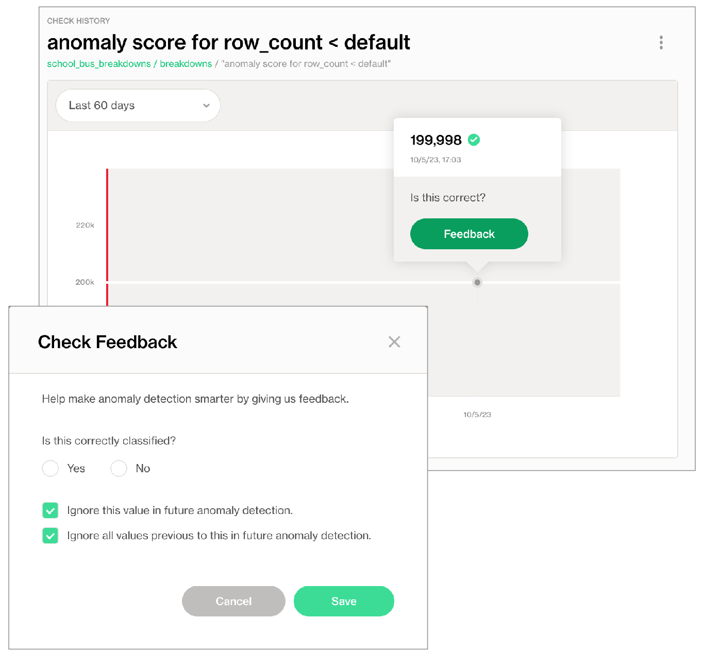

# Anomaly score checks (deprecated)


This check is being **deprecated**. Soda recommends using the new [Metric Monitoring](https://app.gitbook.com/s/A2PmHkO5cBgeRPdiPPOG/data-observability) features, rebuilt from the ground up, 70% more accurate and significantly faster.


Use an anomaly score check to automatically discover anomalies in your time-series data.

```yaml
checks for dim_customer:
  - anomaly score for row_count < default
```

✔️    Requires Soda Core Scientific (included in a Soda Agent)\
✖️    Supported in Soda Core\
✔️    Supported in Soda Library + Soda Cloud\
✔️    Supported in Soda Cloud Agreements + Soda Agent\
✖️    Available as a no-code check

## About anomaly score checks

The anomaly score check is powered by a machine learning algorithm that works with measured values for a metric that occur over time. The algorithm learns the patterns of your data – its trends and seasonality – to identify and flag anomalies in time-series data.

## Install Soda Scientific

To use an anomaly score check, you must install Soda Scientific in the same directory or virtual environment in which you installed Soda Library. Soda Scientific is included in Soda Agent deployment. Best practice recommends installing Soda Library and Soda Scientific in a virtual environment to avoid library conflicts, but you can [Install Soda Scientific locally](anomaly-score.md#install-soda-scientific-locally) if you prefer.

1. Set up a virtual environment, and install Soda Library in your new virtual environment.
2. Use the following command to install Soda Scientific.

```
pip install -i https://pypi.cloud.soda.io soda-scientific
```



Refer to [Troubleshoot Soda Scientific installation](anomaly-score.md#troubleshoot-soda-scientific-installation) for help with issues during installation.

## Define an anomaly score check

The following example demonstrates how to use the anomaly score for the `row_count` metric in a check. You can use any [numeric](numeric-metrics.md), [missing](missing-metrics.md), or [validity](validity-metrics.md) metric in lieu of `row_count`.

```yaml
checks for dim_customer:
  - anomaly score for row_count < default
```

* Currently, you can only use `< default` to define the threshold in an anomaly score check.
* By default, anomaly score checks yield warn check results, not fails.

You can use any [numeric](numeric-metrics.md), [missing](missing-metrics.md), or [validity](validity-metrics.md) metric in anomaly score checks. The following example detects anomalies for the average of `order_price` in an `orders` dataset.

```yaml
checks for orders:
  - anomaly score for avg(order_price) < default
```

The following example detects anomalies for the count of missing values in the `id` column.

```yaml
checks for orders:
  - anomaly score for missing_count(id) < default:
      missing_values: [None, No Value]
```

## Anomaly score check results

Because the anomaly score check requires at least four data points before it can start detecting what counts as an anomalous measurement, the first few scans yield a check result that indicates that Soda does not have enough data.

```shell
Soda Library 1.0.x
Soda Core 3.0.0x
Anomaly Detection Frequency Warning: Coerced into daily dataset with last daily time point kept
Data frame must have at least 4 measurements
Skipping anomaly metric check eval because there is not enough historic data yet
Scan summary:
1/1 check NOT EVALUATED: 
    dim_customer in adventureworks
      anomaly score for missing_count(last_name) < default [NOT EVALUATED]
        check_value: None
1 checks not evaluated.
Apart from the checks that have not been evaluated, no failures, no warnings and no errors.
Sending results to Soda Cloud
```

Though your first instinct may be to run several scans in a row to product the four measurments that the anomaly score needs, the measurements don’t “count” if the frequency of occurrence is too random, or rather, the measurements don't represent enough of a stable frequency.

If, for example, you attempt to run eight back-to-back scans in five minutes, the anomaly score does not register the measurements resulting from those scans as a reliable pattern against which to evaluate an anomaly.

Consider using the Soda library to set up a [programmatic scan](../quick-start-sip/programmatic.md) that produces a check result for an anomaly score check on a regular schedule.

### Produce warnings instead of fails

By default, an anomaly score check yields either a pass or fail result; pass if Soda does not detect an anomaly, fail if it does.

If you wish, you can instruct Soda to issue warn check results instead of fails by adding a `warn_only` configuration, as in the following example.

```yaml
checks for dim_customer:
  - anomaly score for row_count < default:
      warn_only: True
```

## Reset anomaly history

If you wish, you can reset an anomaly score's history, effectively recalibrating what Soda considers anomalous on a dataset.

1. In Soda Cloud, navigate to the **Check History** page of the anomaly check you wish to reset.
2. Click to select a node in the graph that represents a measurement, then click **Feedback**.
3. In the modal that appears, you can choose to exclude the individual measurement, or all previous data up to that measurement, the latter of which resets the anomaly score's history.

<figure><figcaption></figcaption></figure>

## Optional check configurations

<table><thead><tr><th width="100" align="center">Supported</th><th>Configuration</th><th>Documentation</th></tr></thead><tbody><tr><td align="center">✓</td><td>Define a name for an anomaly score check.</td><td>-</td></tr><tr><td align="center">✓</td><td>Add an identity to a check.</td><td><a href="optional-config.md#add-a-check-identity">Add a check identity</a></td></tr><tr><td align="center"> </td><td>Define alert configurations to specify warn and fail thresholds.</td><td>-</td></tr><tr><td align="center">✓</td><td>Apply an in-check filter to return results for a specific portion of the data in your dataset; see <a href="optional-config.md#add-a-filter-to-a-check">example</a>.</td><td><a href="optional-config.md#add-a-filter-to-a-check">Add an in-check filter to a check</a></td></tr><tr><td align="center">✓</td><td>Use quotes when identifying dataset names; see <a href="anomaly-score.md#example-with-quotes">example</a>.<br>Note that the type of quotes you use must match that which your data source uses. For example, BigQuery uses a backtick (`) as a quotation mark.</td><td><a href="optional-config.md#use-quotes-in-a-check">Use quotes in a check</a></td></tr><tr><td align="center"> </td><td>Use wildcard characters ( % or * ) in values in the check.</td><td>-</td></tr><tr><td align="center">✓</td><td>Use for each to apply anomaly score checks to multiple datasets in one scan; see <a href="anomaly-score.md#example-with-for-each">example</a>.</td><td><a href="optional-config.md#apply-checks-to-multiple-datasets">Apply checks to multiple datasets</a></td></tr><tr><td align="center">✓</td><td>Apply a dataset filter to partition data during a scan.</td><td><a href="optional-config.md#scan-a-portion-of-your-dataset">Scan a portion of your dataset</a></td></tr></tbody></table>

#### Example with quotes

```yaml
checks for dim_product:
  - anomaly score for avg("order_price") < default
```

#### Example with for each

```yaml
for each dataset T:
  datasets:
    - dim_customer
  checks:
    - anomaly score for row_count < default
```

## Track anomalies and relative changes by group

You can use a group by configuration to detect anomalies by category, and monitor relative changes over time in each category.

✔️    Requires Soda Core Scientific for anomaly check (included in a Soda Agent)\
✖️    Supported in Soda Core\
✔️    Supported in Soda Library 1.1.27 or greater + Soda Cloud\
✔️    Supported in Soda Cloud Agreements + Soda Agent 0.8.57 or greater\
✖️    Available as a no-code check\


The following example includes three checks grouped by `gender`.

* The first check uses the custom metric `average_children` to collect measurements and gauge them against an absolute threshold of `2`.\
  Soda Cloud displays the check results grouped by gender.
* The second check uses the same custom metric to **detect anomalous measurements** relative to previous measurements. Soda must collect a minimum of four, regular-cadence, measurements to have enough data from which to gauge an anomolous measurement. Until it has enough measurements, Soda returns a check result of `[NOT EVALUATED]`.\
  Soda Cloud displays any detected anomalies grouped by gender.
* The third check uses the same custom metric to **detect changes over time** in the calculated average measurement, and gauge the measurement against a threshold of `between -5 and 5` relative to the previously-recorded measurement. See [Change-over-time thresholds](numeric-metrics.md#change-over-time-thresholds) for supported syntax variations for change-over-time checks.\
  Soda Cloud displays any detected changes grouped by gender.

```yaml
checks for dim_customer:
  - group by:
      name: Group by gender
      query: |
        SELECT gender, AVG(total_children) as average_children
        FROM dim_customer
        GROUP BY gender
      fields:
        - gender
      checks:
        - average_children > 2:
            name: Average children per gender should be more than 2
        - anomaly detection for average_children:
            name: Detect anomaly for average children
        - change for average_children between -5 and 5:
            name: Detect unexpected changes for average children
```

<figure><figcaption></figcaption></figure>

## Troubleshoot Soda Scientific installation

While installing Soda Scientific works on Linux, you may encounter issues if you install Soda Scientific on Mac OS (particularly, machines with the M1 ARM-based processor) or any other operating system. If that is the case, consider using one of the following alternative installation procedures.

* [Install Soda Scientify locally](anomaly-score.md#install-soda-scientific-locally)
* [Troubleshoot Soda Scientific installation in a virtual env](anomaly-score.md#troubleshoot-soda-scientific-installation-in-a-virtual-env)
* [Use Docker to run Soda Library](anomaly-score.md#use-docker-to-run-soda-library)

> Need help? Ask the team in the [Soda community on Slack](https://community.soda.io/slack).

### Install Soda Scientific Locally

1. Set up a virtual environment, and install Soda Library in your new virtual environment.
2. Use the following command to install Soda Scientific.

```
pip install -i https://pypi.cloud.soda.io soda-scientific
```

<details>

<summary>List of Soda Scientific dependencies</summary>

* pandas<2.0.0
* wheel
* pydantic>=1.8.1,<2.0.0
* scipy>=1.8.0
* numpy>=1.23.3, <2.0.0
* inflection==0.5.1
* httpx>=0.18.1,<2.0.0
* PyYAML>=5.4.1,<7.0.0
* cython>=0.22
* prophet>=1.1.0,<2.0.0

</details>

### Use Docker to run Soda Library

Use Soda’s Docker image in which Soda Scientific is pre-installed. You need Soda Scientific to be able to use SodaCL [distribution checks](distribution.md) or [anomaly detection checks](anomaly-detection.md).

1. If you have not already done so, [install Docker](https://docs.docker.com/get-docker/) in your local environment.
2.  From Terminal, run the following command to pull Soda Library’s official Docker image; adjust the version to reflect the most [recent release](../release-notes/soda-library.md).

    ```sh
    docker pull sodadata/soda-library:v1.0.3
    ```
3.  Verify the pull by running the following command.

    ```sh
    docker run sodadata/soda-library:v1.0.3 --help
    ```

    Output:

    ```sh
     Usage: soda [OPTIONS] COMMAND [ARGS]...

       Soda Library CLI version 1.0.x, Soda Core CLI version 3.0.xx

     Options:
       --version  Show the version and exit.
       --help     Show this message and exit.

     Commands:
       ingest           Ingests test results from a different tool
       scan             Runs a scan
       suggest          Generates suggestions for a dataset
       test-connection  Tests a connection
       update-dro       Updates contents of a distribution reference file
    ```

    When you run the Docker image on a non-Linux/amd64 platform, you may see the following warning from Docker, which you can ignore.

    ```sh
    WARNING: The requested image's platform (linux/amd64) does not match the detected host platform (linux/arm64/v8) and no specific platform was requested
    ```
4.  When you are ready to run a Soda scan, use the following command to run the scan via the docker image. Replace the placeholder values with your own file paths and names.

    ```sh
    docker run -v /path/to/your_soda_directory:/sodacl sodadata/soda-library scan -d your_data_source -c /sodacl/your_configuration.yml /sodacl/your_checks.yml
    ```

    Optionally, you can specify the version of Soda Library to use to execute the scan. This may be useful when you do not wish to use the latest released version of Soda Library to run your scans. The example scan command below specifies Soda Library version 1.0.0.

    ```sh
    docker run -v /path/to/your_soda_directory:/sodacl sodadata/soda-library:v1.0.0 scan -d your_data_source -c /sodacl/your_configuration.yml /sodacl/your_checks.yml
    ```



#### **Error: Mounts denied**

If you encounter the following error, follow the procedure below.

```sh
docker: Error response from daemon: Mounts denied: 
The path /soda-library-test/files is not shared from the host and is not known to Docker.
You can configure shared paths from Docker -> Preferences... -> Resources -> File Sharing.
See https://docs.docker.com/desktop/mac for more info.
```

You need to give Docker permission to acccess your configuration.yml and checks.yml files in your environment. To do so:

1. Access your Docker Dashboard, then select Preferences (gear symbol).
2. Select Resources, then follow the [Docker instructions](https://www.docker.com/blog/file-sharing-with-docker-desktop/) to add your Soda project directory – the one you use to store your configuration.yml and checks.yml files – to the list of directories that can be bind-mounted into Docker containers.
3. Click Apply & Restart, then repeat steps 2 - 4 above.

\


#### **Error: Configuration path does not exist**

If you encounter the following error, double check the syntax of the scan command in step 4 above.

* Be sure to prepend `/sodacl/` to both the congifuration.yml filepath and the checks.yml filepath.
* Be sure to mount your files into the container by including the `-v` option. For example, `-v /Users/MyName/soda_project:/sodacl`.

```sh
Soda Library 1.0.x
Configuration path 'configuration.yml' does not exist
Path "checks.yml" does not exist
Scan summary:
No checks found, 0 checks evaluated.
2 errors.
Oops! 2 errors. 0 failures. 0 warnings. 0 pass.
ERRORS:
Configuration path 'configuration.yml' does not exist
Path "checks.yml" does not exist
```

### Troubleshoot Soda Scientific installation in a virtual env

If you have defined an `anomaly detection` check and you use an M1 MacOS machine, you may get a`Library not loaded: @rpath/libtbb.dylib` error. This is a known issue in the MacOS community and is caused by issues during the installation of the [prophet library](https://github.com/facebook/prophet). There currently are no official workarounds or releases to fix the problem, but the following adjustments may address the issue.

1. Install `soda-scientific` as per the local environment installation instructions and activate the virtual environment.
2.  Use the following command to navigate to the directory in which the `stan_model` of the `prophet` package is installed in your virtual environment.

    ```sh
    cd path_to_your_python_virtual_env/lib/pythonyour_version/site_packages/prophet/stan_model/
    ```

    For example, if you have created a python virtual environment in a `/venvs` directory in your home directory and you use Python 3.9, you would use the following command.

    ```sh
    cd ~/venvs/soda-library-prophet11/lib/python3.9/site-packages/prophet/stan_model/
    ```
3.  Use the `ls` command to determine the version number of `cmndstan` that `prophet` installed. The `cmndstan` directory name includes the version number.

    ```sh
    ls
    cmdstan-2.26.1		prophet_model.bin
    ```
4.  Add the `rpath` of the `tbb` library to your `prophet` installation using the following command.

    ```sh
    install_name_tool -add_rpath @executable_path/cmdstanyour_cmdstan_version/stan/lib/stan_math/lib/tbb prophet_model.bin
    ```

    With `cmdstan` version `2.26.1`, you would use the following command.

    ```sh
    install_name_tool -add_rpath @executable_path/cmdstan-2.26.1/stan/lib/stan_math/lib/tbb prophet_model.bin
    ```

## List of comparison symbols and phrases

```
 = 
 < 
 >
 <=
 >=
 !=
 <> 
 between 
 not between 
```

## Go further

* Reference [tips and best practices for SodaCL](../soda-cl-overview/quick-start-sodacl.md#tips-and-best-practices-for-sodacl).


