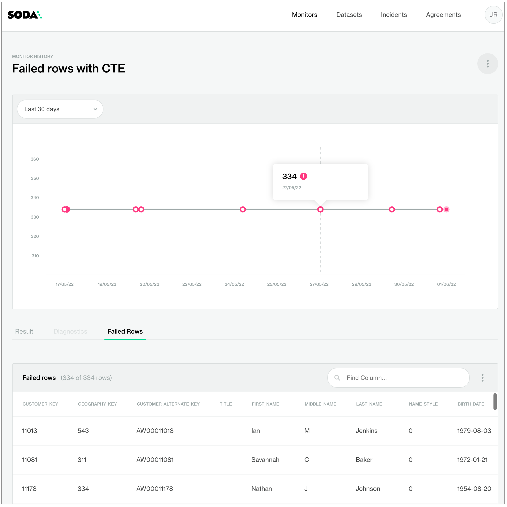
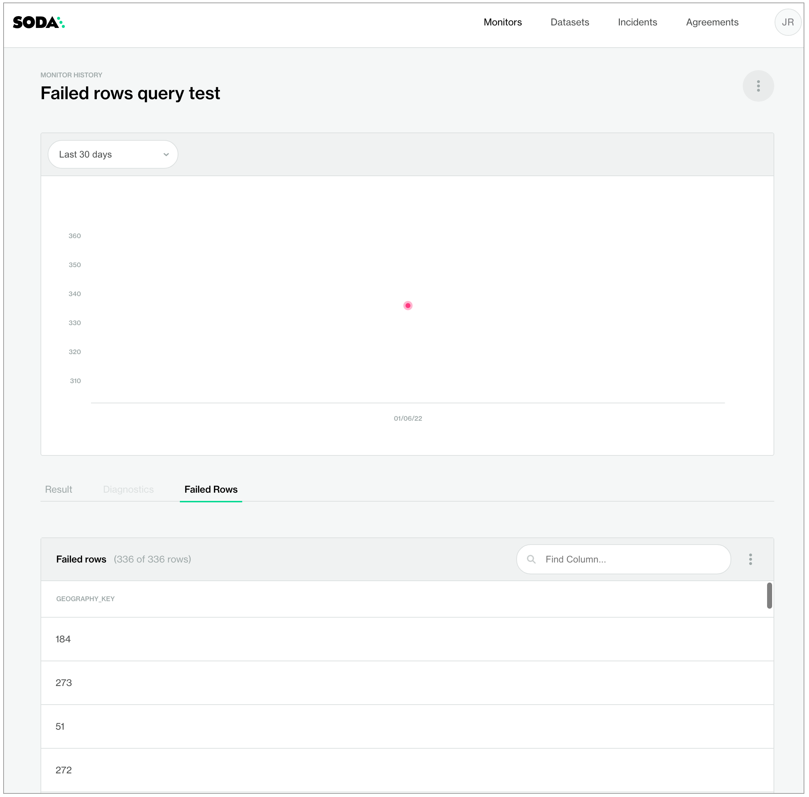

# Failed rows checks

Use a failed rows check to explicitly send samples of rows that failed a check to Soda Cloud.

You can also use a failed row check to configure Soda Library to execute a CTE or SQL query against your data, or to group failed check results by one or more categories.

```yaml
checks for dim_customer:
# Failed rows defined using common table expression
  - failed rows:
      samples limit: 50
      fail condition: total_children = '2' and number_cars_owned >= 3
```

```yaml
checks for dim_customer:
# Failed rows defined using SQL query
  - failed rows:
      fail query: |
        SELECT DISTINCT geography_key
        FROM dim_customer as customer
```

✔️    Requires Soda Core Scientific (included in a Soda Agent)\
✔️    Supported in Soda Core\
✔️    Supported in Soda Library + Soda Cloud\
✔️    Supported in Soda Cloud Agreements + Soda Agent

✔️    Available as a no-code check with a self-hosted Soda Agent connected to any Soda-supported data source, except Spark, and Dask and Pandas\
&#x20;       OR\
&#x20;       with a Soda-hosted Agent connected to a BigQuery, Databricks SQL, MS SQL Server, MySQL, PostgreSQL, Redshift, or Snowflake data source

## Prerequisites

To send failed rows samples to Soda Cloud, samples collection must be enabled in Soda Cloud.

As a user with [permission](../collaborate/roles-global.md#global-roles-and-permissions) to do so, navigate to **your avatar** > **Organization Settings**, then check the box to **Allow Soda to collect sample data and failed row samples for all datasets**.

## Define failed rows checks

In the context of [SodaCL check types](metrics-and-checks.md#check-types), failed row checks are user-defined. This check is limited in its syntax variation, but you can customize your expression or query as much as you like.

When a failed rows check results in a `warn` or `fail` Soda collects up to 100 failed row samples by default. You can decrease or increase the volume of sample rows using the `samples limit` parameter; see [Set a samples limit](../run-a-scan/failed-row-samples.md#set-a-sample-limit).

The example below uses [common table expression (CTE)](https://www.essentialsql.com/introduction-common-table-expressions-ctes/) to define the `fail condition` that any rows in the `dim_customer` dataset must meet in order to qualify as failed rows, during a scan, get sent to Soda Cloud. Soda sends any rows which contain the value 2 in the `total_children` column and which contain a value greater than or equal to 3 in the `number_cars_owned` column to Soda Cloud as failed row samples, up to a default volume of 100 rows. The check also uses the `name` configuration key to customize a name for the check so that it displays in a more readable form in Soda Cloud; see image below.

```yaml
checks for dim_customer:
  - failed rows:
      name: Failed rows with CTE
      fail condition: total_children = '2' and number_cars_owned >= 3

# OR

  - failed rows:
      name: Failed rows with CTE
      fail condition: |
        total_children = '2' and number_cars_owned >= 3

```

<figure><figcaption></figcaption></figure>

If you prefer, you can use a SQL query to define what qualifies as a failed row for Soda to send to Soda Cloud, as in the following simple example. Use this cofiguration to include complete SQL queries in the Soda scan of your data.

```yaml
checks for dim_customer:
  - failed rows:
      fail query: |
        SELECT DISTINCT geography_key
        FROM dim_customer as customer
```

<figure><figcaption></figcaption></figure>

\


## Optional check configurations

<table><thead><tr><th width="100" align="center">Supported</th><th>Configuration</th><th>Documentation</th></tr></thead><tbody><tr><td align="center">✓</td><td>Define a name for a failed rows check; see <a href="failed-rows-checks.md#example-with-check-name">example</a>.</td><td><a href="optional-config.md#customize-check-names">Customize check names</a></td></tr><tr><td align="center">✓</td><td>Add an identity to a check.</td><td><a href="optional-config.md#add-a-check-identity">Add a check identity</a></td></tr><tr><td align="center">✓</td><td>Define alert configurations to specify warn and fail alert conditions; see <a href="failed-rows-checks.md#example-with-alert">example</a>.</td><td><a href="optional-config.md#add-alert-configurations">Add alert configurations</a></td></tr><tr><td align="center"> </td><td>Apply an in-check filter to return results for a specific portion of the data in your dataset.</td><td>-</td></tr><tr><td align="center">✓</td><td>Use quotes when identifying dataset or column names; see <a href="failed-rows-checks.md#example-with-quotes">example</a>.<br>Note that the type of quotes you use must match that which your data source uses. For example, BigQuery uses a backtick (`) as a quotation mark.</td><td><a href="optional-config.md#use-quotes-in-a-check">Use quotes in a check</a></td></tr><tr><td align="center">✓</td><td>Use wildcard characters in the value in the check.</td><td>Use wildcard values as you would with CTE or SQL.</td></tr><tr><td align="center"> </td><td>Use for each to apply failed rows checks to multiple datasets in one scan.</td><td>-</td></tr><tr><td align="center">✓</td><td>Apply a dataset filter to partition data during a scan; see <a href="failed-rows-checks.md#example-with-dataset-filter">example</a>.<br><em>Known issue:</em> Dataset filters are not compatible with failed rows checks which use a SQL query. With such a check, Soda does not apply the dataset filter at scan time.</td><td><a href="optional-config.md#scan-a-portion-of-your-dataset">Scan a portion of your dataset</a></td></tr><tr><td align="center">✓</td><td>Specify a single column against which to run a failed rows check; see <a href="failed-rows-checks.md#example-with-column-parameter">example</a>.</td><td>-</td></tr><tr><td align="center"> </td><td>Supports <code>samples columns</code> parameter to specify columns from which Soda draws failed row samples.</td><td><a href="../run-a-scan/failed-row-samples.md#customize-sampling-for-checks">Customize sampling for checks</a></td></tr><tr><td align="center"> </td><td>Supports <code>samples limit</code> parameter to control the volume of failed row samples Soda collects.</td><td><a href="../run-a-scan/failed-row-samples.md#set-a-sample-limit">Set a sample limit</a></td></tr><tr><td align="center"> </td><td>Supports <code>collect failed rows</code> parameter instruct Soda to collect, or not to collect, failed row samples for a check.</td><td><a href="../run-a-scan/failed-row-samples.md#customize-sampling-for-checks">Customize sampling for checks</a></td></tr></tbody></table>

#### Example with check name

```yaml
checks for dim_customer:
  - failed rows:
      name: Failed rows query test
      fail query: |
        SELECT DISTINCT geography_key
        FROM dim_customer as customer
```

#### Example with alert

```yaml
checks for dim_customer:
  - failed rows:
      fail condition: total_children = '2' and number_cars_owned >= 3
      warn: when between 1 and 10
      fail: when > 10
```

#### Example with quotes

```yaml
checks for dim_customer:
  - failed rows:
      name: Failed rows query test
      fail query: |
        SELECT DISTINCT "geography_key"
        FROM dim_customer as customer
```

#### Example with dataset filter

_Known issue:_ Dataset filters are not compatible with failed rows checks which use a SQL query. With such a check, Soda does not apply the dataset filter at scan time.

```yaml
filter dim_product [new]:
  where: start_date < TIMESTAMP '2015-01-01'

checks for dim_product [new]:
  - failed rows:
      name: Failed CTE with filter
      fail condition: weight < '200' and reorder_point >= 3
```

#### Example with column parameter

```yaml
checks for dim_product:
  # with SQL query
  - failed rows:
      name: Brand must be LUCKY DOG
      column: product_line
      fail query: |
        SELECT *
        FROM dim_product
        WHERE product_line LIKE '%LUCKY DOG%'
  # with CTE
  - failed rows:
      name: Brand must be LUCKY DOG
      column: product_line
      fail condition: brand LIKE '%LUCKY DOG%'
```

\


## Go further

* Learn how to [manage failed row samples](../run-a-scan/failed-row-samples.md).
* Learn more about [SodaCL metrics and checks](metrics-and-checks.md) in general.
* Borrow user-defined check syntax to define a reusable [check template](check-template.md).
* Use a [schema check](schema.md) to discover missing or forbidden columns in a dataset.
* Reference [tips and best practices for SodaCL](../soda-cl-overview/quick-start-sodacl.md#tips-and-best-practices-for-sodacl).


