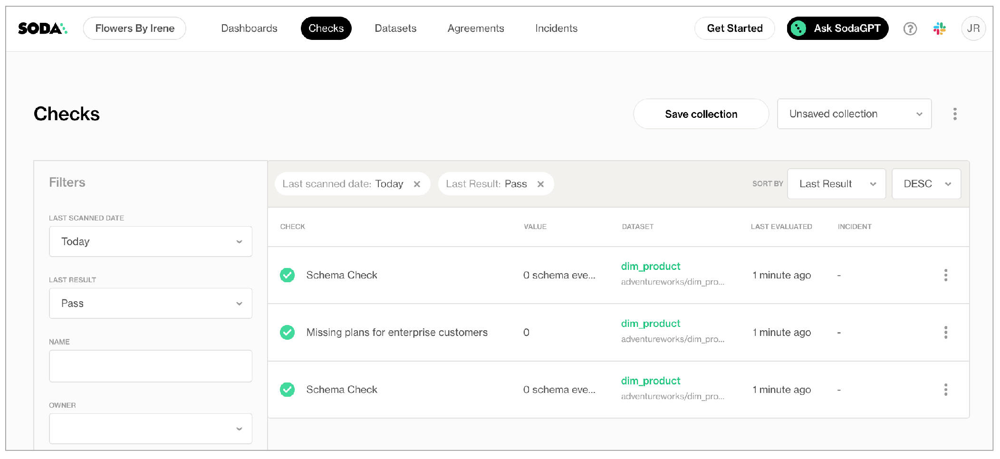

# For each

Use a for each configuration to execute checks against multiple datasets during a scan.

```yaml
for each dataset T:
  datasets:
    - dim_products%
    - fact%
    - exclude fact_survey_response
  checks:
    - row_count > 0
```

✖️    Requires Soda Core Scientific (included in a Soda Agent)\
✔️    Supported in Soda Core\
✔️    Supported in Soda Library + Soda Cloud\
✔️    Supported in Soda Cloud Agreements + Soda Agent\
✖️    Available as a no-code check

## Define a for each configuration

Add a **for each** section to your checks configuration to specify a list of checks you wish to execute on multiple datasets.

1. Add a `for each dataset T` section header anywhere in your YAML file. The purpose of the `T` is only to ensure that every `for each` configuration has a unique name.
2. Nested under the section header, add two nested keys, one for `datasets` and one for `checks`.
3. Nested under `datasets`, add a list of datasets against which to run the checks. Refer to the example below that illustrates how to use `include` and `exclude` configurations and wildcard characters (%) .
4. Nested under `checks`, write the checks you wish to execute against all the datasets listed under `datasets`.

```yaml
for each dataset T:
  datasets:
    # include the dataset 
    - dim_customers
    # include all datasets matching the wildcard expression
    - dim_products%
    # (optional) explicitly add the word include to make the list more readable
    - include dim_employee
    # exclude a specific dataset
    - exclude fact_survey_response
    # exclude any datasets matching the wildcard expression
    - exclude prospective_%
  checks:
    - row_count > 0
```

### Limitations and specifics for for each <a href="#limitations-and-specifics-for-for-each" id="limitations-and-specifics-for-for-each"></a>

* For each is not compatible with dataset filters.
* Soda dataset names matching is case insensitive.
* You cannot use quotes around dataset names in a for each configuration.
* If any of your checks specify column names as arguments, make sure the column exists in all datasets listed under the `datasets` heading.
* To add multiple for each configurations, configure another `for each` section header with a different letter identifier, such as `for each dataset R`.

## Optional check configurations

<table><thead><tr><th width="100" align="center">Supported</th><th align="center">Configuration</th><th align="center">Documentation</th></tr></thead><tbody><tr><td align="center">✓</td><td align="center">Define a name for a for each check; see <a href="for-each.md#example-with-check-name">example</a>.</td><td align="center"><a href="optional-config.md#customize-check-names">Customize check names</a></td></tr><tr><td align="center">✓</td><td align="center">Add an identity to a check.</td><td align="center"><a href="optional-config.md#add-a-check-identity">Add a check identity</a></td></tr><tr><td align="center">✓</td><td align="center">Define alert configurations to specify warn and fail alert conditions; see <a href="for-each.md#example-with-alert-configuration">example</a>.</td><td align="center"><a href="optional-config.md#add-alert-configurations">Add alert configurations</a>.</td></tr><tr><td align="center">✓</td><td align="center">Apply an in-check filter to return results for a specific portion of the data in your dataset; see <a href="for-each.md#example-with-in-check-filter">example</a>.</td><td align="center"><a href="optional-config.md#add-a-filter-to-a-check">Add an in-check filter</a>.</td></tr><tr><td align="center"> </td><td align="center">Use quotes when identifying dataset or column names.</td><td align="center">-</td></tr><tr><td align="center">✓</td><td align="center">Use wildcard characters ( % ) in values in the for each configuration; see <a href="for-each.md#example-with-wildcard">example</a>.</td><td align="center">-</td></tr><tr><td align="center"> </td><td align="center">Apply a dataset filter to partition data during a scan.</td><td align="center">-</td></tr></tbody></table>

#### Example with check name

```yaml
for each dataset T:
  datasets:
    - dim_employee

  checks:
    - max(vacation_hours) < 80:
        name: Too many vacation hours for US Sales
```

#### Example with alert configuration

```yaml
for each dataset T:
  datasets:
    - dim_employee
    - dim_customer

  checks:
    - row_count:
        fail:
          when < 5
        warn:
          when > 10
```

#### Example with in-check filter

```yaml
for each dataset T:
  datasets:
    - dim_employee

  checks:
    - max(vacation_hours) < 80:
        filter: sales_territory_key = 11
```

#### Example with wildcard

```yaml
for each dataset T:
  datasets:
    - dim_%

  checks:
    - row_count > 1
```

### Add a dynamic name to for each checks

To keep your for each check results organized in Soda Cloud, you may wish to dynamically add a name to each check so that you can easily identify to which dataset the check result applies.

For example, if you use for each to execute an anomaly detection check on many datasets, you can use a variable in the syntax of the check name so that Soda dynamically adds a dataset name to each check result.

```yaml
for each dataset R:
  datasets:
    - retail%
  checks:
    - anomaly detection for row_count:
        name: Row count anomaly for ${R}
```

## For each results in Soda Cloud

Soda pushes the check results for each dataset to Soda Cloud where each check appears in the **Checks** dashboard, with an icon indicating their latest scan result. Filter the results by dataset to review dataset-specific results.

```yaml
for each dataset T:
  datasets:
    - dim_employee
    - dim_customer

  checks:
    - row_count > 1
```

<figure><figcaption></figcaption></figure>

## Go further

* Reference [tips and best practices for SodaCL](../soda-cl-overview/quick-start-sodacl.md#tips-and-best-practices-for-sodacl).


