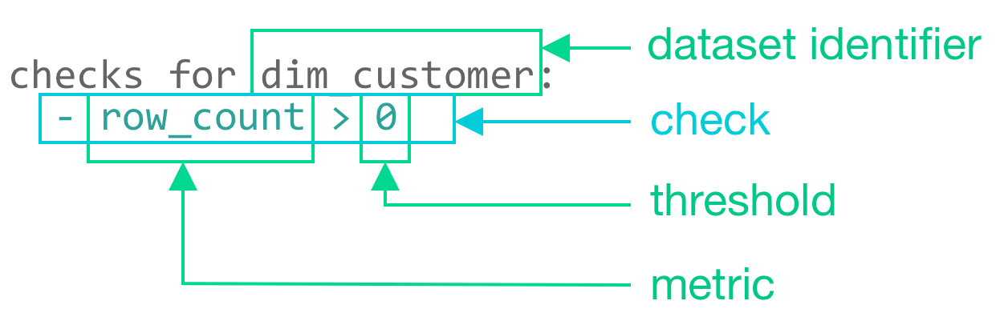
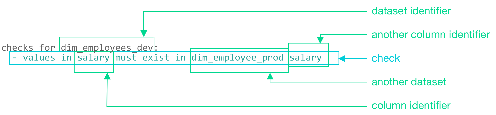
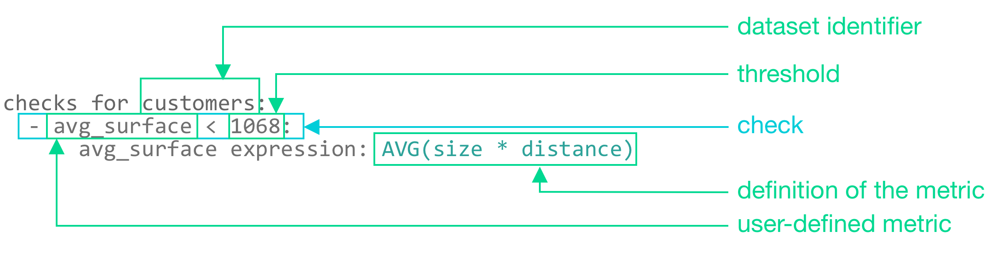

# SodaCL metrics and checks

**Soda Checks Language (SodaCL)** is a YAML-based, domain-specific language for data reliability. Use SodaCL to write checks for data quality which Soda then executes when it scans the data in your data source.

A **metric** is a property of the data in your dataset. A **threshold** is the value for a metric that Soda checks against during a scan. Usually, you use both a metric and a threshold to define a SodaCL **check** in a checks YAML file, like the following example that checks that the `dim_customer` dataset is not empty.

```yaml
checks for dim_customer:
  - row_count > 0
```

{:height="325px" width="325px"}

A check is a test for data quality that you write using the Soda Checks Language (SodaCL). SodaCL includes over 25 built-in metrics that you can use to write checks, but you also have the option of writing your own SQL queries or expressions using SodaCL.

> See a [full list of SodaCL metrics and checks](metrics-and-checks.md#list-of-sodacl-metrics-and-checks).

When it scans datasets in your data source, Soda Library executes the checks you defined in your checks YAML file. Technically, a check is a Python expression that, during a Soda scan, checks metrics to see if they match the parameters you defined for a threshold. A single Soda scan executes multiple checks against one or more datasets in your data source. Read more about [running scans on multiple environments](../run-a-scan/).

As a result of a scan, each check results in one of three default states:

* **pass**: the values in the dataset match or fall within the thresholds you specified
* **fail**: the values in the dataset _do not_ match or fall within the thresholds you specified
* **error**: the syntax of the check is invalid

A fourth state, **warn**, is something you can explicitly configure for individual checks. See [Add alert configurations](optional-config.md#add-alert-configurations).

The scan results appear in your Soda Library command-line interface (CLI) and the latest result appears in the **Checks** dashboard in the Soda Cloud web application; examples follow.

Optionally, you can add `--local` option to the scan command to prevent Soda Library from sending check results and any other metadata to Soda Cloud.

```sh
Soda Library 1.0.x
Soda Core 3.0.x
Sending failed row samples to Soda Cloud
Scan summary:
6/9 checks PASSED: 
    paxstats in paxstats2
      row_count > 0  [PASSED]
        check_value: 15007
      Look for PII  [PASSED]
      duplicate_percent(id) = 0  [PASSED]
        check_value: 0.0
        row_count: 15007
        duplicate_count: 0
      missing_count(adjusted_passenger_count) = 0  [PASSED]
        check_value: 0
      anomaly detection for row_count  [PASSED]
        check_value: 0.0
      Schema Check [PASSED]
1/9 checks WARNED: 
    paxstats in paxstats2
      Abnormally large PAX count [WARNED]
        check_value: 659837
2/9 checks FAILED: 
    paxstats in paxstats2
      Validate terminal ID [FAILED]
        check_value: 27
      Verify 2-digit IATA [FAILED]
        check_value: 3
Oops! 2 failure. 1 warning. 0 errors. 6 pass.
Sending results to Soda Cloud
Soda Cloud Trace: 4774***8
```

<figure><figcaption></figcaption></figure>

## Check types

In general, SodaCL checks fall into one of three broad categories:

1. standard
2. unique
3. user-defined

A **standard** check, as illustrated above with `row_count`, uses a language pattern that includes a metric and a threshold. All numeric, missing, and validity metrics use this pattern and have a multitude of optional configurations. Read more about [standard check types](metrics-and-checks.md#standard-check-types) below.

<details>

<summary>Quick view of standard check metrics</summary>

avg\
avg\_length\
duplicate\_count\
duplicate\_percent\
invalid\_count\
invalid\_percent\
max\
max\_length\
min\
min\_length\
missing\_count\
missing\_percent\
percentile\
row\_count\
stddev\
stddev\_pop\
stddev\_samp\
sum\
variance\
var\_pop\
var\_samp

</details>

\


Some checks that you write with SodaCL do not use metrics and thresholds, and instead follow **unique patterns** relevant to the data quality parameters they check. Each unique check type has its own documentation.

For example, a reference check that validates that the values in a column in one dataset match exactly with the values in another column in another dataset uses a unique pattern.

```yaml
checks for dim_employees_dev:
  - values in salary must exist in dim_employee_prod salary
```

<figure><figcaption></figcaption></figure>

<details>

<summary>Quick view of unique check types</summary>

anomaly detection\
distribution\
freshness\
reconciliation\
reference\
cross\
schema

</details>

\


Finally, the **user-defined** checks make use of common table expressions (CTE) or SQL queries to construct a check; see an example below. This check type is designed to meet the needs of more complex and specific data quality checks, needs which cannot otherwise be met using the built-in standard and unique checks SodaCL provides. Each user-defined check type has its own documentation.

Use these checks to prepare expressions or queries for your data that Soda Library executes during a scan along with all the other checks in your checks YAML file.

```yaml
checks for customers:
  - avg_surface < 1068:
      avg_surface expression: AVG(size * distance)
```

<figure><figcaption></figcaption></figure>

<details>

<summary>Quick view of user-defined check types</summary>

failed rows\
user-defined

</details>

\


## Standard check types

Standard check types use the same pattern to compose a check, but the metrics they use can, themselves, be divided into three categories:

1. [numeric](numeric-metrics.md) - metrics that involve tabulation or calculation of data
2. [missing](missing-metrics.md) - metrics that identify values or formats of data that qualify as missing, such as NULL
3. [validity](validity-metrics.md) - metrics that identify values or formats of data that, according to your own business rules, are acceptable or unacceptable

### Checks with fixed thresholds

All standard checks that use numeric, missing, or validity metrics can specify a **fixed threshold** which is not relative to any other threshold. `row_count > 0` is an example of a check with a fixed threshold as the threshold value, `0`, is absolute.

Generally, a fixed threshold check has three or four mutable parts:

|                               |
| ----------------------------- |
| a metric                      |
| an argument (optional)        |
| a comparison symbol or phrase |
| a threshold                   |

```yaml
checks for retail_products: 
  - row_count > 0
  - max(size) <= 500
```

The example above defines two checks. The first check applies to the entire dataset and counts the rows to confirm that it is not empty. If the `retail_products` dataset contains more than `0` rows, the check result is `pass`.

| metric            | `row_count` |
| ----------------- | ----------- |
| comparison symbol | `>`         |
| threshold         | `0`         |

The second check applies to only the `size` column in the dataset and checks that the values in that column do not exceed `500`. If the `size` column in the `retail_products` dataset contains values larger than `500`, the check result is `fail`.

| metric            | `max`    |
| ----------------- | -------- |
| argument          | `(size)` |
| comparison symbol | `<=`     |
| threshold         | `500`    |

### Checks with change-over-time thresholds

Only checks that use numeric metrics can specify a **change-over-time threshold**, a value that is relative to a previously-measured, or historic, value. Sometimes referred to a dynamic threshold, you use these change-over-time thresholds to gauge changes to the same metric over time.

You must have a Soda Cloud account to use change-over-time thresholds.

Refer to [change-over-time thresholds](numeric-metrics.md#change-over-time-thresholds) for further details.

### Define boundaries with fixed thresholds

While the most basic of standard checks use a single value to identify a fixed threshold, such as `row_count >= 10`, you can use comparison phrases to define the upper and lower boundaries for a fixed threshold value. Read more about [fixed](metrics-and-checks.md#checks-with-fixed-thresholds) and [dynamic](metrics-and-checks.md#checks-with-change-over-time-thresholds) thresholds.

The following sections present several ways to set boundaries using the `row_count` metric in the example checks. You can use any numeric, missing, or validity metric in lieu of `row_count`.

### Implicitly include thresholds in a check

By default, SodaCL includes the values that define the boundary thresholds when Soda Library executes a check. In the following example, the check passes if the number of rows is equal to 10, 11, 12, 13, 14, or 15 because SodaCL includes both boundary thresholds, `10` and `15`, when Soda Library executes the check.

```yaml
checks for dim_customer:
  - row_count between 10 and 15
```

Use negative values to set boundaries, if you wish. The check in the following example passes if the number of rows is equal to -3, -2, -1, 0, 1, 2, 3, 4, or 5.

```yaml
checks for dim_customer:
  - row_count between -3 and 5
```

Use the `not between` comparison phrase to establish a range of acceptable thresholds, so that anything that falls _outside_ the boundaries you specify yields a fail check result. The check in the following example passes if the number of rows is _not_ equal to -3, -2, -1, 0, 1, 2, 3, 4, or 5.

```yaml
checks for dim_customer:
  - row_count not between -3 and 5
```

### Explicitly exclude thresholds in a check

To exclude the values that define the boundary thresholds, use the opening bracket `(` and closing bracket `)` characters. In the following example, the check passes if the number of rows is equal to 11, 12, 13, 14, or 15 because the opening bracket excludes 10 as an acceptable value.

```yaml
checks for dim_customer:
  - row_count between (10 and 15
```

Similarly, the following example check passes if the number of rows is equal to 11, 12, 13, or 14.

```yaml
checks for dim_customer:
  - row_count between (10 and 15)
```

### Explicitly include thresholds in a check

Though SodaCL includes the values that define the boundary thresholds during a check by default, you can use square brackets, `[` and `]`, to explicitly specify which values to include, if you wish.

For example, all of the following checks are equivalent and pass if the number of rows is equal to 10, 11, 12, 13, 14, or 15.

```yaml
checks for dim_customer:
  - row_count between 10 and 15
  - row_count between [10 and 15
  - row_count between 10 and 15]
  - row_count between [10 and 15]
```

## List of SodaCL metrics and checks

```yaml
anomaly detection
anomaly score (deprecated)
avg
avg_length
cross
distribution
duplicate_count
duplicate_percent
failed rows
freshness
group by
group evolution
invalid_count
invalid_percent
max
max_length
min
min_length
missing_count
missing_percent
percentile
reconciliation 
reference
row_count
schema
schema evolution
stddev
stddev_pop
stddev_samp
sum
user-defined
variance
var_pop
var_samp
```

## Go further

* Access information about [optional configurations](optional-config.md) that you can use in SodaCL checks.
* Reference [tips and best practices for SodaCL](../soda-cl-overview/quick-start-sodacl.md#tips-and-best-practices-for-sodacl).


