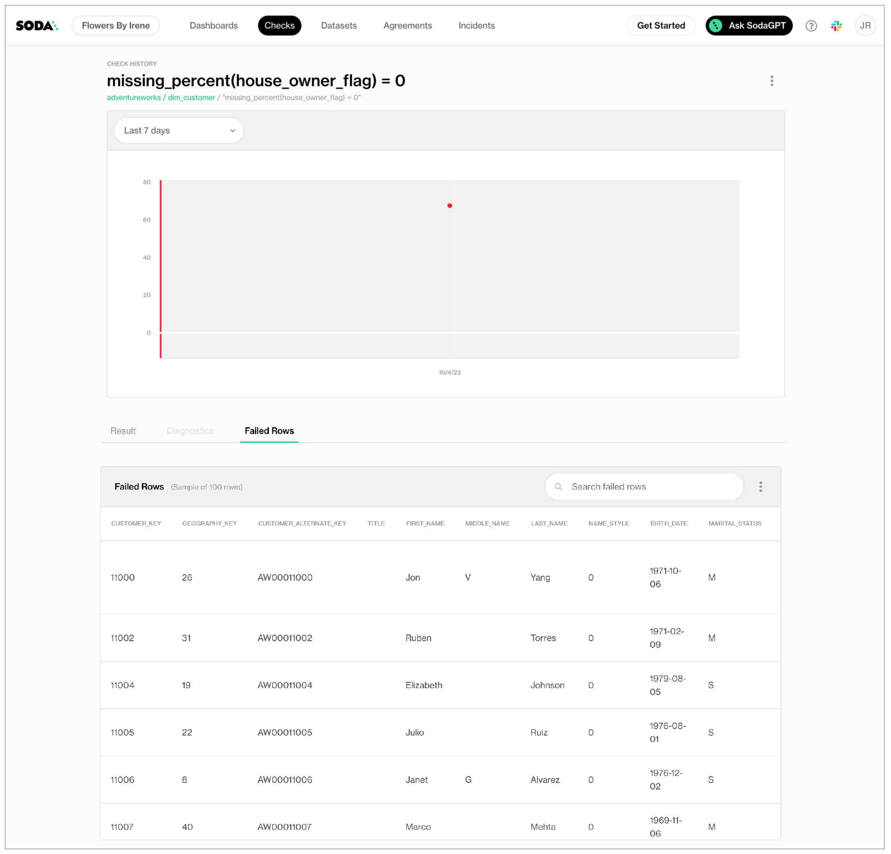

# Missing metrics

Use a missing metric in a check to surface missing values in the data in your dataset.

```yaml
checks for dim_customer
  - missing_count(birthday) = 0
  - missing_percent(gender) < 5%
  - missing_count(first_name) = 0:
      missing regex: (?:N/A)
  - missing_count(last_name) < 5:
      missing values: [n/a, NA, none]
  - missing_percent(email_address) = 0%
```

✖️    Requires Soda Core Scientific (included in a Soda Agent)\
✔️    Supported in Soda Core\
✔️    Supported in Soda Library + Soda Cloud\
✔️    Supported in Soda Cloud Agreements + Soda Agent\
✔️    Available as a no-code check

## Define checks with missing metrics

In the context of [SodaCL check types](metrics-and-checks.md#check-types), you use missing metrics in standard checks. Refer to [Standard check types](metrics-and-checks.md#standard-check-types) for exhaustive configuration details.

You can use both missing metrics in checks that apply to individual columns in a dataset; you cannot use missing metrics in checks that apply to entire datasets. Identify the column by adding a value in the argument between brackets in the check.

* SodaCL considers `NULL` as the default value for "missing".
* If you wish, you can add a `%` character to the threshold for a `missing_percent` metric for improved readability.

```yaml
checks for dim_customer:
  - missing_count(birthday) = 0
```

You can use missing metrics in checks with fixed thresholds, or relative thresholds, but _not_ change-over-time thresholds. See Checks with fixed thresholds for more detail.

```yaml
checks for dim_reseller:
# a check with a fixed threshold
  - missing_count(phone) < 5
# a check with a relative threshold
  - missing_percent(number_employees) < 5%
```

<details>

<summary>What is a relative threshold?</summary>

When it scans a column in your dataset, Soda automatically separates all values in the column into one of three categories:

* missing
* invalid
* valid

Soda then performs two calculations. The sum of the count for all categories in a column is always equal to the total row count for the dataset.\
\
missing count(column name) + invalid count(column name) + valid count(column name) = row count\
\
Similarly, a calculation that uses percentage always adds up to a total of 100 for the column.\
\
missing percent(name) + invalid percent(name) + valid percent(name) = 100\
\
These calculations enable you to write checks that use **relative thresholds**.\
\
In the `missing_percent` example above, the missing values (in this case, NULL) of the `number_employees` column must be less than five percent of the total row count, or the check fails.\
\
Percentage thresholds are between 0 and 100, not between 0 and 1.

</details>

### Specify missing values or missing regex

SodaCL considers `NULL` as the default value for "missing". In the two check examples above, Soda executes the checks to count the number or values which are `NULL`, or the percent of values which are `NULL` relative to the total row count of the column.

However, you can use a nested **configuration key:value pair** to provide your own definition of a missing value. See [List of configuration keys](missing-metrics.md#list-of-configuration-keys) below.

A check that uses a missing metric has four or six mutable parts:

|                                  |
| -------------------------------- |
| a metric                         |
| an argument                      |
| a comparison symbol or phrase    |
| a threshold                      |
| a configuration key (optional)   |
| a configuration value (optional) |

\


The example below defines two checks. The first check applies to the column `last_name`. The `missing values` configuration key specifies that any of the three values in the list exist in a row in that column, Soda recognizes those values as missing values. The check fails if Soda discovers more than five values that match `NA`, `n/a`, or `0`.

* Values in a list must be enclosed in square brackets.
* _Known issue:_ Do not wrap numeric values in single quotes if you are scanning data in a BigQuery data source.

The second check uses a regular expression to define what qualifies as a missing value in the `first_name` column so that any values that are `N/A` qualify as missing. This check passes if Soda discovers no values that match the pattern defined by the regex.

```yaml
checks for dim_customer:
  - missing_count(last_name) < 5:
      missing values: [NA, n/a, 0]
  - missing_count(first_name) = 0:
      missing regex: (?:N/A)
```

First check:

| metric                 | `missing_count`  |
| ---------------------- | ---------------- |
| argument               | `last_name`      |
| comparison symbol      | `<`              |
| threshold              | `5`              |
| configuration key      | `missing values` |
| configuration value(s) | `NA, n/a, 0`     |

Second check:

| metric                      | `missing_count` |
| --------------------------- | --------------- |
| argument                    | `first_name`    |
| comparison symbol or phrase | `=`             |
| threshold                   | `0`             |
| configuration key           | `missing regex` |
| configuration value(s)      | `(?:N/A)`       |

### Failed row samples

Checks with missing metrics automatically collect samples of any failed rows to display Soda Cloud. The default number of failed row samples that Soda collects and displays is 100.

If you wish to limit or broaden the sample size, you can use the `samples limit` configuration in a check with a missing metric. You can add this configuration to your checks YAML file for Soda Library, or when writing checks as part of an agreement in Soda Cloud. See: [Set a sample limit](../run-a-scan/failed-row-samples.md#set-a-sample-limit).

```yaml
checks for dim_customer:
  - missing_percent(email_address) < 50:
      samples limit: 2
```

\


For security, you can add a configuration to your data source connection details to prevent Soda from collecting failed rows samples from specific columns that contain sensitive data. See: [Disable failed row samples](../run-a-scan/failed-row-samples.md#disable-failed-row-samples).

Alternatively, you can set the `samples limit` to `0` to prevent Soda from collecting and sending failed rows samples for an individual check, as in the following example.

```yaml
checks for dim_customer:
  - missing_percent(email_address) < 50:
      samples limit: 0
```

\


You can also use a `samples columns` or a `collect failed rows` configuration to a check to specify the columns for which Soda must implicitly collect failed row sample values, as in the following example with the former. Soda only collects this check’s failed row samples for the columns you specify in the list. See: [Customize sampling for checks](../run-a-scan/failed-row-samples.md#customize-sampling-for-checks).

Note that the comma-separated list of samples columns does not support wildcard characters (%).

```yaml
checks for dim_employee:
  - missing_count(gender) = 0:
      missing values: ["M", "Q"]
      samples columns: [employee_key, first_name]
```

\


To review the failed rows in Soda Cloud, navigate to the **Checks** dashboard, then click the row for a check for missing values. Examine failed rows in the **Failed Rows Analysis** tab; see [Manage failed row samples](../run-a-scan/failed-row-samples.md) for further details.

<figure><figcaption></figcaption></figure>

\


## Optional check configurations

<table><thead><tr><th width="100" align="center">Supported</th><th>Configuration</th><th>Documentation</th></tr></thead><tbody><tr><td align="center">✓</td><td>Define a name for a check with missing metrics; see <a href="missing-metrics.md#example-with-check-name">example</a>.</td><td><a href="optional-config.md#customize-check-names">Customize check names</a></td></tr><tr><td align="center">✓</td><td>Add an identity to a check.</td><td><a href="optional-config.md#add-a-check-identity">Add a check identity</a></td></tr><tr><td align="center">✓</td><td>Define alert configurations to specify warn and fail thresholds; see <a href="missing-metrics.md#example-with-alert-configuration">example</a>.</td><td><a href="optional-config.md#add-alert-configurations">Add alert configurations</a></td></tr><tr><td align="center">✓</td><td>Apply an in-check filter to return results for a specific portion of the data in your dataset; see <a href="missing-metrics.md#example-with-in-check-filter">example</a>.</td><td><a href="optional-config.md#add-a-filter-to-a-check">Add an in-check filter to a check</a></td></tr><tr><td align="center">✓</td><td>Use quotes when identifying dataset or column names; see <a href="missing-metrics.md#example-with-quotes">example</a>.<br>Note that the type of quotes you use must match that which your data source uses. For example, BigQuery uses a backtick (`) as a quotation mark.</td><td><a href="optional-config.md#use-quotes-in-a-check">Use quotes in a check</a></td></tr><tr><td align="center"> </td><td>Use wildcard characters ( % or * ) in values in the check.</td><td>-</td></tr><tr><td align="center">✓</td><td>Use for each to apply checks with missing metrics to multiple datasets in one scan; see <a href="missing-metrics.md#example-with-for-each">example</a>.</td><td><a href="optional-config.md#apply-checks-to-multiple-datasets">Apply checks to multiple datasets</a></td></tr><tr><td align="center">✓</td><td>Apply a dataset filter to partition data during a scan; see <a href="missing-metrics.md#example-with-dataset-filter">example</a>.</td><td><a href="optional-config.md#scan-a-portion-of-your-dataset">Scan a portion of your dataset</a></td></tr><tr><td align="center">✓</td><td>Supports <code>samples columns</code> parameter to specify columns from which Soda draws failed row samples.</td><td><a href="../run-a-scan/failed-row-samples.md#customize-sampling-for-checks">Customize sampling for checks</a></td></tr><tr><td align="center">✓</td><td>Supports <code>samples limit</code> parameter to control the volume of failed row samples Soda collects.</td><td><a href="../run-a-scan/failed-row-samples.md#set-a-sample-limit">Set a sample limit</a></td></tr><tr><td align="center">✓</td><td>Supports <code>collect failed rows</code> parameter instruct Soda to collect, or not to collect, failed row samples for a check.</td><td><a href="../run-a-scan/failed-row-samples.md#customize-sampling-for-checks">Customize sampling for checks</a></td></tr></tbody></table>

#### Example with check name

```yaml
checks for dim_customer:
  - missing_count(first_name) = 0:
      missing regex: (?:N/A)
      name: First names valid
```

#### Example with alert configuration

```yaml
checks for dim_customer:
  - missing_percent(marital_status):
      valid length: 1
      warn: when < 5
      fail: when >= 5  
```

#### Example with in-check filter

```yaml
checks for dim_customer:
  - missing_count(first_name) < 5:
      missing values: [NA, none]
      filter: number_children_at_home > 2
```

#### Example with quotes

```yaml
checks for dim_reseller:
  - missing_percent("phone") = 0
```

#### Example with for each

```yaml
for each dataset T:
  datasets:
    - dim_product
    - dim_product_%
  checks:
    - missing_count(product_line) = 0
```

#### Example with dataset filter

```yaml
filter CUSTOMERS [daily]:
  where: TIMESTAMP '{ts_start}' <= "ts" AND "ts" < TIMESTAMP '${ts_end}'

checks for CUSTOMERS [daily]:
  - missing_count(user_id) = 0
```

\


## List of missing metrics

<table><thead><tr><th width="168.5500030517578">Metric</th><th>Column config keys</th><th>Description</th><th>Supported data types</th></tr></thead><tbody><tr><td><code>missing_count</code></td><td><code>missing values</code></td><td>The number of rows in a column that contain NULL values and any other user-defined values that qualify as missing.</td><td>number<br>text<br>time</td></tr><tr><td></td><td><code>missing regex</code></td><td>The number of rows in a column that contain NULL values and any other user-defined values that qualify as missing.</td><td>text</td></tr><tr><td><code>missing_percent</code></td><td><code>missing values</code></td><td>The percentage of rows in a column, relative to the total row count, that contain NULL values and any other user-defined values that qualify as missing.</td><td>number<br>text<br></td></tr><tr><td></td><td><code>missing regex</code></td><td>The percentage of rows in a column, relative to the total row count, that contain NULL values and any other user-defined values that qualify as missing.</td><td>text</td></tr></tbody></table>

## List of configuration keys

The column configuration key:value pair defines what SodaCL ought to consider as missing values.

| Column config key | Description                                                              | Values                                          |
| ----------------- | ------------------------------------------------------------------------ | ----------------------------------------------- |
| `missing regex`   | Specifies a regular expression to define your own custom missing values. | regex, no forward slash delimiters, string only |
| `missing values`  | Specifies the values that Soda is to consider missing.                   | values in a list                                |

## List of comparison symbols and phrases

```
 = 
 < 
 >
 <=
 >=
 !=
 <> 
 between 
 not between 
```

## Go further

* Use missing metrics in checks with alert configurations to establish [warn and fail zones](optional-config.md#define-zones-using-alert-configurations)
* Use missing metrics in checks to define ranges of acceptable thresholds using [boundary thresholds](metrics-and-checks.md#define-boundaries-with-fixed-thresholds).
* Reference [tips and best practices for SodaCL](../soda-cl-overview/quick-start-sodacl.md#tips-and-best-practices-for-sodacl).


