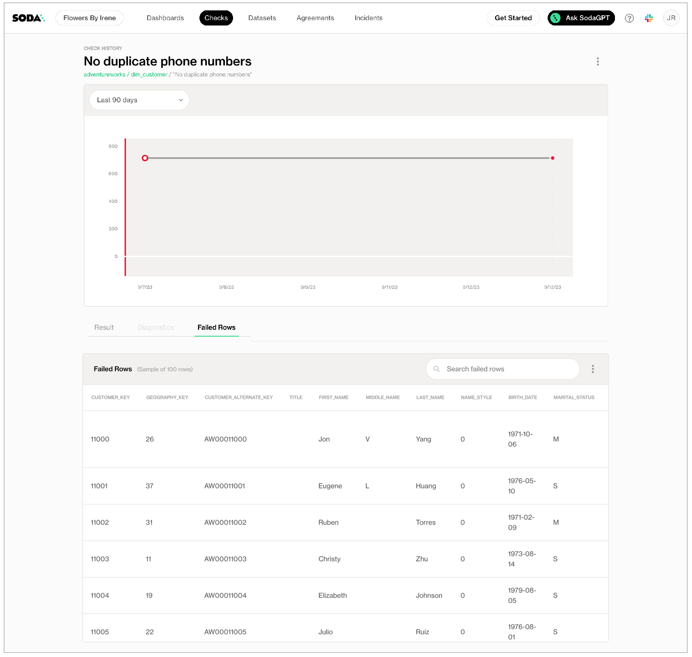

# Numeric metrics

Use a numeric metric in a check to perform basic calculations on the data in your dataset.

```yaml
checks for retail_products:
  - avg(size) between 100 and 300 
  - avg_length(manufacturer) > 10
  - duplicate_count(product_id) = 0
  - duplicate_percent(user_id) < 2%
  - max(size) <= 500
  - max_length(manufacturer) = 25
  - min(size) >= 50
  - min_length(manufacturer) = 5
  - row_count > 0
  - percentile(size, 0.95) > 50
```

```yaml
checks for retail_orders_postgres:
  - stddev(order_quantity) > 0
  - stddev_pop(order_quantity) between 3 and 4
  - stddev_samp(order_quantity) not between 3 and 4
  - sum(discount) < 120
  - variance(discount) > 0
  - var_pop(discount) between 0 and 5
  - var_samp(discount) not between 0 and 5
```

✖️    Requires Soda Core Scientific (included in a Soda Agent)\
✔️    Supported in Soda Core\
✔️    Supported in Soda Library + Soda Cloud\
✔️    Supported in Soda Cloud Agreements + Soda Agent\
✔️    **Some** available as a no-code check with a self-hosted Soda Agent connected to any Soda-supported data source, except Spark, and Dask and Pandas\
OR\
with a Soda-hosted Agent connected to a BigQuery, Databricks SQL, MS SQL Server, MySQL, PostgreSQL, Redshift, or Snowflake data source

## Define checks with numeric metrics

In the context of Soda check types, you use numeric metrics in Standard checks. Refer to [Standard check types](metrics-and-checks.md#standard-check-types) for exhaustive configuration details.

You can use the `row_count` metric in checks that apply to entire datasets.

```yaml
checks for dim_reseller:
  - row_count > 0
```

You can use all numeric metrics in checks that apply to individual columns in a dataset. Identify the column by adding a value in the argument between brackets in the check.

```yaml
checks for dim_reseller:
  - duplicate_count(phone) = 0
```

You can use some numeric metrics in checks with either fixed or change-over-time thresholds. See [Change-over-time thresholds](numeric-metrics.md#change-over-time-thresholds) for more detail.

```yaml
checks for dim_reseller:
# a check with a fixed threshold
  - duplicate_count(phone) = 0
# a check with a dynamic threshold
  - change avg last 7 for row_count < 50
```

### Failed row samples

Checks that use the `duplicate_count` or `duplicate_percent` metrics automatically collect samples of any failed rows to display in Soda Cloud. The default number of failed row samples that Soda collects and displays is 100.

If you wish to limit or broaden the sample size, you can use the `samples limit` configuration in a check with a validity metric. You can add this configuration to your checks YAML file for Soda Library, or when writing checks as part of an agreement in Soda Cloud. See: [Set a sample limit](../run-a-scan/failed-row-samples.md#set-a-sample-limit).

```yaml
checks for dim_customer:
  - duplicate_count(email_address) < 50:
      samples limit: 2
```

\


For security, you can add a configuration to your data source connection details to prevent Soda from collecting failed rows samples from specific columns that contain sensitive data. See: [Disable failed row samples](../run-a-scan/failed-row-samples.md#disable-failed-row-samples).

Alternatively, you can set the `samples limit` to `0` to prevent Soda from collecting and sending failed rows samples for an individual check, as in the following example.

```yaml
checks for dim_customer:
  - duplicate_count(email_address) < 50:
      samples limit: 0
```

\


You can also use a `samples columns` or a `collect failed rows` configuration to a check to specify the columns for which Soda must implicitly collect failed row sample values, as in the following example with the former. Soda only collects this check’s failed row samples for the columns you specify in the list. See: [Customize sampling for checks](../run-a-scan/failed-row-samples.md#customize-sampling-for-checks).

Note that the comma-separated list of samples columns does not support wildcard characters (%).

```yaml
checks for dim_customer:
  - duplicate_count(email_address) < 50:
      samples columns: [last_name, first_name]
```

\


To review the failed rows in Soda Cloud, navigate to the **Checks** dashboard, then click the row for a check for duplicate values. Examine failed rows in the **Failed Rows Analysis** tab; see [Manage failed row samples](../run-a-scan/failed-row-samples.md) for further details.

<figure><figcaption></figcaption></figure>

## Optional check configurations

<table><thead><tr><th width="100" align="center">Supported</th><th>Configuration</th><th>Documentation</th></tr></thead><tbody><tr><td align="center">✓</td><td>Define a name for a check with numeric metrics; see <a href="numeric-metrics.md#example-with-check-name">example</a>.</td><td><a href="optional-config.md#customize-check-names">Customize check names</a></td></tr><tr><td align="center">✓</td><td>Add an identity to a check.</td><td><a href="optional-config.md#add-a-check-identity">Add a check identity</a></td></tr><tr><td align="center">✓</td><td>Define alert configurations to specify warn and fail thresholds; see <a href="numeric-metrics.md#example-with-alert-configuration">example</a>.</td><td><a href="optional-config.md#add-alert-configurations">Add alert configurations</a></td></tr><tr><td align="center">✓</td><td>Apply an in-check filter to return results for a specific portion of the data in your dataset; see <a href="numeric-metrics.md#example-with-in-check-filter">example</a>.</td><td><a href="optional-config.md#add-a-filter-to-a-check">Add an in-check filter to a check</a></td></tr><tr><td align="center">✓</td><td>Use quotes when identifying dataset or column names; see <a href="numeric-metrics.md#example-with-quotes">example</a>.<br>Note that the type of quotes you use must match that which your data source uses. For example, BigQuery uses a backtick (`) as a quotation mark.</td><td><a href="optional-config.md#use-quotes-in-a-check">Use quotes in a check</a></td></tr><tr><td align="center"> </td><td>Use wildcard characters ( % or * ) in values in the check.</td><td>-</td></tr><tr><td align="center">✓</td><td>Use for each to apply checks with numeric metrics to multiple datasets in one scan; see <a href="numeric-metrics.md#example-with-for-each">example</a>.</td><td><a href="optional-config.md#apply-checks-to-multiple-datasets">Apply checks to multiple datasets</a></td></tr><tr><td align="center">✓</td><td>Apply a dataset filter to partition data during a scan; see <a href="numeric-metrics.md#example-with-dataset-filter">example</a>.</td><td><a href="optional-config.md#scan-a-portion-of-your-dataset">Scan a portion of your dataset</a></td></tr></tbody></table>

#### Example with alert configuration

```yaml
checks for dim_reseller:
  - duplicate_count(phone):
      warn: when > 5
      fail: when >= 10  
```

#### Example with check name

```yaml
checks for dim_reseller:
  - duplicate_count(phone) = 0:
      name: Duplicate phone numbers
```

#### Example with in-check filter

```yaml
checks for dim_employee:
  - max(vacation_hours) < 80:
      name: Too many vacation hours for sales territory US
      filter: sales_territory_key = 11
```

#### Example with quotes

```yaml
checks for dim_reseller:
  - duplicate_count("phone") = 0
```

#### Example with dataset filter

```yaml
filter CUSTOMERS [daily]:
  where: TIMESTAMP '{ts_start}' <= "ts" AND "ts" < TIMESTAMP '${ts_end}'

checks for CUSTOMERS [daily]:
  - duplicate_count(phone) > 10
```

#### Example with for each

```yaml
for each dataset T:
  datasets:
    - dim_product
    - dim_customer
    - dim reseller
  checks:
    - row_count > 0
```

## List of numeric metrics

<table><thead><tr><th width="186.75">Metric</th><th width="161.75">Description</th><th width="131.9000244140625">Supported data type</th><th>Supported data sources</th></tr></thead><tbody><tr><td><code>avg</code></td><td>The average value in a numeric column.</td><td>number</td><td>all</td></tr><tr><td><code>avg_length</code></td><td>The average length in a text column.</td><td>text</td><td>all</td></tr><tr><td><code>duplicate_count</code></td><td>The count of distinct values that have duplicates.<br>Multiple column names can be specified to count duplicate sets of values, as in <code>duplicate_count(a, b)</code><br>See also: <a href="../soda-cl-overview/quick-start-sodacl.md#duplicate-check">Duplicate check</a></td><td>number<br>text<br>time</td><td>all</td></tr><tr><td><code>duplicate_percent</code></td><td><code>duplicate_count</code> (as defined above) over the total row count, expressed as a percentage.<br>See also: <a href="../soda-cl-overview/quick-start-sodacl.md#duplicate-check">Duplicate check</a></td><td>number<br>text<br>time</td><td>all</td></tr><tr><td><code>max</code></td><td>The greatest value in a numeric column.</td><td>number</td><td>all</td></tr><tr><td><code>max_length</code></td><td>The greatest length in a text column.</td><td>text</td><td>all</td></tr><tr><td><code>min</code></td><td>The smallest value in a numeric column.</td><td>number</td><td>all</td></tr><tr><td><code>min_length</code></td><td>The smallest length in a text column.</td><td>text</td><td>all</td></tr><tr><td><code>percentile</code></td><td>The value below which a percentage of observations fall within a group of observations.<br>For example, <code>percentile(distance, 0.7)</code>.</td><td>number</td><td>PostgreSQL<br>Snowflake</td></tr><tr><td><code>row_count</code></td><td>The number of rows in a dataset or column, if specified.</td><td>number<br>text<br>time</td><td>all</td></tr><tr><td><code>stddev</code></td><td>The calculated standard deviation of values in a numeric column.</td><td>number</td><td>Athena<br>BigQuery<br>PostgreSQL<br>Redshift<br>Snowflake</td></tr><tr><td><code>stddev_pop</code></td><td>The calculated population standard deviation of values in a numeric column.</td><td>number</td><td>Athena<br>BigQuery<br>PostgreSQL<br>Redshift<br>Snowflake</td></tr><tr><td><code>stddev_samp</code></td><td>The calculated sample standard deviation of values in a numeric column.</td><td>number</td><td>Athena<br>BigQuery<br>PostgreSQL<br>Redshift<br>Snowflake</td></tr><tr><td><code>sum</code></td><td>The calculated sum of the values in a numeric column.</td><td>number</td><td>all</td></tr><tr><td><code>variance</code></td><td>The calculated variance of the values in a numeric column.</td><td>number<br>time</td><td>Athena<br>BigQuery<br>PostgreSQL<br>Redshift<br>Snowflake</td></tr><tr><td><code>var_pop</code></td><td>The calculated population variance of the values in a numeric column.</td><td>number<br>time</td><td>Athena<br>BigQuery<br>PostgreSQL<br>Redshift<br>Snowflake</td></tr><tr><td><code>var_samp</code></td><td>The calculated sample variance of the values in a numeric column.</td><td>number<br>time</td><td>Athena<br>BigQuery<br>PostgreSQL<br>Redshift<br>Snowflake</td></tr></tbody></table>

## List of comparison symbols and phrases

```
 = 
 < 
 >
 <=
 >=
 !=
 <> 
 between 
 not between 
```

## Change-over-time thresholds



Numeric metrics can specify a **fixed threshold** which is not relative to any other threshold. `row_count > 0` is an example of a check with a fixed threshold as the threshold value, `0`, is absolute. Refer to [Checks with fixed thresholds](metrics-and-checks.md#checks-with-fixed-thresholds) for details.

Only checks that use numeric metrics can specify a **change-over-time threshold**, a value that is relative to a previously-measured, or historic, value. Sometimes referred to as a dynamic threshold or historic metrics, you use these change-over-time thresholds to gauge changes to the same metric over time. Most of the examples below use the `row_count` metric, but you can use any numeric metric in checks that use change-over-time thresholds.

The most basic of change-over-time threshold checks has three or four mutable parts:

|                               |
| ----------------------------- |
| a metric                      |
| an argument (optional)        |
| a comparison symbol or phrase |
| a threshold                   |

The example below defines a check that applies to the entire dataset and counts the rows in the dataset, then compares that value to the preceding value contained in the Cloud Metric Store. If the `row_count` at present is greater than the previously-recorded historic value for `row_count` by more than 50 or less than -20, the check fails.

Use `between` for checks with change-over-time thresholds as much as possible to trigger check failures when the measurement falls outside of a range of acceptable values. This practice ensures that you get visibility into changes that either exceed or fall short of threshold expectations.

```yaml
checks for dim_customer:
  - change for row_count between -20 and +50
```

| metric    | `row_count`           |
| --------- | --------------------- |
| threshold | `between -20 and +50` |

You can also use use a change-over-time threshold to compare check results relative to the same day in the previous week. The example below uses change-over-time to compare today's value with the same check result from last week to confirm that the delta is greater than 10.

```yaml
checks for dim_customer:
  - change same day last week for row_count > 10
```

| metric    | `row_count` |
| --------- | ----------- |
| threshold | `> 10`      |

The example below defines a check that applies to the entire dataset and counts the rows in the dataset, then compares that value to the preceding value contained in the Cloud Metric Store. If the `row_count` at present is greater than the previously-recorded historic value for `row_count` by more than 50%, the check fails.

For example, the previously-recorded historic measurement for row count is 80, and the newly-recorded value is 100, the relative change is 25%, which is less than the 50% specified in the threshold, so the check passes.

* Percentage thresholds are between 0 and 100, not between 0 and 1.
* If you wish, you can add a `%` character to the threshold for a change-over-time threshold for improved readability.
* If the previous measurement value is 0 and the new value is 0, Soda calculates the relative change as 0%. However, if the previous measurement value is 0 and the new value is not 0, then Soda indicates the check as `NOT EVALUATED` because the calculation is a division by zero.

```yaml
checks for dim_customer:
  - change percent for row_count < 50%
```

| metric            | `row_count` |
| ----------------- | ----------- |
| comparison symbol | `<`         |
| threshold         | `50 %`      |

The example below applies to only the `phone` column in the dataset and counts the rows that contain duplicate values, then compares that value to the preceding value contained in the Cloud Metric Store. If the number of duplicate phone numbers at present is greater than the preceding historic values for `duplicate_count` by more than 20, the check fails.

```yaml
checks for dim_customer:
  - change for duplicate_count(phone) < 20
```

| metric            | `duplicate_count` |
| ----------------- | ----------------- |
| argument          | `(phone)`         |
| comparison symbol | `<`               |
| threshold         | `20`              |

A more complex change-over-time threshold check includes two more optional mutable parts:

| a calculation type (optional) `avg`, `min`, `max` |
| ------------------------------------------------- |
| a historical value definition (optional) `7`      |
| percent (optional)                                |
| a metric                                          |
| an argument (optional)                            |
| a comparison symbol or phrase                     |
| a threshold                                       |

```yaml
checks for dim_customer:
  - change avg last 7 for row_count < 50
  - change min last 7 for row_count < 50
  - change max last 7 percent for row_count < 50
```

The example above defines three checks, one for each type of calculation available to use, `avg`, `min`, and `max`, all of which apply to the entire dataset.

The first check counts the rows in the dataset, then compares that value to the calculated average of the preceding seven measurement values for that metric contained in the Cloud Metric Store. If the `row_count` at present is greater than the average of the seven preceding historic values by more than 50, the check fails. The only valid historical value definition you can use is seven.

| calculation type (optional)              | `avg`       |
| ---------------------------------------- | ----------- |
| a historical value definition (optional) | `last 7`    |
| percent (optional)                       | -           |
| metric                                   | `row_count` |
| argument (optional)                      | -           |
| comparison symbol or phrase              | `<`         |
| a threshold                              | `50`        |

The second check in the example determines the minimum value of the preceding seven historic values, then uses that value to compare to the present measurement value.

| calculation type (optional)            | `min`       |
| -------------------------------------- | ----------- |
| historical value definition (optional) | `last 7`    |
| percent (optional)                     | -           |
| metric                                 | `row_count` |
| argument (optional)                    | -           |
| comparison symbol or phrase            | `<`         |
| a threshold                            | `50`        |

The third check in the example determines the maximum value of the preceding seven historic values, then uses that value and the present measurement value to calculate the percentage of change.

| calculation type (optional)            | `max`       |
| -------------------------------------- | ----------- |
| historical value definition (optional) | `last 7`    |
| percent (optional)                     | `percent`   |
| metric                                 | `row_count` |
| argument (optional)                    | -           |
| comparison symbol or phrase            | `<`         |
| a threshold                            | `50`        |

## Go further

* Use numeric metrics in checks with alert configurations to establish [warn and fail zones](optional-config.md#define-zones-using-alert-configurations)
* Use numeric metrics in checks to define ranges of acceptable thresholds using [boundary thresholds](metrics-and-checks.md#define-boundaries-with-fixed-thresholds).
* Reference [tips and best practices for SodaCL](../soda-cl-overview/quick-start-sodacl.md#tips-and-best-practices-for-sodacl).


