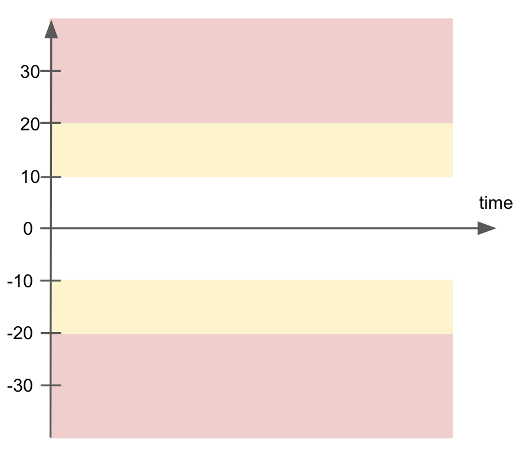

# SodaCL optional check configurations

When you define SodaCL checks for data quality in your checks YAML file, you have the option of adding one or more extra configurations or syntax variations. Read more about [SodaCL metrics and checks](metrics-and-checks.md) in general.

The following optional configurations are available to use with most, though not all, [check types](metrics-and-checks.md#check-types). The detailed documentation for metrics and individual check types indicate specifically which optional configurations are compatible.

## Customize check names

Add a customized, plain-language name to your check so that anyone reviewing the check results can easily grasp the intent of the check.

Add the name to the check as a nested key:value pair, as per the example below.

```yaml
checks for dim_employee:
  - max(vacation_hours) < 80:
      name: Too many vacation hours
```

* Be sure to add the `:` to the end of your check, before the nested content.
* If `name` is configured, Soda Library sends the value of `name` to Soda Cloud as the check identifier.
* Avoid applying the same customized check names in multiple agreements. Soda Cloud associates check results with agreements according to name so if you reuse custom names, Soda Cloud may become confused about which agreement to which to link check results.

\


If you wish, you can use a variable to customize a dynamic check name. Read more about [Filters and variables](filters.md).

```yaml
variables:
  name: Customers UK
checks for dim_customer:
  - row_count > 1:
     name: Row count in ${name}
```

When you run a scan with Soda Library, it uses the value you specified for your variable in the scan results, as in the example below.

```shell
Soda Library 1.0.x
Soda Core 3.0.x
Scan summary:
1/1 check PASSED: 
    dim_customer in adventureworks
      Row count in Customers UK [PASSED]
All is good. No failures. No warnings. No errors.
```

## Add a check identity

Soda Cloud identifies a check using details such as the check definition, the check YAML file name, and the file's location. When you modify an individual check, the check identity changes, which results in a new check in Soda Cloud. For example, the following check sends one check result to Soda Cloud after a scan.

```yaml
checks for dim_customer:
  - missing_count(last_name) > 0
```

If you changed the threshold from `0` to `99`, then after the next scan, Soda Cloud considers this as a new check and discards the previous check result's history; it would appear as though the original check and its results had disappeared. Note that this behaviour _does not_ apply to changing values that use an in-check variable, as in the example below.

```yaml
checks for dataset_1:
  - row_count > ${VAR}

```


If you anticipate modifying a check, you can explicitly specify a check identity so that Soda Cloud can correctly accumulate the results of a single check and retain its history even if the check has been modified. Be sure to complete the steps below _before_ making any changes to the check so that you do not lose the existing check result history.


1. Add an identity property to your check using the identifier you copied as the identity's value.

```yaml
checks for dim_customer:
  - missing_count(last_name) > 99:
         identity: aa457447-60f6-4b09-4h8t-02fbb78f9587
```

2. Choosing a Value for `identity`

The most important rule is that the **`identity`  value must be unique across all your checks**.\
Here are some recommended approaches:

* **Generate a UUID** yourself.
* **Use the generated check ID from Soda Cloud** (available in the check details).
*   **Follow a naming pattern**, for example:

    ```
    {data_source}-{dataset}-{column}-{5 random characters}
    ```

    Example:

    ```
    sales_db-dim_customer-last_name-a8k4z
    ```

This ensures no accidental collisions between checks and preserves a clear mapping over time.

3. Save your changes, then run a scan to push new results to Soda Cloud that include the check identity.
4. With the check identity now associated with the check in Soda Cloud, you may proceed to make changes to the check.


> See also: [Missing check results in Soda Cloud](troubleshoot.md#missing-check-results-in-soda-cloud)


#### Difference Between **Check Identity** and Soda Cloud **Check ID**

It’s important to note that **check identity is not the same as check ID** in Soda Cloud.

* **Check ID**
  * Generated automatically by Soda Cloud as a UUID when a check is first created.
  * Used to uniquely reference that check.
* **Check Identity**
  * Provided by Soda Core, Soda Library, or Soda Agent.
  * Acts as a correlation key so Soda Cloud can associate results with the correct check **even if the check definition changes**.

Think of **check identity** as the _link between old and new versions_ of your check, while the **check ID** is simply the identifier inside Soda Cloud.


## Add alert configurations

When Soda runs a scan of your data, it returns a check result for each check. Each check results in one of three default states:

* **pass**: the values in the dataset match or fall within the thresholds you specified
* **fail**: the values in the dataset _do not_ match or fall within the thresholds you specified
* **error**: the syntax of the check is invalid

However, you can add alert configurations to a check to explicitly specify the conditions that warrant a **warn** result. Setting more granular conditions for a warn, or fail, state of a check result gives you more insight into the severity of a data quality issue.

For example, perhaps 50 missing values in a column is acceptable, but more than 50 is cause for concern; you can use alert configurations to warn you when there are 0 - 50 missing values, but fail when there are 51 or more missing values.

### Configure a single alert

Add alert configurations as nested key:value pairs, as in the following example which adds a single alert configuration. It produces a `warn` check result when the volume of duplicate phone numbers in the dataset exceeds five. Refer to the CLI output below.

```yaml
checks for dim_reseller:
  - duplicate_count(phone):
      warn: when > 5
```

```shell
Soda Library 1.0.x
Soda Core 3.0.x
Scan summary:
1/1 check WARNED: 
    dim_reseller in adventureworks
      duplicate_count(phone) [WARNED]
        check_value: 48
Only 1 warning. 0 failure. 0 errors. 0 pass.
Sending results to Soda Cloud
```

### Configure multiple alerts

Add multiple nested key:value pairs to define both `warn` alert conditions and `fail` alert conditions.

The following example defines the conditions for both a `warn` and a `fail` state. After a scan, the check result is `warn` when there are between one and ten duplicate phone numbers in the dataset, but if Soda Library discovers more than ten duplicates, as it does in the example, the check fails. If there are no duplicate phone numbers, the check passes.

* Be sure to add the `:` to the end of your check, before the nested content.
* Be aware that a check that contains one or more alert configurations only ever yields a [single check result](optional-config.md#expect-one-check-result).

```yaml
checks for dim_reseller:
  - duplicate_count(phone):
      warn: when between 1 and 10
      fail: when > 10
```

```shell
Soda Library 1.0.x
Soda Core 3.0.x
Scan summary:
1/1 check FAILED: 
    dim_reseller in adventureworks
      duplicate_count(phone) [FAILED]
        check_value: 48
Oops! 1 failures. 0 warnings. 0 errors. 0 pass.
Sending results to Soda Cloud
```

### Expect one check result

Be aware that a check that contains one or more alert configurations only ever yields a _single_ check result; one check yields one check result. If your check triggers both a `warn` and a `fail`, the check result only displays the more severe, failed check result. (Schema checks behave slightly differently; see [Schema checks](schema.md#expect-one-check-result).)

Using the following example, Soda Library, during a scan, discovers that the data in the dataset triggers both alerts, but the check result is still `Only 1 warning`. Nonetheless, the results in the CLI still display both alerts as having both triggered a `[WARNED]` state.

```yaml
checks for dim_customer:
  - row_count:
      warn:
        when > 2
        when < 0
```

```sh
Soda Library 1.0.x
Soda Core 3.0.x
Scan summary:
1/1 check WARNED: 
    dim_customer in adventureworks
      row_count warn when > 2 when > 3 [WARNED]
        check_value: 18484
Only 1 warning. 0 failure. 0 errors. 0 pass.
Sending results to Soda Cloud
Soda Cloud Trace: 42812***
```

The check in the example below data triggers both `warn` alerts and the `fail` alert, but only returns a single check result, the more severe `Oops! 1 failures.`

```yaml
checks for dim_product:
  - sum(safety_stock_level):
      name: Stock levels are safe
      warn:
        when > 0
      fail:
        when > 0
```

```sh
Soda Library 1.0.x
Soda Core 3.0.x
Scan summary:
1/1 check FAILED: 
    dim_product in adventureworks
      Stock levels are safe [FAILED]
        check_value: 275936
Oops! 1 failures. 0 warnings. 0 errors. 0 pass.
Sending results to Soda Cloud
Soda Cloud Trace: 6016***
```

### Define zones using alert configurations

Use alert configurations to write checks that define fail or warn zones. By establishing these zones, the check results register as more severe the further a measured value falls outside the threshold parameters you specify as acceptable for your data quality.

The example that follows defines split warning and failure zones in which inner is good, and outer is bad. The chart below illustrates the pass (white), warn (yellow), and fail (red) zones. Note that an individual check only ever yields one check result. If your check triggers both a `warn` and a `fail`, the check result only displays the more serious, failed check result. See [Expect one check result](optional-config.md#expect-one-check-result) for details.

```yaml
checks for CUSTOMERS:
  - row_count:
      warn: when not between -10 and 10
      fail: when not between -20 and 20
```

<figure><figcaption></figcaption></figure>

\


The next example defines a different kind of zone in which inner is bad, and outer is good. The chart below illustrates the fail (red), warn (yellow), and pass (white) zones.

```yaml
checks for CUSTOMERS:
  - row_count:
      warn: when between -20 and 20
      fail: when between -10 and 10
```

<figure><figcaption></figcaption></figure>

## Add a filter to a check

Add a filter to a check to apply conditions that specify a portion of the data against which Soda executes the check. For example, you may wish to use an in-check filter to support a use case in which “Column X must be filled in for all rows that have value Y in column Z”.

Add a filter as a nested key:value pair, as in the following example which filters the scan results to display only those rows with a value of 81 or greater and which contain `11` in the `sales_territory_key` column. You cannot use a variable to specify an in-check filter.

```yaml
checks for dim_employee:
  - max(vacation_hours) < 80:
      name: Too many vacation hours for US Sales
      filter: sales_territory_key = 11
```

If your filter uses a string as a value, be sure to wrap the string in single quotes, as in the following example.

```yaml
checks for dim_employee:
  - max(vacation_hours) < 80:
      name: Too many vacation hours for US Sales
      filter: middle_name = 'Henry'
```

You can use `AND` or `OR` to add multiple filter conditions to a filter key:value pair to further refine your results, as in the following example.

```yaml
checks for dim_employee:
  - max(vacation_hours) < 80:
      name: Too many vacation hours for US Sales
      filter: sales_territory_key = 11 AND salaried_flag = 1
```

To improve the readability of multiple filters in a check, consider adding filters as separate line items, as per the following example.

```yaml
checks for dim_employee:
  - max(vacation_hours) < 80:
      name: Too many vacation hours for US Sales
      filter: sales_territory_key = 11 AND 
              sick_leave_hours > 0 OR
              pay_frequency > 1
```

If your column names use quotes, these quotes produce invalid YAML syntax which results in an error message. Instead, write the check without the quotes or, if the quotes are mandatory for the filter to work, prepare the filter in a text block as in the following example.\


```yaml
checks for my_dataset:
  - missing_count("Email") = 0:
      name: missing email
      filter: |
        "Status" = 'Client'  
```

\


Be aware that if no rows match the filter parameters you set, Soda does not evaluate the check. In other words, Soda first finds rows that match the filter, _then_ executes the check on those rows.

If, in the example above, none of the rows contained a value of `11` in the `sales_territory_key` column, Soda does not evaluate the check and returns a `NOT EVALUATED` message in the CLI scan output, such as the following.

```sh
Soda Library 1.0.x
Soda Core 3.0.x
Scan summary:
1/1 check NOT EVALUATED: 
    dim_employee in adventureworks
      Too many vacation hours for US Sales [NOT EVALUATED]
        check_value: None
1 checks not evaluated.
Apart from the checks that have not been evaluated, no failures, no warnings and no errors.
```

> See [Filters and variables](filters.md) for further details.
>
> See also: [Troubleshoot SodaCL](troubleshoot.md#errors-when-using-in-check-filters).

## Use quotes in a check

In the checks you write with SodaCL, you can apply the quoting style that your data source uses for dataset or column names. Soda Library uses the quoting style you specify in the aggregated SQL queries it prepares, then executes during a scan.

* Note that the type of quotes you use must match that which your data source uses. For example, BigQuery uses a backtick (\`) as a quotation mark.
* Soda does not support quotes in the dataset name identifier, as in `checks for "CUSTOMERS":`

Check:

```yaml
checks for CUSTOMERS:
  - missing("id") = 0
```

Resulting SQL query:

```sql
SELECT
  COUNT(CASE WHEN "id" IS NULL THEN 1 END)
FROM CUSTOMERS
```

## Apply checks to multiple datasets

Add a **for each** section to your checks configuration to specify a list of checks you wish to execute on multiple datasets.

1. Add a `for each dataset T` section header anywhere in your YAML file. The purpose of the `T` is only to ensure that every `for each` configuration has a unique name.
2. Nested under the section header, add two nested keys, one for `datasets` and one for `checks`.
3. Nested under `datasets`, add a list of datasets against which to run the checks. Refer to the example below that illustrates how to use `include` and `exclude` configurations and wildcard characters (%) .
4. Nested under `checks`, write the checks you wish to execute against all the datasets listed under `datasets`.

```yaml
for each dataset T:
  datasets:
    # include the dataset 
    - dim_customers
    # include all datasets matching the wildcard expression
    - dim_products%
    # (optional) explicitly add the word include to make the list more readable
    - include dim_employee
    # exclude a specific dataset
    - exclude fact_survey_response
    # exclude any datasets matching the wildcard expression
    - exclude prospective_%
  checks:
    - row_count > 0
```

#### Limitations and specifics for for each <a href="#limitations-and-specifics-for-for-each" id="limitations-and-specifics-for-for-each"></a>

* For each is not compatible with dataset filters.
* Soda dataset names matching is case insensitive.
* You cannot use quotes around dataset names in a for each configuration.
* If any of your checks specify column names as arguments, make sure the column exists in all datasets listed under the `datasets` heading.
* To add multiple for each configurations, configure another `for each` section header with a different letter identifier, such as `for each dataset R`.

> See [For each](for-each.md) for further details.

## Scan a portion of your dataset

It can be time-consuming to check exceptionally large datasets for data quality in their entirety. Instead of checking whole datasets, you can use a **dataset filter** to specify a portion of data in a dataset against which Soda Library executes a check.

* Except with a `NOW` variable, you cannot use variables in checks you write in an agreement in Soda Cloud as it is impossible to provide the variable values at scan time.
* _Known issue:_ Dataset filters are not compatible with [failed rows checks which use a SQL query](failed-rows-checks.md#define-failed-rows-checks). With such a check, Soda does not apply the dataset filter at scan time.

1. In your checks YAML file, add a section header called `filter`, then append a dataset name and, in square brackets, the name of the filter. The name of the filter _cannot_ contain spaces. Refer to the example below.
2. Nested under the `filter` header, use a SQL expression to specify the portion of data in a dataset that Soda Library must check.
   * The SQL expression in the example references two variables: `ts_start` and `ts_end`.
   * Variables must use the following syntax: `${VAR_NAME}`.
   *   When you run the `soda scan` command, you must include these two variables as options in the command; see step 5.

       ```yaml
       filter CUSTOMERS [daily]:
          where: TIMESTAMP '${ts_start}' <= "ts" AND "ts" < TIMESTAMP '${ts_end}'
       ```
3. Add a separate section for `checks for your_dataset_name [filter name]`. Any checks you nest under this header execute _only_ against the portion of data that the expression in the filter section defines. Refer to the example below.
4.  Write any checks you wish for the dataset and the columns in it.

    ```yaml
    checks for CUSTOMERS [daily]:
      - row_count = 6
      - missing(cat) = 2
    ```
5.  When you wish to execute the checks, use Soda Library to run a scan of your data source and use the `-v` option to include each value for the variables you included in your filter expression, as in the example below.

    ```sh
    soda scan -d snowflake_customer_data -v ts_start=2022-03-11 -v ts_end=2022-03-15 checks.yml
    ```

If you wish to run checks on the same dataset _without_ using a filter, add a separate section for `checks for your_dataset_name` without the appended filter name. Any checks you nest under this header execute against all the data in the dataset.

See [Filters and variables](filters.md) for further details.

## Collect failed rows samples

Soda collects failed rows samples explicitly and implicitly.

To explicitly collect failed row samples, you can add a check to explicitly collect samples of failed rows.

Explicitly, Soda automatically collects 100 failed row samples for the following explicitly-configured checks:

* [failed rows checks](failed-rows-checks.md)
* [user-defined checks](user-defined.md) that use the `failed rows query` configuration

Implicitly, Soda automatically collects 100 failed row samples for the following checks:

* [reference check](reference.md#failed-row-samples)
* checks that use a [missing metric](missing-metrics.md#failed-row-samples)
* checks that use a [validity metric](validity-metrics.md#failed-row-samples)
* checks that use a [duplicate metric](numeric-metrics.md#failed-row-samples)
* [metric reconciliation check](recon.md#metric-reconciliation-checks) that include missing, validity, or duplicate metrics, or reference checks
* [record reconciliation checks](recon.md#record-reconciliation-checks)

Beyond the default behavior of collecting and sending 100 failed row samples to Soda Cloud when a check fails, you can:

* customize the sample size
* customize columns from which to collect samples
* disable failed row collection
* reroute failed row samples to a non-Soda Cloud destination, such as an S3 bucket.

Learn how to [Manage failed row samples](../run-a-scan/failed-row-samples.md).

## Go further

* Reference [tips and best practices for SodaCL](../soda-cl-overview/quick-start-sodacl.md#tips-and-best-practices-for-sodacl).


