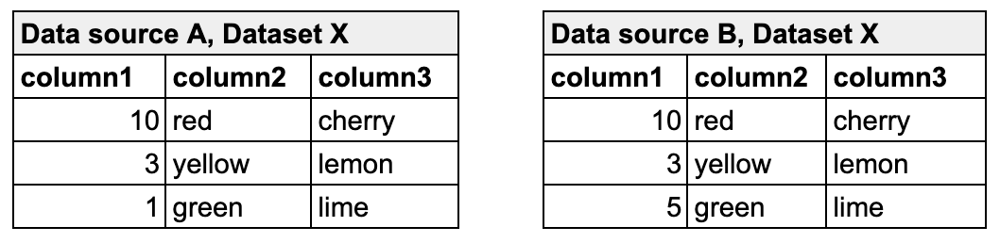
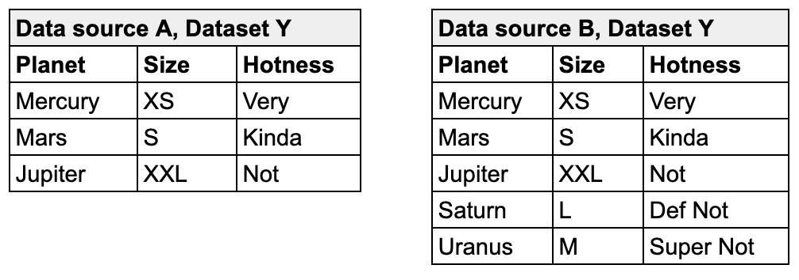
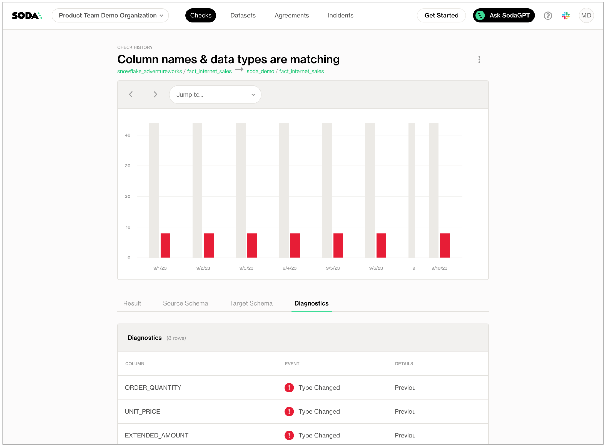
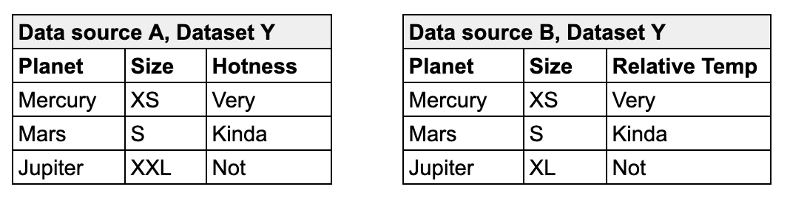

# Reconciliation checks



Use a reconciliation check to validate that target data matches source data before and/or after migrating between data sources.

For example, if you must migrate data from a MySQL data source to a Snowflake data source, you can use reconciliation checks to make sure the MySQL data appears intact in Snowflake in staging before conducting the migration in production.

```yaml
reconciliation Production:
  label: "Reconcile MySQL to Snowflake"
  attributes:
     priority: 3
  datasets:
    source:
      dataset: dim_customer
      datasource: mysql_adventureworks
    target:
      dataset: dim_customer
      datasource: snowflake_retail

  checks:
  # Metric reconciliation checks
    - row_count diff = 0
    - duplicate_count(last_name):
        fail: when diff > 10%
        warn: when diff < 5%
    - avg(total_children) diff < 10
    - name_combo diff = 0:
        name: Name Combo
        source query: |
          SELECT count(*)
          FROM dim_customer
          WHERE first_name = 'Rob' or last_name = 'Walters'
        target query: |
          SELECT count(*)
          FROM dim_customer
          WHERE last_name = 'Walters'

  # Record reconciliation checks
    - rows diff < 5:
        key columns: [customer_key]
    - rows diff = 0:
        strategy: deepdiff
        source columns: [customer_key, region_id]
        target columns: [customer_base_key, region]

  # Schema reconciliation check
    - schema
```

✖️    Requires Soda Core Scientific (included in a Soda Agent)\
✖️    Supported in Soda Core\
✔️    Supported in Soda Library + Soda Cloud\
✔️    Supported in Soda Cloud Agreements + Soda Agent\
✖️    Available as a no-code check

## Prerequisites

* Python version 3.9.x or greater.
* A Soda Cloud account connected to Soda Library via API keys. See [Take a sip of Soda](../quick-start-sip/).
* Soda Library; [install](../quick-start-sip/install.md) one Soda Library package for each of the source and target data sources involved in your migration. See [step 1](recon.md#define-reconciliation-checks), below.

## Types of reconciliation checks

Soda supports four types of reconciliation checks:

* metric reconciliation checks
* record reconciliation checks
* schema reconciliation checks
* reference reconciliation checks

A **metric reconciliation check** calculates the measurement of a metric such as `sum` or `avg` on data in the same dataset in two different data sources; where the delta between calculated measurements differs to the extent that it exceeds the threshold you set in the check, the check fails. Note, you can also compare data between datasets within the same data source.

In other words, the check validates the delta between calculated measurements of a metric in multiple datasets.

In the following example, the metric reconciliation check calculates the sum of column 1 in dataset X in both data source A and data source B. The calculated value of each is the measurement for the sum metric. It then compares the calculated measurements and gauges the difference between them. In this example, the difference between measurements is `4`, so the check passes.

```yaml
reconciliation Production:
  label: "Recon metric check"
  datasets:
    source:
      dataset: dataset X
      datasource: Data source A
    target:
      dataset: dataset X
      datasource: Data source B
  checks:
    - sum(column1) < 5
```

<figure><figcaption></figcaption></figure>

Read more about [metrics, measurements, and thresholds](metrics-and-checks.md) in general.

A **record reconciliation check** performs a row-to-row comparison of the contents of each column, or specific columns, in datasets in two different data sources; where the values do not match exactly, the check fails. The numeric value the check result produces represents the number of rows with different, additional, or missing contents.

For example, the following check compares the entire contents of dataset Y in data source A and dataset Y in data source B. Though the contents of the rows match exactly, one dataset contains additional rows, so it is not an exact match and the reconciliation check fails with a numeric value of `2`.

```yaml
reconciliation Production:
  label: "Recon diff check"
  datasets:
    source:
      dataset: dataset Y
      datasource: Data source A
    target:
      dataset: dataset Y
      datasource: Data source B
  checks:
    - rows diff = 0:
        key columns: [Planet]
```

<figure><figcaption></figcaption></figure>

Read more about the strategies and optional configurations you can add to a [record reconciliation check](recon.md#record-reconciliation-checks).

A **schema reconciliation check** compares the columns of two datasets to reveal any differences between target and source; where the columns names differ, or the data type has changed, Soda registers a mismatch and the check fails.

```yaml
reconciliation Production:
  label: "Recon diff check"
  datasets:
    source:
      dataset: dataset Y
      datasource: Data source A
    target:
      dataset: dataset Y
      datasource: Data source B
  checks:
    - schema
```

<figure><figcaption></figcaption></figure>

A **reference reconciliation check** verifies that all target values exist in the source. It performs the same comparison as a standard reference check but uses a different mechanism, allowing you to validate referential integrity across different data sources.

```yaml
reconciliation Production:
  label: "Recon diff check"
  datasets:
    source:
      dataset: dataset Y
      datasource: Data source A
    target:
      dataset: dataset Y
      datasource: Data source B
  checks:
    - values in target must exist in source:
        source columns: [first_name, last_name]
        target columns: [fname, lname]
```

### Best practice for using reconciliation checks

To efficiently use resources at scan time, best practice dictates that you first configure and run metric reconciliation checks, then use the output to write refined record reconciliation checks to fine-tune the comparison.

Depending on the volume of data on which you must perform reconciliation checks, metric recon checks run considerably faster and use much fewer resources. Start by defining metric reconciliation checks that test grouping, filters, and joins to get meaningful insight into whether your ingestion or transformation works as expected. Where these checks do not surface all the details you need, or does not provide enough confidence in the output, then proceed with record reconciliation checks.

For running record reconciliation checks, if primary keys exist in your dataset, best practice recommends that you use a `simple` strategy for executing a record-by-record comparison. This strategy loads rows into memory in batches, thereby reducing the risk of system overload and increasing the speed with which Soda can execute the comparison. See [Record reconciliation checks](recon.md#record-reconciliation-checks) for details about strategies.

Read more about [Limitations and constraints](recon.md#limitations-and-constraints).

## Define reconciliation checks

The following outlines the basic steps to configure and execute reconciliation checks.

1. [Install](../quick-start-sip/install.md) a Soda Library package for both the migration source and target data sources. For the very first example above, you would install both `soda-mysql` and `soda-snowflake`. If you use a Soda Agent and connect data sources via Soda Cloud, add both data sources to your account.
2. [Configure](../quick-start-sip/install.md#configure-soda) both data sources in a configuration YAML file, and add your `soda_cloud` configuration. For the very first example above, you would add both [MySQL](../data-source-reference/connect-mysql.md) and [Snowflake](../data-source-reference/connect-snowflake.md) connection configuration details to a configuration YAML file.
3. Prepare a `recon.yml` file or new Soda agreement and configure the reconciliation metadata; see details below.
4. Define reconciliation checks to compare data between data sources; see details below.
5. [Run a Soda scan](../run-a-scan/) against either the source or target data source to execute the reconciliation checks and review results in the command-line output and in Soda Cloud. Note that check results are associated with the _target_ dataset in Soda Cloud.

```shell
soda scan -d mysql_adventureworks -c configuration.yml recon.yml

```

To define reconciliation checks, best practice dictates that you prepare a separate agreement or a `recon.yml` file separate from your checks YAML file which contains regular, non-reconciliation checks for data quality in your data source. Technically, you can use one YAML file or agreement to contain all recon and regular SodaCL checks, but troubleshooting and issue investigation is easier if you use separate files.

In a `recon.yml` file, you must first provide reconciliation metadata for the checks, as per the configuration in the example and table below.

```yaml
reconciliation my_project_name:
  label: "Reconcile MySQL to Snowflake"
  attributes:
     priority: 3
  datasets:
    source:
      dataset: dim_customer
      datasource: mysql_adventureworks
    target:
      dataset: dim_customer
      datasource: snowflake_retail

  checks:
    - row_count diff = 0
```

| `reconciliation my_project_name` | required | An identifier for the reconciliation project.                                                                                                                                                                                 |
| -------------------------------- | -------- | ----------------------------------------------------------------------------------------------------------------------------------------------------------------------------------------------------------------------------- |
| `label`                          | required | An identifier that prepends check result name identifiers in Soda Cloud.                                                                                                                                                      |
| `attributes`                     | optional | <p>A list of attributes that Soda applies to the reconciliation project’s check results in Soda Cloud so that you can filter and find the project’s results.<br>See: <a href="recon.md#add-attributes">Add attributes</a></p> |
| `datasets`                       | required | A subheading to contain the list of datasets to apply your reconciliation checks.                                                                                                                                             |
| `source`                         | required | Key-value pairs to identify the `dataset` and `data source` of the source, or origin location of the data to be migrated.                                                                                                     |
| `target`                         | required | Key-value pairs to identify the `dataset` and `data source` of the target, or destination location of the data to be migrated.                                                                                                |
| `checks`                         | required | A subheading to contain the checks that reconcile the data between source and target. In this section, you can define any number of both metric and record reconciliation checks; see details below.                          |


### Metric reconciliation checks

The syntax of metric reconciliation checks follows the basic patterns of standard SodaCL metrics and checks with the addition of `diff` in the syntax. Metric reconciliation checks do not support _all_ SodaCL metrics and checks; see [compatible checks and metrics](recon.md#list-of-compatible-metrics-and-checks-for-metric-reconciliation-checks) below.

For example, you define a regular SodaCL check for data quality that checks for duplicate values in a `last_name` column as follows:

```yaml
checks for dim_customer:
  - duplicate_count(last_name) = 0
```

For a metric reconciliation check, you add the word `diff` to indicate that it ought to compare the count of duplicate values between the source dataset and the target dataset to confirm that the delta between those counts is zero. Refer to examples below.

Note that with reconciliation checks, there is no need to identify the dataset as you specified both source and target datasets in the project metadata configuration.

```yaml
reconciliation Production:
...
  checks:
    - duplicate_count(last_name) diff = 0
    - avg(total_children) diff < 10
    - freshness(date_first_purchase) diff < 100h
    - row_count:
        fail: when diff > 10%
        warn: when diff between 5% and 9%
    - missing_count(middle_name) diff = 0:
        samples columns: [last_name, first_name]
```

When you [run a scan](../run-a-scan/) against either the source or target data source, the `Scan summary` in the output indicates the check value, which is the calculated delta between measurements, the measurement value of each metric or check for both the source and target datasets, along with the diff value and percentage, and the absolute value and percentage.

```shell
soda scan -d adventureworks -c configuration.yml recon2.yml
Soda Library 1.x.x
Soda Core 3.0.xx
xxx
Sending failed row samples to Soda Cloud
Sending failed row samples to Soda Cloud
Sending failed row samples to Soda Cloud
Scan summary:
3/5 checks PASSED:
    dim_customer in aws_postgres_retail
      Recon Test: duplicate_count(last_name) diff = 0 [PASSED]
      Recon Test: avg(total_children) diff < 10 [PASSED]
      freshness(date_first_purchase) diff < 100h [PASSED]
1/5 checks WARNED:
    dim_customer in aws_postgres_retail
      Recon Test: row_count warn when diff < 5% fail when diff > 10% [WARNED]
        check_value: 0.0
        source_row_count: 18484
        target_row_count: 18484
        diff_value: 0
        diff_percentage: 0.0%
1/5 checks FAILED:
    dim_customer in aws_postgres_retail
      Recon Test: missing_count(middle_name) diff = 0 [FAILED]
        check_value: 7830
        source_missing_count: 7830
        target_missing_count: 0
        diff_value: 7830
        diff_percentage: 100.0%
Oops! 1 failure. 1 warning. 0 errors. 3 pass.
Sending results to Soda Cloud
Soda Cloud Trace: 6925***98
```

\


To customize your metric reconciliation checks, you can borrow from the syntax of [failed rows checks](failed-rows-checks.md) to execute SQL queries on the source and target datasets. You can also write a [user-defined check](user-defined.md) to define a SQL query or a common table expression (CTE) that Soda executes on both datasets to reconcile data; see examples below.

```yaml
reconciliation Production:
...
  checks:
    - name_combo diff = 0:
        name: Name Combo
        source query: |
          SELECT count(*)
          FROM dim_customer
          WHERE first_name = 'Rob' or last_name = 'Walters'
        target query: |
          SELECT count(*)
          FROM dim_customer
          WHERE last_name = 'Walters'

    - average_children diff = 0:
        average_children expression: avg(total_children)
```

Learn about reconciliation check [Limitations and constraints](recon.md#limitations-and-constraints).

### Record reconciliation checks

_Requires Soda Library 1.2.0 or greater_\
The syntax of record reconciliation checks expects a `rows diff` input to perform a record-by-record comparison of data between datasets. Choose between two strategies to refine how this type of check executes during a Soda scan:

* `simple`
* `deepdiff`

```yaml
reconciliation Production:
  label: "Reconcile Planet Info"
  datasets:
    source:
      dataset: dataset_Y
      datasource: datasource_A
    target:
      dataset: dataset_Y
      datasource: datasource_B

  checks:
  # simple strategy with default page and batch sizes
  # If not explicitly defined, Soda defaults to simple strategy
    - rows diff = 0:
        key columns: [Planet, Size]
  # simple strategy with custom page and batch sizes
    - rows diff = 0:
        key columns: [Planet, Size]
        batch size: 100
        page size: 1000
  # simple strategy with different primary key column names
    - rows diff < 5:
        source key columns: [Planet, Hotness]
        target key columns: [Planet, Relative Temp]
  # simple strategy with different primary key column names and different number of columns
  - rows diff < 5:
        source key columns: [City]  # Key columns to match rows between source and target
        target key columns: [Town]
        source columns: [City, Hotness] # Columns Soda compares in the source table
        target columns: [Town, Relative Temp] # Columns Soda compares in the target table
  # deepdiff strategy
    - rows diff = 0:
        strategy: deepdiff
```

The `simple` strategy works by processing record comparisons according to one or more primary key identifiers in batches and pages. This type of processing serves to temper large-scale comparisons by loading rows into memory in batches so that a system is not overloaded; it is typically faster than the `deepdiff` strategy.

* If you do not specify a `strategy`, Soda executes the record reconciliation check using the `simple` strategy.
* If you do not specify `batch size` and/or `page size`, Soda applies default values of `1` and `100000`, respectively.
* If you want to use `simple` strategy for comparing datasets with different numbers of columns, you must define the key columns that order the data and match rows between the two datasets. Additionally, you must map the source columns to the target columns that you wish to compare.

The `deepdiff` strategy works by processing record comparisons of entire datasets by loading all rows into memory at once. This type of processing is more memory-heavy but allows you to work without primary key identifiers, or without specifying any other details about the data to be compared; it is typically slower than the `simple` strategy.

#### Record reconciliation strategy comparison

|                                                                                   | Simple strategy                                                | Deepdiff strategy                                      |
| --------------------------------------------------------------------------------- | -------------------------------------------------------------- | ------------------------------------------------------ |
| Default strategy                                                                  | ✓                                                              |                                                        |
| Processing                                                                        | Loads rows into memory one by one, or by batch for comparison  | Loads all rows into memory for comparison              |
| Specify key columns                                                               | Required; can be one or more keys                              | Optional                                               |
| Specify batch and page sizes                                                      | Optional                                                       | N/A                                                    |
| Specify column-constrained comparisons                                            | Optional                                                       | Optional                                               |
| Best for                                                                          | Standard comparisons in which a primary key exists in the data | Comparisons in which no primary key exists in the data |
| <p>Benchmark:<br>    10 columns<br>    1% changes in target<br>    500K rows</p>  | <p>&#x3C;80MB RAM<br>9s to execute diff</p>                    | <p>8GB RAM<br>136s to execute diff</p>                 |
| <p>Benchmark:<br>    360 columns<br>    1% changes in target<br>    100K rows</p> | <p>&#x3C;80MB RAM<br>1m to execute diff</p>                    | <p>8GB RAM<br>~6m to execute diff</p>                  |
| <p>Benchmark:<br>    360 columns<br>    1% changes in target<br>    1M rows</p>   | <p>&#x3C;80MB RAM<br>35m to execute diff</p>                   | does not compute on 16GB RAM machine                   |

\


Beyond choosing a strategy, you can configure a number of granular details for Soda to refine its execution of a record reconciliation check.

| Configuration                                    | Compares                                                                                                                                                                                   | Description and example                                                                                                                                                                                                                                                                                                                                                                                                                      |
| ------------------------------------------------ | ------------------------------------------------------------------------------------------------------------------------------------------------------------------------------------------ | -------------------------------------------------------------------------------------------------------------------------------------------------------------------------------------------------------------------------------------------------------------------------------------------------------------------------------------------------------------------------------------------------------------------------------------------- |
| Column-constrained                               | Only the data in a specified list of columns.                                                                                                                                              | In the example below, the first check applies a `deepdiff` strategy and compares _only_ the contents of the listed columns, mapping the columns according to the order in which they appear in the list– Planet to Planet, Hotness to Relative Temp. This check passes because the values of the mapped columns are the same.                                                                                                                |
| With composite primary key                       | The entire contents of the datasets, specifying columns to define a primary key in the source.                                                                                             | In the example below, the second check applies a `simple` strategy by default and uses the `key columns` you identify to form a primary key in the source that defines a single record. Soda uses the key to map records between datasets. Note that you can list column names as comma-separated values in square brackets, or as an unordered list as in the example. This check fails because of the mismatched value for Jupiter's size. |
| With different primary keys in source and target | The entire contents of the datasets, specifying columns to define mutiple primary keys in both the source and target. This is useful when the column names in your datasets are different. | In the example below, the third check applies a `simple` strategy by default and enables you to define the primary keys in both the source and target datasets. Soda uses the key to map records between datasets. This check passes because with only one failed row, it does not exceed the threshold of `5` that the check sets.                                                                                                          |

```yaml
reconciliation Production:
...
  checks:
    # Column-constrained
    - rows diff = 0:
        strategy: deepdiff
        source columns: [Planet, Hotness]
        target columns: [Planet, Relative Temp]
    # With composite primary key
    - rows diff = 0:
        key columns:
          - Planet
          - Size
    # With different primary keys in source and target
    - rows diff < 5:
        source key columns: [Planet, Hotness]
        target key columns: [Planet, Relative Temp]
```

<figure><figcaption></figcaption></figure>

\


To customize your record reconciliation checks, you can borrow from the syntax of [failed rows checks](failed-rows-checks.md) to execute SQL queries on the source and target datasets. You can also write a [user-defined check](user-defined.md) to define a SQL query or a common table expression (CTE) that Soda executes record-by-record on both datasets to reconcile data; see example below.

```yaml
reconciliation records_recon_check:
  datasets:
    source:
      dataset: retail_customers
      datasource: postgres_soda_demo_data_testing
    target:
      dataset: retail_customers_sfdc
      datasource: postgres_soda_demo_data_testing

  checks:
    - rows diff = 0:
        strategy: deepdiff
        source query: |
          SELECT DISTINCT salary
          FROM retail_customers
        target query: |
          SELECT DISTINCT annual_pay
          FROM retail_sfdc_customers
```

#### Custom value comparator

If you use programmatic Soda scans to execute reconciliation checks, you may wish to use a custom value comparator, an example of which follows.

```python
from soda.scan import Scan

from soda.execution.compare.value_comparator import ValueComparator

from datetime import datetime

class CustomValueComparator(ValueComparator):

    def equals(self, x, y):

        # Ignore microsecond difference less than 4ms in datetimes

        if isinstance(x, datetime) and isinstance(y, datetime):

            xms = x.microsecond

            yms = y.microsecond

            ms_diff = abs(xms - yms)

            if ms_diff > 0 and ms_diff <= 4000:

                x = x.replace(microsecond=0)

                y = y.replace(microsecond=0)

        return x == y

if __name__ == "__main__":

    s = Scan()

    s.value_comparator = CustomValueComparator()

    s.set_scan_definition_name("test_scan")

    s.set_verbose(True)

    s.set_data_source_name("soda_demo")

    s.add_configuration_yaml_file("configuration.yml")

    s.add_sodacl_yaml_file("perf.yml")

    s.execute()

    print(s.get_logs_text())

    print(s.build_scan_results())
```

\


### Schema reconciliation checks

The syntax of schema reconciliation checks is simple, and without configuration details beyond the check identifier.

```yaml
reconciliation Production:
...
  checks:
    - schema
```

Optionally, you can add a mapping configuration to a schema check to properly compare columns that use different data types. For example, you can use this configuration to map the comparison of a Snowflake column that uses Boolean and an MSSQL Server column that uses bit.

```yaml
reconciliation Production:
  label: "Reconcile MS SQL to Snowflake"
  datasets:
    source:
      dataset: opt-in-campaign
      datasource: sqlserver1
    target:
      dataset: optin-campaign
      datasource: snowflake_retail

  checks:
    - schema:
        types:
          - source: bit
            target: boolean
          - source: enum
            target: string
```

### Reference reconciliation checks

_Requires Soda Library 1.11.2 or greater_\


A reference reconciliation check assesses whether all target values are present in the source. It validates referential integrity across data sources by checking that each value in the target column(s) has a corresponding match in the source column(s).

The check is performed on the target dataset, which is treated as the dataset under test. If it contains missing values from the source, those discrepancies will be flagged.\
To configure this check, you must specify the column(s) in the source and target to compare

This check supports two **primary use cases**:

* Downstream-upstream consistency: Verify that records in a downstream dataset (target dataset) also exist in an upstream dataset (source dataset).
* Reference table validation: Validate that values in a dataset (target dataset) exist in a reference or lookup table (source dataset), such as ensuring all country codes in your data are part of a standardized country code list.

```yaml
reconciliation Production:
  label: "Reference check"
  datasets:
    source:
      dataset: dataset Y
      datasource: Data source A
    target:
      dataset: dataset Y
      datasource: Data source B
  checks:
    - values in target must exist in source:
        source columns: [first_name, last_name]
        target columns: [fname, lname]
```

### Add attributes

Add attributes to reconciliation checks to organize your checks and alert notifications in Soda Cloud. For example, you can apply attributes to checks to label and sort check results by department, priority, location, etc.

You can add custom attributes to reconciliation checks in two ways:

* in bulk, so that Soda adds the attribute to all checks in the reconciliation project
* individually, so that Soda adds the attribute to individual reconciliation checks in the project

After following the instructions to [create a check attribute](../collaborate/check-attributes.md) in Soda Cloud, you can add the attribute to a reconciliation project, and/or to individual checks, as in the following example.

Where attribute values for the project and the individual check conflict or overlap, Soda uses the value for the individual check.

```yaml
reconciliation Production:
  label: "Reconcile MySQL to Snowflake"
  # Soda adds this attribute to each check in the reconciliation project
  attributes:
     priority: 3
  datasets:
    source:
      dataset: dim_customer
      datasource: mysql_adventureworks
    target:
      dataset: dim_customer
      datasource: snowflake_retail
  checks:
    - row_count diff = 0:
        # Soda adds this attribute to this check, only.
        attributes:
           department: [Marketing]
    - rows diff:
        # Soda adds this attribute to this check, only.
        name: Row diff check
        attributes:
            department: [Development]
        fail: when > 10
        warn: when between 5 and 9
```

\


### Add a filter

You can add a filter to a reconciliation project's configuration to constrain the data on which Soda executes the reconciliation checks. Refer to the example below.

Best practice dictates that you add filters when using record reconciliation checks to mitigate heavy memory usage and long scan times when performing record-to-record comparisons of data. See [Limitations and constraints](recon.md#limitations-and-constraints).

```yaml
reconciliation Production:
  label: "Recon Test"
  datasets:
    source:
      dataset: dim_customer
      datasource: adventureworks
      filter: total_children > 3
    target:
      dataset: dim_customer
      datasource: aws_postgres_retail

  checks:
    - row_count diff = 0
```

Output:

```shell
soda scan -d adventureworks -c configuration.yml recon2.yml
Soda Library 1.x.x
Soda Core 3.0.x
...
Scan summary:
1/1 check FAILED:
    dim_customer in aws_postgres_retail
      row_count diff = 0 [FAILED]
        check_value: 14757
        source_row_count: 3727
        target_row_count: 18484
        diff_value: 14757
        diff_percentage: 395.95%
Oops! 1 failures. 0 warnings. 0 errors. 0 pass.
Sending results to Soda Cloud
Soda Cloud Trace: 4380***10
```

\


### Failed row samples

Record reconciliation checks and metric reconcilication checks that borrow from `failed rows` check syntax such as the `name_combo` check in the example above, explicitly collect samples of any failed rows to display in Soda Cloud. The default number of failed row samples that Soda collects and displays is 100.

> Read more [About failed row samples](../run-a-scan/failed-row-samples.md#about-failed-row-samples).


If you wish to limit or broaden the sample size, you can add the `samples limit` configuration to a check. Read more about [Setting a sample limit](../run-a-scan/failed-row-samples.md#set-a-sample-limit).

```yaml
checks:
  - rows diff = 0:
      samples limit: 20
```

\


Alternatively, you can set the `samples limit` to `0` to prevent Soda from collecting and sending failed rows samples for an individual check, as in the following example.

```yaml
checks:
  - rows diff = 0:
      samples limit: 0
```

\


To review the failed rows in Soda Cloud, navigate to the **Checks** dashboard, then click the row for a the grouped reference checks. Examine failed rows in the **Failed Rows Analysis** tab; see [Manage failed row samples](../run-a-scan/failed-row-samples.md) for further details.\


### List of compatible metrics and checks for metric reconciliation checks

| Metric or check     | Supported data sources                                                                                    |
| ------------------- | --------------------------------------------------------------------------------------------------------- |
| `avg`               | all                                                                                                       |
| `avg_length`        | all                                                                                                       |
| `duplicate_count`   | all                                                                                                       |
| `duplicate_percent` | all                                                                                                       |
| `failed rows`       | all                                                                                                       |
| `freshness`         | all                                                                                                       |
| `invalid_count`     | <p>Athena<br>BigQuery<br>DB2<br>SQL Server<br>PostgreSQL<br>Redshift<br>Snowflake<br>Spark DataFrames</p> |
| `invalid_percent`   | <p>Athena<br>BigQuery<br>DB2<br>SQL Server<br>PostgreSQL<br>Redshift<br>Snowflake<br>Spark DataFrames</p> |
| `max`               | all                                                                                                       |
| `max_length`        | all                                                                                                       |
| `min`               | all                                                                                                       |
| `min_length`        | all                                                                                                       |
| `missing_count`     | <p>Athena<br>BigQuery<br>DB2<br>SQL Server<br>PostgreSQL<br>Redshift<br>Snowflake<br>Spark DataFrames</p> |
| `missing_percent`   | <p>Athena<br>BigQuery<br>DB2<br>SQL Server<br>PostgreSQL<br>Redshift<br>Snowflake<br>Spark DataFrames</p> |
| `percentile`        | <p>PostgreSQL<br>Snowflake</p>                                                                            |
| `row_count`         | all                                                                                                       |
| `stddev`            | <p>Athena<br>BigQuery<br>PostgreSQL<br>Redshift<br>Snowflake</p>                                          |
| `stddev_pop`        | <p>Athena<br>BigQuery<br>PostgreSQL<br>Redshift<br>Snowflake</p>                                          |
| `stddev_samp`       | <p>Athena<br>BigQuery<br>PostgreSQL<br>Redshift<br>Snowflake</p>                                          |
| `sum`               | all                                                                                                       |
| `user-defined`      | all                                                                                                       |
| `variance`          | <p>Athena<br>BigQuery<br>PostgreSQL<br>Redshift<br>Snowflake</p>                                          |
| `var_pop`           | <p>Athena<br>BigQuery<br>PostgreSQL<br>Redshift<br>Snowflake</p>                                          |
| `var_samp`          | <p>Athena<br>BigQuery<br>PostgreSQL<br>Redshift<br>Snowflake</p>                                          |

## Optional check configurations

<table><thead><tr><th width="100" align="center">Supported</th><th>Configuration</th><th>Documentation</th></tr></thead><tbody><tr><td align="center">✓</td><td>Define a name for a reconciliation check; see <a href="https://docs.soda.io/soda-cl/recon.html#example-with-name">example</a>.</td><td><a href="optional-config.md#customize-check-names">Customize check names</a></td></tr><tr><td align="center">✓</td><td>Add an identity to a check; see <a href="https://docs.soda.io/soda-cl/recon.html#example-with-identity">example</a>.</td><td><a href="https://docs.soda.io/soda-cl/optional-config.html#add-a-check-identity">Add a check identity</a></td></tr><tr><td align="center">✓</td><td>Define alert configurations to specify warn and fail alert conditions; see <a href="https://docs.soda.io/soda-cl/recon.html#example-with-alerts">example</a>.<br><em>Exception:</em> schema reconciliation checks do not support alert configurations.</td><td><a href="optional-config.md#add-alert-configurations">Add alert configurations</a></td></tr><tr><td align="center"> </td><td>Apply an in-check filter to return results for a specific portion of the data in your dataset.</td><td>-</td></tr><tr><td align="center">✓</td><td>Use quotes when identifying dataset or column names; see <a href="https://docs.soda.io/soda-cl/recon.html#example-with-quotes">example</a>.<br>Note that the type of quotes you use must match that which your data source uses. For example, BigQuery uses a backtick (`) as a quotation mark.</td><td><a href="optional-config.md#use-quotes-in-a-check">Use quotes in a check</a></td></tr><tr><td align="center"> </td><td>Use wildcard characters ( % or * ) in values in the check.</td><td>-</td></tr><tr><td align="center"> </td><td>Use for each to apply reconciliation checks to multiple datasets in one scan.</td><td>-</td></tr><tr><td align="center"> </td><td>Apply a dataset filter to partition data during a scan.</td><td>-</td></tr><tr><td align="center"> </td><td>Supports <code>samples columns</code> parameter to specify columns from which Soda draws failed row samples.</td><td><a href="../run-a-scan/failed-row-samples.md#customize-sampling-for-checks">Customize sampling for checks</a></td></tr><tr><td align="center">✓</td><td>Supports <code>samples limit</code> parameter to control the volume of failed row samples Soda collects.</td><td><a href="../run-a-scan/failed-row-samples.md#set-a-sample-limit">Set a sample limit</a></td></tr><tr><td align="center">✓</td><td>Supports <code>collect failed rows</code> parameter instruct Soda to collect, or not to collect, failed row samples for a check.</td><td><a href="../run-a-scan/failed-row-samples.md#customize-sampling-for-checks">Customize sampling for checks</a></td></tr></tbody></table>

#### Example with name

```yaml
  checks:
    - rows diff between 35000 and 36000:
        name: Simple row diff
```

#### Example with identity

```yaml
  checks:
    - duplicate_count(last_name) diff < 1:
        identity: 05229d67-e3f0-***-a327-b2***84
```

#### Example with alerts

```yaml
  checks:
    - row_count:
        fail: when diff > 10%
        warn: when diff between 5% and 9%
```

#### Example with quotes

```yaml
  checks:
    - duplicate_count("last_name") diff = 0
```

\


## Limitations and constraints

* The Python environment in which `deepdiff` record reconciliation checks run consumes more time/CPU/memory because this type of check loads all data into memory to execute a comparison. Because record-to-record comparison is dense, exercise caution when executing scans with record reconciliation checks as they can cause usage spikes in the data source, and cost spikes in case of cloud-managed data sources. Best practice dictates that you [add filters](recon.md#add-a-filter) and use [column-constrained](recon.md#record-reconciliation-checks) record reconciliation checks whenever possible to mitigate cost and performance issues. See also: [Best practice for using reconciliation checks](recon.md#best-practice-for-using-reconciliation-checks).
* Reconciliation checks on TEXT type columns are case sensitive.
* Record reconciliation checks do not support `samples columns` configuration.
* Reconciliation checks do not support `exclude columns` in the data source configuration in a configuration YAML file; see Disable failed rows sampling for [specific columns](../run-a-scan/failed-row-samples.md#disable-failed-row-samples).\
  \* \*\*\*Known issue\*\*\*: Do not define a threshold as a percentage \`%\` if you expect the measurement of a metric to equal \`0\`. Using a percentage for a threshold causes an error for an absolute check; the check evaluates correctly but the error persists with a non-zero exit command.

## Go further

* Learn more about [SodaCL metrics and checks](metrics-and-checks.md) in general.
* Learn more about [Comparing data using SodaCL](../soda-cl-overview/compare.md).
* Use a [schema check](schema.md) to discover missing or forbidden columns in a dataset.
* Reference [tips and best practices for SodaCL](../soda-cl-overview/quick-start-sodacl.md#tips-and-best-practices-for-sodacl).


