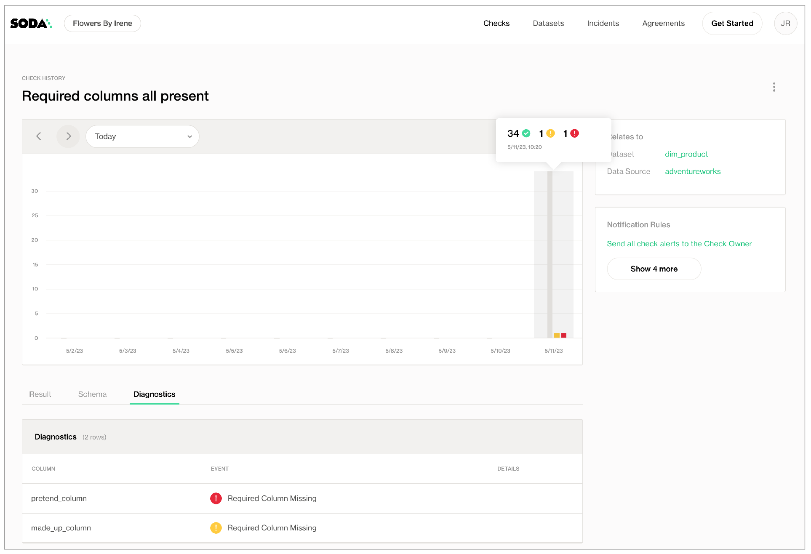

# Schema checks

Use a schema check to validate the presence, absence or position of columns in a dataset, or to validate the type of data column contains.

```yaml
checks for dim_product:
  - schema:
      name: Confirm that required columns are present
      warn:
        when required column missing: [weight_unit_measure_code, product_subcategory_key, made_up_column]
      fail:
        when required column missing:
          - product_key 
          - product_alternate_key
  - schema:
      warn:
        when forbidden column present: [credit_card]
        when wrong column type:
          standard_cost: money
      fail:
        when forbidden column present: [pii*]
        when wrong column type:
          reorder_point: smallint
  - schema:
      name: Columns out of order
      warn:
        when wrong column index:
          style: 1
      fail:
        when wrong column index:
          model_name: 22
  - schema:
      name: Any schema changes
      warn: 
        when schema changes: any
```

## Define schema checks

✖️    Requires Soda Core Scientific (included in a Soda Agent)\
✔️    Supported in Soda Core\
✔️    Supported in Soda Library + Soda Cloud\
✔️    Supported in Soda Cloud Agreements + Soda Agent\
✔️    Available as a no-code check with a self-hosted Soda Agent connected to any Soda-supported data source, except Spark, and Dask and Pandas\
&#x20;       OR\
&#x20;       with a Soda-hosted Agent connected to a BigQuery, Databricks SQL, MS SQL Server, MySQL, PostgreSQL, Redshift, or Snowflake data source\
\


In the context of [SodaCL check types](metrics-and-checks.md#check-types), schema checks are unique. Schema checks always employ alert configurations – specifying warn and/or fail alert conditions – with **validation keys**. Refer to [Add alert configurations](optional-config.md#add-alert-configurations) for exhaustive alert configuration details.

The validation key:value pairs in schema checks set the conditions for a warn or a fail check result. See a [List of validation keys](schema.md#list-of-validation-keys) below.

For example, the following check uses the `when required column missing` validation key to validate that specific columns are present in a dataset; if any of columns in the list are absent, the check result is fail.

```yaml
checks for dim_product:
  - schema:
      fail:
        when required column missing:
          - standard_cost
          - list_price
          - weight
```

In the example above, the value for the validation key is in a nested list format, but you can use an inline list of comma-separated values inside square brackets instead. The following example yields identical check results to the example above.

```yaml
checks for dim_product:
  - schema:
      fail:
        when required column missing: [standard_cost, list_price, weight]

```

You can define a schema check with both warn and fail alert conditions, each with multiple validation keys. Refer to [Configure multiple alerts](optional-config.md#configure-multiple-alerts) for details. Be aware, however, that a single schema check only ever produces a _single check result_. See [Expect one check result](schema.md#expect-one-check-result) below for details.

The following example is a single check; Soda executes each of its validations during a scan. Note that unlike the nested list of column names in the example above, the nested key:value pairs that form the value for these validation keys are indented, but do not use a `-`.

```yaml
checks for dim_product:
  - schema:
      warn:
        when forbidden column present: [standard_cost]
        when wrong column type:
          standard_cost: money
          weight: double precision
      fail:
        when forbidden column present: [sombrero]
        when wrong column type:
          reorder_point: smallint
```

\


Add a `schema_name` parameter to a schema check to address a situation in which you need to explicitly identify or override a dataset's schema in the data source.

```yaml
checks for dim_employee:
   - schema:
      schema_name: staff.pr
      name: Required columns present
      warn:
        when required column missing: [last_name, birth_date]
```

\


## Define schema evolution checks

✖️    Requires Soda Core Scientific (included in a Soda Agent)\
✖️    Supported in Soda Core\
✔️    Supported in Soda Library + Soda Cloud\
✔️    Supported in Soda Cloud Agreements + Soda Agent\
✔️    Available as a no-code check with a self-hosted Soda Agent connected to any Soda-supported data source, except Spark, and Dask and Pandas\
✔️    Available as a no-code check with a Soda-hosted Agent connected to a BigQuery, Databricks SQL, MS SQL Server, MySQL, PostgreSQL, Redshift, or Snowflake data source\
\


Rather than specifying exact parameters for column changes, you can use the `when schema changes` validation key to warn or fail when indistinct changes occur in a dataset.

Soda Cloud must have at least two measurements to yield a check result. In other words, the first time you run a scan to execute a schema evolution check, Soda returns no results because it has nothing against which to compare; the second scan that executes the check yields a check result.

```yaml
checks for dim_customer:
  - schema:
      warn:
        when schema changes: any
      fail:
        when schema changes: 
         - column delete
         - column add
         - column index change
         - column type change
```

The output in Soda Cloud displays the output of all the alert states during the scan.

<figure><figcaption></figcaption></figure>

## Optional check configurations

<table><thead><tr><th width="100" align="center">Supported</th><th>Configuration</th><th>Documentation</th></tr></thead><tbody><tr><td align="center">✓</td><td>Define a name for a schema check; see <a href="schema.md#example-with-check-name">example</a>.</td><td><a href="optional-config.md#customize-check-names">Customize check names</a></td></tr><tr><td align="center">✓</td><td>Add an identity to a check.</td><td><a href="https://docs.soda.io/soda-cl/optional-config.html#add-a-check-identity">Add a check identity</a></td></tr><tr><td align="center">✓</td><td>Define alert configurations to specify warn and fail alert conditions; see <a href="schema.md#example-with-alert-configuration">example</a>.</td><td><a href="optional-config.md#add-alert-configurations">Add alert configurations</a></td></tr><tr><td align="center"> </td><td>Apply an in-check filter to return results for a specific portion of the data in your dataset.</td><td>-</td></tr><tr><td align="center">✓</td><td>Use quotes when identifying dataset or column names; see <a href="schema.md#example-with-quotes">example</a>.<br>Note that the type of quotes you use must match that which your data source uses. For example, BigQuery uses a backtick (`) as a quotation mark.</td><td><a href="optional-config.md#use-quotes-in-a-check">Use quotes in a check</a></td></tr><tr><td align="center">✓</td><td>Use wildcard characters ( % or * ) in values in the check; see <a href="schema.md#example-with-wildcards">example</a>.</td><td>See note in <a href="schema.md#example-with-wildcards">example</a> below.</td></tr><tr><td align="center">✓</td><td>Use for each to apply schema checks to multiple datasets in one scan; see <a href="schema.md#example-with-for-each">example</a>.</td><td><a href="optional-config.md#apply-checks-to-multiple-datasets">Apply checks to multiple datasets</a></td></tr><tr><td align="center">✓</td><td>Apply a dataset filter to partition data during a scan; see <a href="schema.md#example-with-dataset-filter">example</a>.</td><td><a href="optional-config.md#scan-a-portion-of-your-dataset">Scan a portion of your dataset</a></td></tr></tbody></table>

#### Example with check name

```yaml
checks for dim_product:
  - schema:
      name: Confirm that required columns are present
      warn:
        when required column missing: [weight_unit_measure_code, product_subcategory_key]
```

#### Example with alert configuration

```yaml
checks for dim_product:
  - schema:
      warn:
        when forbidden column present: [standard_cost]
```

#### Example with quotes

```yaml
checks for dim_product:
  - schema:
      warn:
        when wrong column type:
          standard_cost: "money"
```

#### Example with wildcards

You can use `*` or `%` as wildcard characters in a list of column names. If the column name begins with a wildcard character, add single quotes as per the example below.

```yaml
checks for dim_product:
  - schema:
      fail:
        when forbidden column present:
          - credit_card
          - obsolete_%
          - '%SALARY%'
          - pii*
```

#### Example with for each

```yaml
for each dataset T:
  datasets:
    - dim_product_%
  checks:
    - schema:
       warn:
         when schema changes: any
```

#### Example with dataset filter

```yaml
filter CUSTOMERS [daily]:
  where: TIMESTAMP '{ts_start}' <= "ts" AND "ts" < TIMESTAMP '${ts_end}'

checks for CUSTOMERS [daily]:
  - schema:
      fail:
        when forbidden column present:
          - credit_card
```

\


## List of validation keys

| Validation key                  | Values                                                                                                                                                                                                                                                             |
| ------------------------------- | ------------------------------------------------------------------------------------------------------------------------------------------------------------------------------------------------------------------------------------------------------------------ |
| `when required column missing`  | <p>one or more column names in an inline<br>list of comma-separated values, or a nested list</p>                                                                                                                                                                   |
| `when forbidden column present` | <p>one or more column names in an inline<br>list of comma-separated values, or a nested list</p>                                                                                                                                                                   |
| `when wrong column type`        | nested key:value pair to identify column:expected\_data\_type                                                                                                                                                                                                      |
| `when wrong column index`       | <p>nested key:value pair to identify<br>column:expected_position_in_dataset_index</p>                                                                                                                                                                              |
| `when schema changes`           | <p><code>any</code> as an inline value<br><code>column add</code> as a nested list item<br><code>column delete</code> as a nested list item<br><code>column index change</code> as a nested list item<br><code>column type change</code> as a nested list item</p> |

## Expect one check result

Be aware that a check that contains one or more alert configurations only ever yields a _single_ check result; one check yields one check result. If your check triggers both a `warn` and a `fail`, the check result only displays the more severe, failed check result.

Using the following example, Soda Library, during a scan, discovers that the data in the dataset triggers both alerts, but the check result at the bottom is `Oops! 1 failures`. Nonetheless, the results in the `Scan summary` section of the CLI output still display both the warn and fail alerts as having been triggered.

```yaml
checks for dim_product:
  - schema:
      name: Required columns all present
      warn:
        when required column missing: [weight_unit_measure_code, product_subcategory_key, made_up_column]
      fail:
        when required column missing: [pretend_column]
```

```shell
Soda Library 1.0.x
Soda Core 3.0.x
Scan summary:
1/1 check FAILED: 
    dim_product in adventureworks
      Required columns all present [FAILED]
        fail_missing_column_names = [pretend_column]
        warn_missing_column_names = [made_up_column]
        schema_measured = [product_key integer, product_alternate_key character varying ...]
Oops! 1 failures. 0 warnings. 0 errors. 0 pass.
Sending results to Soda Cloud
Soda Cloud Trace: 7845***
```

## Example: Detect PII

To address a common use case, you may wish to use a schema check in combination with a for each configuration and wildcard characters to automatically detect columns that contain personally identifiable information (PII) in your datasets, as in the following example.

```yaml
for each dataset R:
  tables:
    # Apply the check to any dataset that begins with retail.
    - retail%
  checks:
    - schema:
        fail:
          when forbidden column present: ['*name*', '*address*', '*phone*', '*email*']
```

## Go further

* Learn more about [SodaCL metrics and checks](metrics-and-checks.md) in general.
* Use a [reference check](reference.md) to validate matching contents between datasets.
* Reference [tips and best practices for SodaCL](../soda-cl-overview/quick-start-sodacl.md#tips-and-best-practices-for-sodacl).


