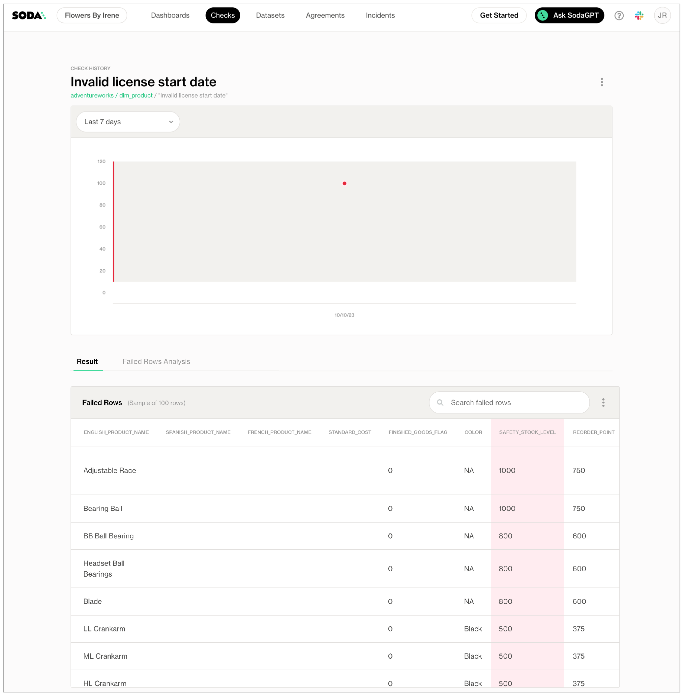

# Validity metrics

Use a validity metric in a check to surface invalid or unexpected values in your dataset.

```yaml
checks for dim_customer:
# Check for valid values
  - invalid_count(email_address) = 0:
      valid format: email
  - invalid_percent(english_education) = 0:
      valid length: 100
  - invalid_percent(total_children) <= 2:
      valid max: 6
  - invalid_percent(marital_status) = 0:
      valid max length: 10
  - invalid_count(number_cars_owned) = 0:
      valid min: 1
  - invalid_percent(marital_status) = 0:
      valid min length: 1
  - invalid_percent(last_name) < 5%:
      invalid regex: (?:XX)
  - invalid_count(house_owner_flag) = 0:
      valid values: [0, 1]
```

```yaml
checks for dim_customer:
# Check for invalid values
  - invalid_count(first_name) = 0:
      invalid values: [Antonio]
  - invalid_count(number_cars_owned) = 0:
      invalid values: [0, 3] 
```

✖️    Requires Soda Core Scientific (included in a Soda Agent)\
✔️    Supported in Soda Core\
✔️    Supported in Soda Library + Soda Cloud\
✔️    Supported in Soda Cloud Agreements + Soda Agent\
✔️    Available as a no-code check with a self-hosted Soda Agent connected to any Soda-supported data source, except Spark, and Dask and Pandas\
&#x20;       OR\
&#x20;       with a Soda-hosted Agent connected to a BigQuery, Databricks SQL, MS SQL Server, MySQL, PostgreSQL, Redshift, or Snowflake data source

## Define checks with validity metrics

In the context of [SodaCL check types](metrics-and-checks.md#check-types), you use validity metrics in standard checks. Refer to [Standard check types](metrics-and-checks.md#standard-check-types) for exhaustive configuration details.

You can use all validity metrics in checks that apply to individual columns in a dataset; you cannot use validity metrics in checks that apply to entire datasets. Identify the column by adding a value in the argument between brackets in the check.

* You must use a [configuration key:value pair](validity-metrics.md#list-of-configuration-keys) to define what qualifies as an valid value or invalid value.
* If you wish, you can add a `%` character to the threshold for a `invalid_percent` metric for improved readability. This character does not behave as a wildard in this context.

```yaml
checks for dim_customer
  - invalid_count(number_cars_owned) = 0:
      valid min: 1
```

You can use validity metrics in checks with fixed thresholds, or relative thresholds, but _not_ change-over-time thresholds. See [Checks with fixed thresholds](metrics-and-checks.md#checks-with-fixed-thresholds) for more detail.

```yaml
checks for dim_reseller:
# a check with a fixed threshold
  - invalid_count(email_address) = 0:
      valid format: email
# a check with a relative threshold
  - invalid_percent(english_education) < 3%:
      valid max length: 100
```

<details>

<summary>What is a relative threshold?</summary>

When it scans a column in your dataset, Soda automatically separates all values in the column into one of three categories:

* missing
* invalid
* valid

Soda then performs two calculations. The sum of the count for all categories in a column is always equal to the total row count for the dataset.\
`missing_count(column_name) + invalid_count(column_name) + valid_count(column_name) = row_count`\
Similarly, a calculation that uses percentage always adds up to a total of 100 for the column.\
`missing_percent(name) + invalid_percent(name) + valid_percent(name) = 100`\
These calculations enable you to write checks that use **relative thresholds**.\
\
In the example above, the invalid values of the `english_education` column must be less than three percent of the total row count, or the check fails.\
\
Percentage thresholds are between 0 and 100, not between 0 and 1.

</details>

### Specify valid or invalid values

Use a nested **configuration key:value pair** to provide your own definition of a valid or invalid value. There are several configuration keys that you can use to define what qualifies as valid; the examples below illustrate the use of just a few config keys. See a complete [List of configuration keys](validity-metrics.md#list-of-configuration-keys) below.

A check that uses a validity metric has six mutable parts:

|                               |
| ----------------------------- |
| a metric                      |
| an argument                   |
| a comparison symbol or phrase |
| a threshold                   |
| a configuration key           |
| a configuration value         |

The example below defines two checks. The first check applies to the column `house_owner_flag`. The `valid values` configuration key specifies that if a row in that column contains _anything other than_ the two valid values in the list, Soda registers them as invalid. The check fails if Soda discovers any values that are _not_ `0` or `1`.

* Values in a list must be enclosed in square brackets.
* _Known issue:_ Do not wrap numeric values in single quotes if you are scanning data in a BigQuery data source.

The second check uses a regular expression to define what qualifies as an invalid value in the `last_name` column so that any values that match the pattern defined by the regex qualify as invalid.

```yaml
checks for dim_customer:
  - invalid_count(house_owner_flag) = 0:
      valid values: [0, 1]
  - invalid_count(last_name) = 0:
      invalid regex: (?:XX)
```

First check:

| metric                 | `invalid_count`    |
| ---------------------- | ------------------ |
| argument               | `house_owner_flag` |
| comparison symbol      | `=`                |
| threshold              | `0`                |
| configuration key      | `valid values`     |
| configuration value(s) | `0, 1`             |

Second check:

| metric                      | `invalid_count` |
| --------------------------- | --------------- |
| argument                    | `last_name`     |
| comparison symbol or phrase | `=`             |
| threshold                   | `0`             |
| configuration key           | `invalid regex` |
| configuration value(s)      | `(?:XX)`        |

\


The `invalid values` configuration key specifies that if a row in that column contains the invalid values in the list, Soda registers them as invalid. In the example below, the check fails if Soda discovers any values that are `Antonio`.

Values in a list must be enclosed in square brackets.

```yaml
checks for dim_customer:
  - invalid_count(first_name) = 0:
      invalid values: [Antonio]
```

\


### Specify valid format

If the data type of the column you are checking is TEXT (such as character, character varying, or string) then you can use the `valid format` configuration key. This config key uses built-in values that test the data in the column for specific formats, such as email address format, date format, or uuid format. See [List of valid formats](validity-metrics.md#list-of-valid-formats) below.

The check below validates that all values in the `email_address` column conform to an email address format.

```yaml
checks for dim_customer:
  - invalid_percent(email_address) = 0:
      valid format: email
```

| metric                      | `invalid_percent` |
| --------------------------- | ----------------- |
| argument                    | `email_address`   |
| comparison symbol or phrase | `=`               |
| threshold                   | `0`               |
| configuration key           | `valid format`    |
| configuration value(s)      | `email`           |

\


### Troubleshoot valid format and values

**Problem:** You are using a `valid format` to test the format of values in a column and the CLI returns the following error message when you run a scan.

```shell
  | HINT:  No operator matches the given name and argument types. You might need to add explicit type casts.

Error occurred while executing scan.
  | unsupported operand type(s) for *: 'Undefined' and 'int'

```

**Solution:** The error indicates that the data type of the column is not TEXT. Adjust your check to use a different configuration key, instead.

\
\


### Failed row samples

Checks with validity metrics automatically collect samples of any failed rows to display Soda Cloud. The default number of failed row samples that Soda collects and displays is 100.

If you wish to limit or broaden the sample size, you can use the `samples limit` configuration in a check with a validity metric. You can add this configuration to your checks YAML file for Soda Library, or when writing checks as part of an agreement in Soda Cloud. See: [Set a sample limit](../run-a-scan/failed-row-samples.md#set-a-sample-limit).

```yaml
checks for dim_customer:
  - invalid_percent(email_address) < 50:
      samples limit: 2
```

\


For security, you can add a configuration to your data source connection details to prevent Soda from collecting failed rows samples from specific columns that contain sensitive data. See: [Disable failed row samples](../run-a-scan/failed-row-samples.md#disable-failed-row-samples).

Alternatively, you can set the `samples limit` to `0` to prevent Soda from collecting and sending failed rows samples for an individual check, as in the following example.

```yaml
checks for dim_customer:
  - invalid_percent(email_address) < 50:
      samples limit: 0
```

\


You can also use a `samples columns` or a `collect failed rows` configuration to a check to specify the columns for which Soda must implicitly collect failed row sample values, as in the following example with the former. Soda only collects this check’s failed row samples for the columns you specify in the list. See: [Customize sampling for checks](../run-a-scan/failed-row-samples.md#customize-sampling-for-checks).

Note that the comma-separated list of samples columns does not support wildcard characters (%).

```yaml
checks for dim_employee:
  - invalid_count(gender) = 0:
      valid values: ["M", "Q"]
      samples columns: [employee_key, first_name]
```

\


To review the failed rows in Soda Cloud, navigate to the **Checks** dashboard, then click the row for a check for validity values. Examine failed rows in the **Failed Rows Analysis** tab; see [Manage failed row samples](../run-a-scan/failed-row-samples.md) for further details.

<figure><figcaption></figcaption></figure>

## Optional check configurations

<table><thead><tr><th width="120.5333251953125" align="center">Supported</th><th>Configuration</th><th>Documentation</th></tr></thead><tbody><tr><td align="center">✓</td><td>Define a name for a check with validity metrics; see <a href="https://docs.soda.io/soda-cl/validity-metrics.html#example-with-check-name">example</a>.</td><td><a href="optional-config.md#customize-check-names">Customize check names</a></td></tr><tr><td align="center">✓</td><td>Add an identity to a check.</td><td><a href="https://docs.soda.io/soda-cl/optional-config.html#add-a-check-identity">Add a check identity</a></td></tr><tr><td align="center">✓</td><td>Define alert configurations to specify warn and fail thresholds; see <a href="https://docs.soda.io/soda-cl/validity-metrics.html#example-with-alert-configuration">example</a>.</td><td><a href="optional-config.md#add-alert-configurations">Add alert configurations</a></td></tr><tr><td align="center">✓</td><td>Apply an in-check filter to return results for a specific portion of the data in your dataset; see <a href="https://docs.soda.io/soda-cl/validity-metrics.html#example-with-filter">example</a>.</td><td><a href="optional-config.md#add-a-filter-to-a-check">Add an in-check filter to a check</a></td></tr><tr><td align="center">✓</td><td>Use quotes when identifying dataset or column names; see <a href="https://docs.soda.io/soda-cl/validity-metrics.html#example-with-quotes">example</a>.<br>Note that the type of quotes you use must match that which your data source uses. For example, BigQuery uses a backtick (`) as a quotation mark.</td><td><a href="optional-config.md#use-quotes-in-a-check">Use quotes in a check</a></td></tr><tr><td align="center"> </td><td>Use wildcard characters ( % or * ) in values in the check.</td><td>-</td></tr><tr><td align="center">✓</td><td>Use for each to apply checks with validity metrics to multiple datasets in one scan; see <a href="https://docs.soda.io/soda-cl/validity-metrics.html#example-with-for-each-checks">example</a>.</td><td><a href="optional-config.md#apply-checks-to-multiple-datasets">Apply checks to multiple datasets</a></td></tr><tr><td align="center">✓</td><td>Apply a dataset filter to partition data during a scan; see <a href="https://docs.soda.io/soda-cl/validity-metrics.html#example-with-dataset-filter">example</a>.</td><td><a href="optional-config.md#scan-a-portion-of-your-dataset">Scan a portion of your dataset</a></td></tr><tr><td align="center">✓</td><td>Supports <code>samples columns</code> parameter to specify columns from which Soda draws failed row samples.</td><td><a href="../run-a-scan/failed-row-samples.md#customize-sampling-for-checks">Customize sampling for checks</a></td></tr><tr><td align="center">✓</td><td>Supports <code>samples limit</code> parameter to control the volume of failed row samples Soda collects.</td><td><a href="../run-a-scan/failed-row-samples.md#set-a-sample-limit">Set a sample limit</a></td></tr><tr><td align="center">✓</td><td>Supports <code>collect failed rows</code> parameter instruct Soda to collect, or not to collect, failed row samples for a check.</td><td><a href="../run-a-scan/failed-row-samples.md#customize-sampling-for-checks">Customize sampling for checks</a></td></tr></tbody></table>

#### Example with check name

```yaml
checks for dim_customer:
  - invalid_count(first_name) = 0 :
      valid min length: 2
      name: First name has 2 or more characters
```

#### Example with alert configuration

```yaml
  - invalid_count(house_owner_flag):
      valid values: [0, 1]
      warn: when between 1 and 5
      fail: when > 6  
```

#### Example with in-check filter

```yaml
checks for dim_customer:
  - invalid_percent(marital_status) = 0:
      valid max length: 1
      filter: total_children = 0
```

#### Example with quotes

```yaml
checks for dim_customer:
  - invalid_count("number_cars_owned") = 0:
      valid min: 1
```

#### Example with for each

```yaml
for each dataset T:
  datasets:
    - dim_customer
    - dim_customer_%
  checks:
    - invalid_count(email_address) = 0:
        valid format: email
```

#### Example with dataset filter

```yaml
filter CUSTOMERS [daily]:
  where: TIMESTAMP '{ts_start}' <= "ts" AND "ts" < TIMESTAMP '${ts_end}'

checks for CUSTOMERS [daily]:
  - invalid_count(email_address) = 0:
      valid format: email
```

\


## List of validity metrics

<table><thead><tr><th valign="top">Metric</th><th>Column config keys</th><th>Description</th><th>Supported data types</th></tr></thead><tbody><tr><td valign="top"><code>invalid_count</code></td><td><code>invalid format</code><br><code>invalid values</code><br><code>valid format</code><br><code>valid length</code><br><code>valid max</code><br><code>valid max length</code><br><code>valid min</code><br><code>valid min length</code><br><code>valid values</code></td><td>The number of rows in a<br>column that contain<br>values that are not valid.</td><td>number<br>text<br>time</td></tr><tr><td valign="top"></td><td><code>invalid regex</code><br><code>valid regex</code></td><td></td><td>text</td></tr><tr><td valign="top"><code>invalid_percent</code></td><td><code>invalid format</code><br><code>invalid values</code><br><code>valid format</code><br><code>valid length</code><br><code>valid max</code><br><code>valid max length</code><br><code>valid min</code><br><code>valid min length</code><br><code>valid values</code></td><td>The percentage of rows<br>in a column, relative to<br>the total row count, that<br>contain values that<br>are not valid.</td><td>number<br>text<br>time</td></tr><tr><td valign="top"></td><td><code>invalid regex</code><br><code>valid regex</code></td><td></td><td>text</td></tr></tbody></table>

## List of configuration keys

The column configuration key:value pair defines what SodaCL ought to consider as valid values.

| Column config key  | Description                                                                                                                                                                                                                                                                                                                                      | Values                                                                  |
| ------------------ | ------------------------------------------------------------------------------------------------------------------------------------------------------------------------------------------------------------------------------------------------------------------------------------------------------------------------------------------------ | ----------------------------------------------------------------------- |
| `invalid format`   | <p>Defines the format of a value that Soda ought to register as invalid.<br>Only works with columns that contain data type TEXT.</p>                                                                                                                                                                                                             | See [List of valid formats](validity-metrics.md#list-of-valid-formats). |
| `invalid regex`    | Specifies a regular expression to define your own custom invalid values.                                                                                                                                                                                                                                                                         | regex, no forward slash delimiters                                      |
| `invalid values`   | Specifies the values that Soda ought to consider invalid.                                                                                                                                                                                                                                                                                        |                                                                         |
| `valid format`     | <p>Defines the format of a value that Soda ought to register as valid.<br>Only works with columns that contain data type TEXT.</p>                                                                                                                                                                                                               | See [List of valid formats](validity-metrics.md#list-of-valid-formats). |
| `valid length`     | <p>Specifies a valid length for a string.<br>Works with columns that contain data type TEXT, and also with INTEGER on most databases, where implicit casting from string to integer is supported.<br><strong>Note:</strong> PostgreSQL does not support this behavior, as it does not implicitly cast strings to integers for this use case.</p> | integer                                                                 |
| `valid max`        | Specifies a maximum numerical value for valid values.                                                                                                                                                                                                                                                                                            | integer or float                                                        |
| `valid max length` | <p>Specifies a valid maximum length for a string.<br>Only works with columns that contain data type TEXT.</p>                                                                                                                                                                                                                                    | integer                                                                 |
| `valid min`        | Specifies a minimum numerical value for valid values.                                                                                                                                                                                                                                                                                            | integer or float                                                        |
| `valid min length` | <p>Specifies a valid minimum length for a string.<br>Only works with columns that contain data type TEXT.</p>                                                                                                                                                                                                                                    | integer                                                                 |
| `valid regex`      | Specifies a regular expression to define your own custom valid values.                                                                                                                                                                                                                                                                           | regex, no forward slash delimiters                                      |
| `valid values`     | Specifies the values that Soda ought to consider valid.                                                                                                                                                                                                                                                                                          | values in a list                                                        |

## List of valid formats

* Though table below lists valid formats, the same apply for invalid formats.
* Valid formats apply _only_ to columns using data type **TEXT**, not DATE or NUMBER.
* The Soda Library package for **MS SQL Server** has limited support for valid formats. See the [separate list below](validity-metrics.md#formats-supported-with-soda-for-ms-sql-server) of formats supported for MS SQL Server.

| Valid format value          | Format                                                                                                                                                                           |
| --------------------------- | -------------------------------------------------------------------------------------------------------------------------------------------------------------------------------- |
| `credit card number`        | <p>Four four-digit numbers separated by spaces.<br>Four four-digit numbers separated by dashes.<br>Sixteen-digit number.<br>Four five-digit numbers separated by spaces.<br></p> |
| `date eu`                   | <p>Validates date only, not time.<br>dd/mm/yyyy</p>                                                                                                                              |
| `date inverse`              | <p>Validates date only, not time.<br>yyyy/mm/dd</p>                                                                                                                              |
| `date iso 8601`             | <p>Validates date and/or time according to <a href="https://www.w3.org/TR/NOTE-datetime">ISO 8601 format </a>.<br>2021-04-28T09:00:00+02:00</p>                                  |
| `date us`                   | <p>Validates date only, not time.<br>mm/dd/yyyy</p>                                                                                                                              |
| `decimal`                   | Number uses a `,` or `.` as a decimal indicator.                                                                                                                                 |
| `decimal comma`             | Number uses `,` as decimal indicator.                                                                                                                                            |
| `decimal point`             | Number uses `.` as decimal indicator.                                                                                                                                            |
| `email`                     | name@domain.extension                                                                                                                                                            |
| `integer`                   | Number is whole.                                                                                                                                                                 |
| `ip address`                | Four whole numbers separated by `.`                                                                                                                                              |
| `ipv4 address`              | Four whole numbers separated by `.`                                                                                                                                              |
| `ipv6 address`              | Eight values separated by `:`                                                                                                                                                    |
| `money`                     | A money pattern with currency symbol + decimal point or comma + currency abbreviation.                                                                                           |
| `money comma`               | A money pattern with currency symbol + decimal comma + currency abbreviation.                                                                                                    |
| `money point`               | A money pattern with currency symbol + decimal point + currency abbreviation.                                                                                                    |
| `negative decimal`          | Negative number uses a `,` or `.` as a decimal indicator.                                                                                                                        |
| `negative decimal comma`    | Negative number uses `,` as decimal indicator.                                                                                                                                   |
| `negative decimal point`    | Negative number uses `.` as decimal indicator.                                                                                                                                   |
| `negative integer`          | Number is negative and whole.                                                                                                                                                    |
| `negative percentage`       | Negative number is a percentage.                                                                                                                                                 |
| `negative percentage comma` | Negative number is a percentage with a `,` decimal indicator.                                                                                                                    |
| `negative percentage point` | Negative number is a percentage with a `.` decimal indicator.                                                                                                                    |
| `percentage comma`          | Number is a percentage with a `,` decimal indicator.                                                                                                                             |
| `percentage point`          | Number is a percentage with a `.` decimal indicator.                                                                                                                             |
| `percentage`                | Number is a percentage.                                                                                                                                                          |
| `phone number`              | <p>+12 123 123 1234<br>123 123 1234<br>+1 123-123-1234<br>+12 123-123-1234<br>+12 123 123-1234<br>555-2368<br>555-ABCD</p>                                                       |
| `positive decimal`          | Postive number uses a `,` or `.` as a decimal indicator.                                                                                                                         |
| `positive decimal comma`    | Positive number uses `,` as decimal indicator.                                                                                                                                   |
| `positive decimal point`    | Positive number uses `.` as decimal indicator.                                                                                                                                   |
| `positive integer`          | Number is positive and whole.                                                                                                                                                    |
| `positive percentage`       | Positive number is a percentage.                                                                                                                                                 |
| `positive percentage comma` | Positive number is a percentage with a `,` decimal indicator.                                                                                                                    |
| `positive percentage point` | Positive number is a percentage with a `.` decimal indicator.                                                                                                                    |
| `time 12h`                  | <p>Validates against the 12-hour clock.<br>hh:mm:ss</p>                                                                                                                          |
| `time 12h nosec`            | <p>Validates against the 12-hour clock.<br>hh:mm</p>                                                                                                                             |
| `time 24h`                  | <p>Validates against the 244-hour clock.<br>hh:mm:ss</p>                                                                                                                         |
| `time 24h nosec`            | <p>Validates against the 24-hour clock.<br>hh:mm</p>                                                                                                                             |
| `timestamp 12h`             | <p>Validates against the 12-hour clock.<br>hh:mm:ss</p>                                                                                                                          |
| `timestamp 24h`             | <p>Validates against the 24-hour clock.<br>hh:mm:ss</p>                                                                                                                          |
| `uuid`                      | Universally unique identifier.                                                                                                                                                   |

### Formats supported with Soda for MS SQL Server

| Valid format value | Format                                                                                                                     |
| ------------------ | -------------------------------------------------------------------------------------------------------------------------- |
| `date eu`          | <p>Validates date only, not time.<br>dd/mm/yyyy</p>                                                                        |
| `date inverse`     | <p>Validates date only, not time.<br>yyyy/mm/dd</p>                                                                        |
| `date us`          | <p>Validates date only, not time.<br>mm/dd/yyyy</p>                                                                        |
| `decimal`          | Number uses a `,` or `.` as a decimal indicator.                                                                           |
| `integer`          | Number is whole.                                                                                                           |
| `ip address`       | Four whole numbers separated by `.`                                                                                        |
| `negative integer` | Number is negative and whole.                                                                                              |
| `phone number`     | <p>+12 123 123 1234<br>123 123 1234<br>+1 123-123-1234<br>+12 123-123-1234<br>+12 123 123-1234<br>555-2368<br>555-ABCD</p> |
| `positive integer` | Number is positive and whole.                                                                                              |
| `uuid`             | Universally unique identifier.                                                                                             |

## List of comparison symbols and phrases

```
 = 
 < 
 >
 <=
 >=
 !=
 <> 
 between 
 not between 
```

## Go further

* Use validity metrics in checks with alert configurations to establish [warn and fail zones](optional-config.md#define-zones-using-alert-configurations)
* Use validity metrics in checks to define ranges of acceptable thresholds using [boundary thresholds](metrics-and-checks.md#define-boundaries-with-fixed-thresholds).
* Reference [tips and best practices for SodaCL](../soda-cl-overview/quick-start-sodacl.md#tips-and-best-practices-for-sodacl).


