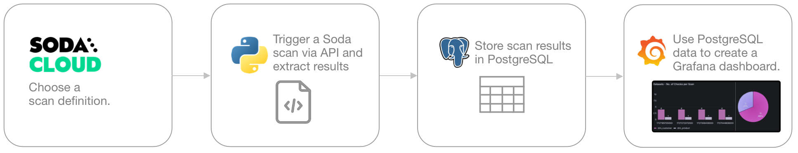
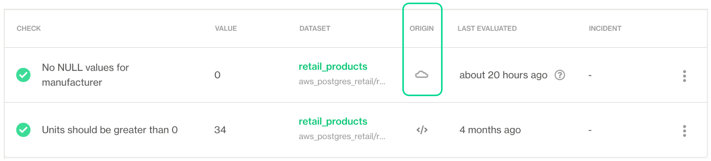
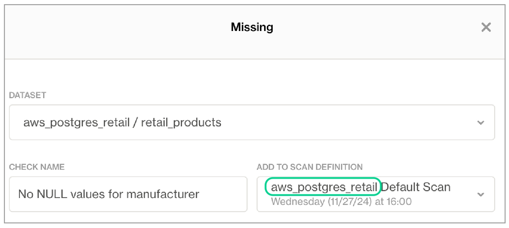
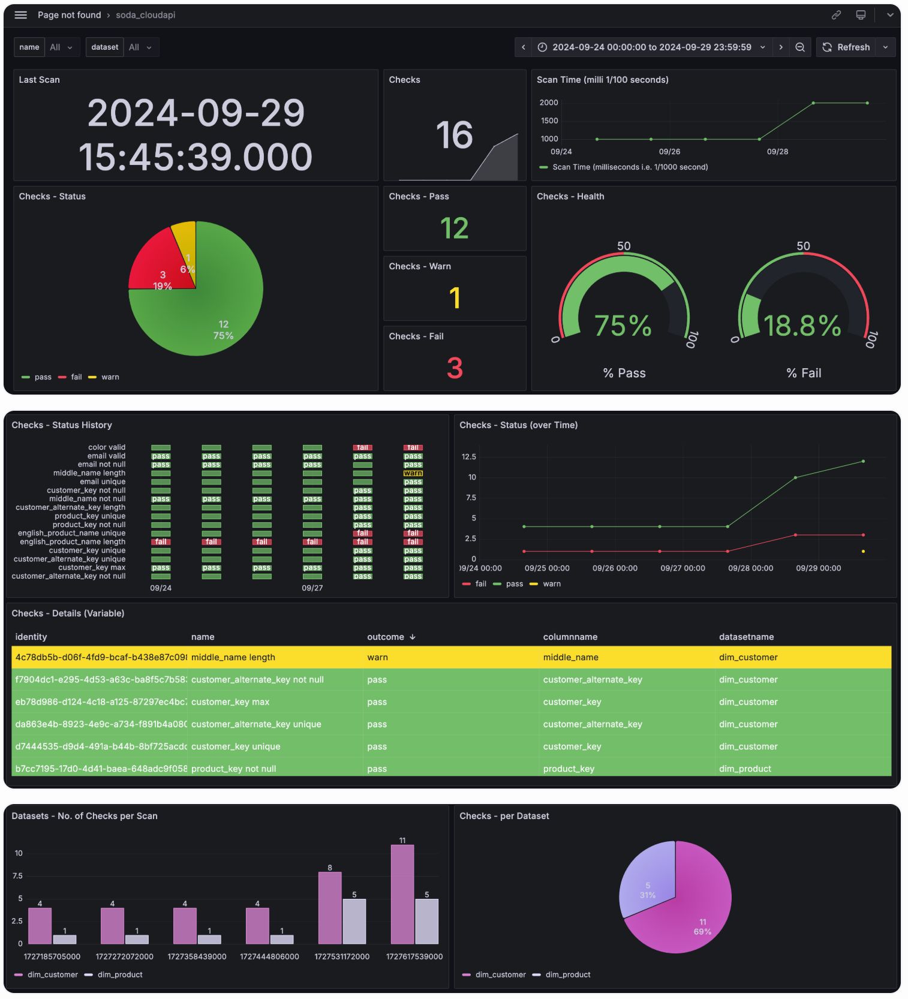

# Build a Grafana dashboard

This guide offers an example of how to create a data quality reporting dashboard using the Soda Cloud API and Grafana. Such a dashboard enables data engineers to monitor the status of Soda scans and capture and display check results.

Use the [Soda Cloud API](https://docs.soda.io/api-docs/public-cloud-api-v1.html) to trigger data quality scans and extract metadata from your Soda Cloud account, then store the metadata in PostgreSQL and use it to customize visualized data quality results in Grafana.

<figure><figcaption></figcaption></figure>

## Prerequisites

* access to a [Grafana account](https://grafana.com/)
* Python 3.8, 3.9, or 3.10
* familiarity with Python, with Python library interactions with APIs
* access to a PostgreSQL data source
* a Soda Cloud account: [Sign Up](https://cloud.soda.io/select-region)
* permission in Soda Cloud to access dataset metadata; see [Manage dataset roles](../collaborate/roles-dataset.md)
* at least one agreement or no-code check associated with a scan definition in Soda Cloud; see [Use no-code checks](../soda-cl-overview/#define-sodacl-checks)

## Choose a scan definition

Because this guide uses the Soda Cloud API to trigger a scan execution, you must first choose an existing check in Soda Cloud to identify its associated [scan definition](../learning-resources/glossary.md#scan-definition), which you will use to identify which checks to execute during the triggered scan.

> See also: [Trigger a scan via API](../run-a-scan/#trigger-a-scan-via-api)

1.  Log in to your Soda Cloud account and navigate to the **Checks** page. Choose a check that originated in Soda Cloud, identifiable by the cloud icon, that you can use to complete this exercise. Use the action menu (stacked dots) next to the check to select **Edit Check**.

    <figure><figcaption></figcaption></figure>
2.  In the dialog that opens, copy the scan definition name from the **Add to Scan Definition** field. Under **Scans**, above the scan definition name, copy the scan definition ID that uses undescores to represent spaces. Paste the scan definition ID in a temporary local file; you will use it in the next steps to trigger a scan via the Soda Cloud API.\


    <figure><figcaption></figcaption></figure>
3. Be aware that when you use the Soda Cloud API to trigger the execution of this scan definition remotely, Soda executes _all_ checks associated with the scan definition. This is a good thing, as you can see the metadata for multiple check results in the Grafana dashboard this guide prepares.

## Prepare to use the Soda Cloud API

1.  As per best practice, set up a new Python virtual environment so that you can keep your projects isolated and avoid library clashes. The example below uses the built-in venv module to create, then navigate to and activate, a virtual environment named `soda-grafana`. Run `deactivate` to close the virtual environment when you wish.\


    ```shell
    python3 -m venv ~/venvs/soda-grafana

    cd venvs

    source soda-grafana/bin/activate
    ```
2. Run the following command to install the requests libraries in your virtual environment that you need to connect to Soda Cloud API endpoints.\
   Because this exercise moves the data it extracts from your Soda Cloud account into a PostgreSQL data source, it requires the `psycopg2` library. Alternatively, you can list and save all the requirements in a `requirements.txt` file, then install them from the command-line using `pip install -r requirements.txt`. If you use a different type of data source, find a corresponding plugin, or check SQLAlchemy's built-in database compatibility.

```shell
pip install requests psycopg2
```

3.  In the same directory, create a new file named `apiscan.py`. Paste the following contents into the file to define an ApiScan class, which you will use to interact with the Soda Cloud API.

    ```python
    import os
    import requests


    class ApiScan():
        def __init__(self):
           self.url = os.environ.get("SODA_URL")
           self.auth = (os.environ.get("API_KEY"), os.environ.get("API_SECRET"))

        def _get(self, endpt: str, headers: dict = None):
            r = requests.get(url=self.url + endpt, auth=self.auth,
                             headers=headers)
            print(f"_get result for endpoint {endpt}: {r}")
            r = r.json()
            return r

        def _post(self, endpt: str, headers: dict = None, data: dict = None):
            r = requests.post(url=self.url + endpt, auth=self.auth,
                              headers=headers, data=data)
            return r

        def test(self):  # expect response 200
            return self._get(endpt="test-login")

        def checks(self, datasetID: str, size: int = 100):
            headers = {"Accept": "application/json"}
            params = f"?size={size}&datasetID={datasetID}"
            return self._get(endpt=f"checks{params}", headers=headers)

        def datasets(self, from_ts: str, size: int = 100):
            headers = {"Accept": "application/json"}
            params = f"?size={size}&from={from_ts}"
            return self._get(endpt=f"datasets{params}", headers=headers)

        def trigger(self, scan: str):
            headers = {"Accept": "application/json",
                       "Content-Type": "application/x-www-form-urlencoded"}
            data = {"scanDefinition": scan}
            return self._post(endpt="scans", headers=headers, data=data)

        def state(self, scan_id: str):
            return self._get(endpt=f"scans/{scan_id}")
    ```
4. From the command-line, create the following environment variables to facilitate a connection to your Soda Cloud account and your PostgreSQL data source.

* `SODA_URL`: use `https://cloud.soda.io/api/v1/` or `https://cloud.us.soda.io/api/v1/` as the value, according to the region in which you created your Soda Cloud account.
* `API_KEY` and `API_SECRET`: see [Generate API keys](api-keys.md)

````sh
    # Soda Cloud API keys, used in apiscan.py
    SODA_URL = https://cloud.soda.io/api/v1/
    API_KEY = xxx
    API_SECRET = xxx
    
    # PostgreSQL access credentials, used in main.py
    HOST = host_name
    PG_USER = user_login
    PG_PASSWORD = user_pass
    ```
````

#### Troubleshoot

**Problem:** You get an error that reads, "psycopg2 installation fails with error: metadata-generation-failed" and the suggestion "If you prefer to avoid building psycopg2 from source, please install the PyPI 'psycopg2-binary' package instead."

**Solution:** As suggested, install the binary package instead, using `pip install psycopg2-binary`.

## Trigger and monitor a Soda scan

1. In the same directory in which you created the `apiscan.py` file, create a new file named `main.py`.
2. To the file, add the following code which:

* imports necessary libraries, as well as the ApiScan class from `apiscan.py`
* initializes an `ApiScan` object as `ascan`, uses the object to trigger a scan with `scan_definition` as a parameter which, in this case, is `grafanascan0`; replace `grafanascan0` with the scan definition ID you copied to a local file earlier.
* stores the scan `id` as a variable
* checks the state of the scan every 10 seconds, then only when it is in a completion state (`completedWithErrors`, `completedWithFailures`, `completedWithWarnings`, or `completed`), stores the scan results as variable `r`.

```python
from apiscan import ApiScan
import os
import psycopg2
import time
scan_definition = "grafanascan0"
ascan = ApiScan()
sc = ascan.trigger(scan=scan_definition)
id = sc.headers["X-Soda-Scan-Id"]
state = ""  # do not get logs until scan completed
while "completed" not in state:
    r = ascan.state(scan_id=id)
    state = r["state"]
    print(f"Scan state: {state}", end="\r")
    time.sleep(10)
r = ascan.state(scan_id=id)
print(f"Scan done!")
```

## Extract scan results

To the `main.py` file, add the following code which:

* extracts Soda scan details, from the scan results stored in variable `r`
* extracts dataset details, using Soda Cloud API's datasets endpoint
* extracts checks details, using Soda Cloud API's checks endpoint
* combines scan, dataset and checks details into one dictionary per check, and appends the dictionary to a list of checks

```python
# EXTRACT SCAN DETAILS
s = {}
s["definitionName"] = r["scanDefinition"]["name"]
s["scanStartTimestamp"] = r["started"]
s["scanEndTimestamp"] = r["ended"]
s["hasErrors"] = (False if r["errors"] == 0 else True)
# EXTRACT DATASETS DETAILS
### get only the datasets just scanned
d_api = ascan.datasets(from_ts=r["started"])
d_all = [{"datasetName": d["name"],
          "datasetID": d["id"],
          "dataSource": d["datasource"]["name"]}
          for d in d_api["content"]]
# EXTRACT CHECKS DETAILS
c_all = []  ### get only the checks for datasets just scanned
for d in d_all:
    d_checks = ascan.checks(datasetID=d["datasetID"])
    c_all = c_all + d_checks["content"]
c_cols = ["id", "name", "evaluationStatus", "column"]
checks = []  # list of rows, each row has both scan and check details
for check in r["checks"]:  ### find scanned check in all checks from api
    c_single = next(c for c in c_all if c["id"] == check["id"])
    c = {col:c_single[col] for col in c_cols}
    # rename keys to standardize and avoid SQL special words
    c["identity"] = c.pop("id")
    c["outcome"] = c.pop("evaluationStatus")
    c["columnName"] = c.pop("column")
    # add dataset details - datasetName, dataSource
    c["datasetName"] = c_single["datasets"][0]["name"]
    d_full = next(d for d in d_all if d["datasetName"] == c["datasetName"])
    c["dataSource"] = d_full["dataSource"]
    checks.append({**s, **c})  # combine scan, dataset and check details in one row
```

## Process scan results into a PostgreSQL data source

The following example code serves as reference for adding data to a PostgreSQL data source. Replace it if you intend to store scan results in another type of data source.

1. To the `main.py` file, add the code below which:

* connects to a PostgreSQL data source, using the psycopg2 library
* creates a table in the data source in which to store scan results, if one does not already exist
* processes the list of dicts, and inserts them into table of scan results

2. From the command-line, run `python3 main.py`.

```python
# POSTGRES / SQL
target = "my_schema.api_results"  # <schema>.<table>

try:
    print("postgres.py trying to connect to database...")
    conn = psycopg2.connect(database="postgres",
                            user=os.environ.get("PG_USER"),
                            password=os.environ.get("PG_PASSWORD"),
                            host=os.environ.get("HOST"),
                            port="5432")
    print("postgres.py connected to database!")
    curs = conn.cursor()
except Exception as e:
    print(f"postgres.py failed to connect to database: {e}")

# Create a table if one does not exist
schema = []
for col in checks[0].keys():
    if "Timestamp" in col:
        schema.append(f"{col} TIMESTAMP")
    elif col[0:3] == "has":
        schema.append(f"{col} BOOLEAN")
    else:
        schema.append(f"{col} VARCHAR")

schema = "(" + ", ".join(schema) + ")"

curs.execute(f"""
create table if not exists {target} {schema}
"""
)
curs.connection.commit()

# Insert into table
# Create list of cols without quotation marks " "
cols = "(%s)" % ", ".join(map(str, checks[0].keys()))

# create tuples of values to be appended
values = [tuple(str(v) for v in check.values()) for check in checks]
values = str(values).strip('[]')

curs.execute(f"""
insert into {target} {cols} values {values}
""")
curs.connection.commit()

print(f"Scan processed to PostgreSQL# !")
```

## Visualize scan results in a Grafana dashboard

1. Log into your Grafana account, select My Account, then launch Grafana Cloud.
2. Follow Grafana's [PostgreSQL data source](https://grafana.com/docs/grafana-cloud/connect-externally-hosted/data-sources/postgres/) instructions to add your data source which contains the Soda check results.
3. Follow Grafana's [Create a dashboard](https://grafana.com/docs/grafana-cloud/visualizations/dashboards/build-dashboards/create-dashboard/) instructions to create a new dashboard. Use the following details for reference in the Edit panel for Visualizations.

* In the Queries tab, configure a Query using Builder or Code, then Run query on the data source. Toggle the Table view at the top to see Query results.
* In the Transformations tab, create, edit, or delete Transformations that transform Query results into the data and format that Visualization needs.
* Access Grafana's Visualizations documentation for [guidance on Visualizations](https://grafana.com/docs/grafana-cloud/visualizations/panels-visualizations/visualizations/).

The example code included in this guide produces the following visualizations.

<figure><figcaption></figcaption></figure>

## Go further

* Access full [Soda Cloud API](broken-reference) and [Soda Cloud Reporting API](broken-reference) documentation.
* Learn more about [remotely running a Doda scan](../run-a-scan/#trigger-a-scan-via-api).


