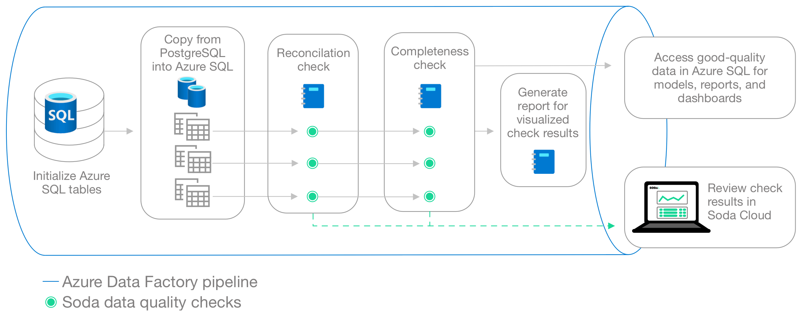
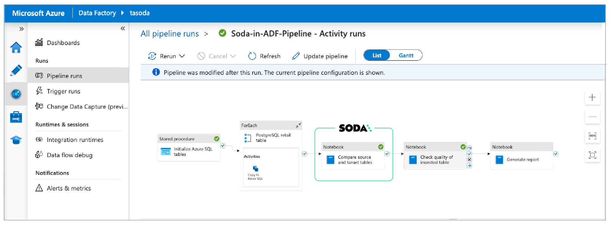
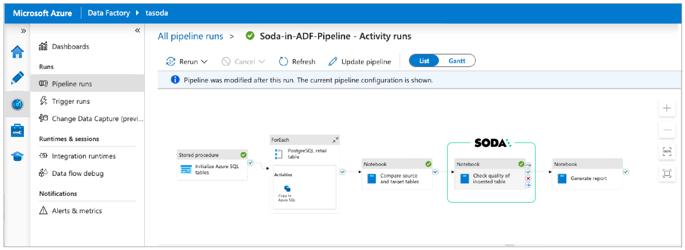
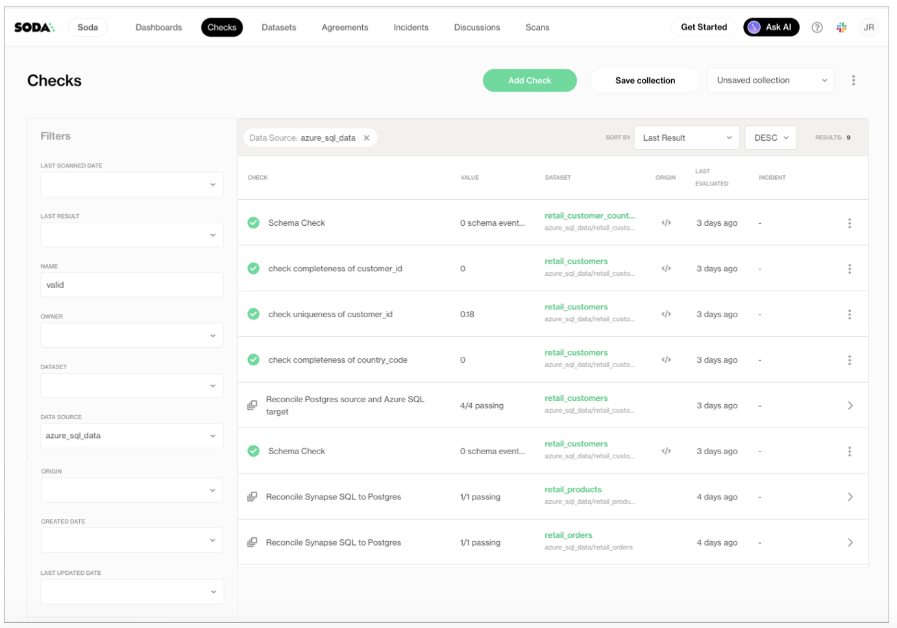

# Test data quality in an Azure Data Factory pipeline

Use this guide as an example of how to set up Soda to run data quality tests on data in an ETL pipeline in Azure Data Factory.

<figure><figcaption></figcaption></figure>

## About this guide

This guide offers an example of how to set up and trigger Soda to run data quality scans from an Azure Data Factory (ADF) pipeline.

The Data Engineer in this example has copied data from a PostgreSQL data source to an Azure SQL Server data source and uses Soda reconciliation checks in a Synapse notebook to validate that data copied from the source to the target is the same. Next, they create a second notebook to execute Soda checks to validate the completeness of the ingested data. Finally, the Engineer generates a visualized report of the data quality results.

This example uses a programmatic deployment model which invokes the Soda Python library, and uses Soda Cloud to validate a commercial usage license and display visualized data quality test results.

Read more: [SodaCL reference](../sodacl-reference/)\
Read more: [Soda reconciliation checks](../sodacl-reference/recon.md)\
Read more: [Choose a flavor of Soda](../quick-start-sip/setup-guide.md)

## Prerequisites

The Data Engineer in this example has the following:

* permission to configure Azure Cloud resources through the user interface
* access to:
  * an Azure Data Factory pipeline
  * a Synapse workspace
  * a dedicated SQL pool in Synapse
  * a dedicated Apache Spark pool in Synapse
  * an external source SQL database such as PostgreSQL
  * an Azure Data Lake Storage account
  * an Azure Key Vault
* The above-listed resources have permissions to interact with each other; for example the Synapse workspace has permission to fetch secrets from the Key Vault.
* Python 3.8, 3.9, or 3.10
* Pip 21.0 or greater

<details>

<summary>Python versions Soda supports</summary>

Soda officially supports Python versions 3.8, 3.9, and 3.10.\
Though largely funcntional, efforts to fully support Python 3.11 and 3.12 are ongoing.

Using Python 3.11, some users might have some issues with dependencies constraints. At times, extra the combination of Python 3.11 and dependencies constraints requires that a dependency be built from source rather than downloaded pre-built.

The same applies to Python 3.12, although there is some anecdotal evidence that indicates that 3.12 might not work in all scenarios due to dependencies constraints.

</details>

## Create a Soda Cloud account

To validate your account license or free trial, Soda Library must communicate with a Soda Cloud account via API keys. You create a set of API keys in your Soda Cloud account, then use them to configure the connection to Soda Library.

1. In a browser, the engineer navigated to [cloud.soda.io/signup](https://cloud.soda.io/signup) to create a new Soda account, which is free for a 45-day trial.
2. They navigated to **your avatar** > **Profile**, then accessed the **API keys** tab and clicked the plus icon to generate new API keys.
3. They copy+pasted the API key values to their Azure Key Vault.

## Use Soda to reconcile data

This example executes checks which, after a data migration, validate that the source and target data are matching. The first ADF Notebook Activity links to a notebook which contains the Soda connection details, the check definitions, and the script to run a Soda scan for data quality which executes the [reconciliation checks](../sodacl-reference/recon.md).

<figure><figcaption></figcaption></figure>

Download the notebook: [Soda Synapse Recon notebook](https://docs.soda.io/assets/soda-synapse-recon-notebook.ipynb)

1. In the ADF pipeline, the Data Engineer [adds a Notebook activity](https://learn.microsoft.com/en-us/azure/data-factory/transform-data-synapse-notebook#add-a-notebook-activity-for-synapse-to-a-pipeline-with-ui) for Synapse to a pipeline. In the Settings tab, they name the notebook `Reconciliation Checks`.
2. Next, in the Azure Synapse Analytics (Artifacts) tab, they create a [new Azure Synapse Analytics linked service](https://learn.microsoft.com/en-us/azure/data-factory/transform-data-synapse-notebook#azure-synapse-analytics-artifacts-settings) that serves to execute the Notebook activity.
3. In the Settings tab, they [choose the Notebook](https://learn.microsoft.com/en-us/azure/data-factory/transform-data-synapse-notebook#settings-tab) and the base parameters to pass to it.
4. The Spark Pool that runs the notebook must have the Soda Library packages it needs to run scans of the data. Before creating the notebook in the Synapse workspace, they add a `requirement.txt` file to the Spark Pool and include the following contents. Access [Spark Pool instructions](https://sqlofthenorth.blog/2021/02/26/adding-new-python-libraries-to-azure-synapse-spark-pools/).\
   Because this example runs scans on both the source (PostgreSQL) and target (SQL server) data sources, it requires two Soda Library packages.

```
--extra-index-url https://pypi.cloud.soda.io
soda-postgres
soda-sqlserver
```

5. They [create a new notebook](https://learn.microsoft.com/en-us/azure/synapse-analytics/spark/apache-spark-development-using-notebooks) in their Synapse workspace, then add the following contents that enable Soda to connect with the data sources, and with Soda Cloud. For the sensitive data source login credentials and Soda Cloud API key values, the example fetches the values from an Azure Key Vault. Read more: \[Integrate Soda with a secrets manager]\(#integrate-with-a-secrets-manager)

```python
from notebookutils import mssparkutils

config_str = f"""
data_source postgres_data:
  type: postgres
  host: soda-demo.xxx.eu-west-1.rds.amazonaws.com
  port: 5432
  username: my_user
  password: {mssparkutils.credentials.getSecret('soda-vault' , 'postgres-pw')}
  database: postgres
  schema: soda_demo_data_testing
data_source azure_sql_data:
  type: sqlserver
  driver: ODBC Driver 18 for SQL Server
  host: soda.sql.azuresynapse.net
  port: xxxx
  username: my_sql_user
  password: {mssparkutils.credentials.getSecret('soda-vault' , 'sql-pw')}
  database: soda_sqlserver
  schema: soda_demo_data_testing
soda_cloud:
  host: cloud.us.soda.io
  api_key_id: {mssparkutils.credentials.getSecret('soda-vault' , 'soda-api-key-id')}
  api_key_secret: {mssparkutils.credentials.getSecret('soda-vault' , 'soda-api-key-secret')}
"""
```

6. They define the SodaCL reconciliation checks inside another YAML string. The checks include [check attributes](../collaborate/check-attributes.md) which they created in Soda Cloud. When added to checks, the Data Engineer can use the attributes to filter check results in Soda Cloud, build custom views ([Collections](../collaborate/#build-check-collections)), and stay organized as they monitor data quality in the Soda Cloud user interface.

```python
check_str = """reconciliation retail_customers:
  label: 'Reconcile Postgres source and Azure SQL target'
  datasets:
    source:
      dataset: retail_customers
      datasource: postgres_data
    target:
      dataset: retail_customers
      datasource: azure_sql_data

  checks:
- row_count diff = 0
    attributes:
      data_quality_dimension: [Reconciliation, Volume]
      pipeline: ADF_pipeline_demo
      pipeline_stage: Migration
      data_domain: Sales
- duplicate_count(customer_id):
    fail: when diff > 0
    attributes:
      data_quality_dimension: [Reconciliation, Uniqueness]
      pipeline: ADF_pipeline_demo
      pipeline_stage: Migration
      data_domain: Sales
- missing_count(customer_id):
    fail: when diff > 0
    attributes:
      data_quality_dimension: [Reconciliation, Completeness]
      pipeline: ADF_pipeline_demo
      pipeline_stage: Migration
      data_domain: Sales
- missing_count(country_code):
    fail: when diff > 0
    attributes:
      data_quality_dimension: [Reconciliation, Completeness]
      pipeline: ADF_pipeline_demo
      pipeline_stage: Migration
      data_domain: Sales
"""
```

7. Finally, they define the script that runs the Soda scan for data quality, executing the reconcilation checks that validate the matching source and target data. If `scan.assert_no_checks_fail()` returns an `AssertionError` indicating that one or more checks have failed during the scan, then the Azure Data Factory pipeline halts.

```python
from soda.scan import Scan
scan = Scan()
scan.set_data_source_name('azure_sql_data')
scan.add_configuration_yaml_str(config_str)
scan.set_scan_definition_name('reconciliation')
scan.set_verbose(True)
scan.add_sodacl_yaml_str(check_str)
scan.execute()
scan.assert_no_checks_fail()
```

## Add post-ingestion checks

Beyond reconciling the copied data, the Data Engineer uses SodaCL checks to gauge the completeness of data. In a new ADF Notebook Activity, they follow the same pattern as the reconciliation check notebook in which they configured connections to Soda Cloud and the data source, defined SodaCL checks, then prepared a script to run the scan and execute the checks.

<figure><figcaption></figcaption></figure>

> Download the notebook: [Soda Synapse Ingest notebook](https://docs.soda.io/assets/soda-synapse-ingest-notebook.ipynb)

```python
## Configure connections to the data source and Soda Cloud
config_str = f"""
data_source azure_sql_data:
  type: sqlserver
  driver: ODBC Driver 18 for SQL Server
  host: soda.sql.azuresynapse.net
  port: xxxx
  username: my_sql_user
  password: {mssparkutils.credentials.getSecret('soda-vault' , 'sql-pw')}
  database: soda_sqlserver
  schema: soda_demo_data_testing
soda_cloud:
  host: cloud.us.soda.io
  api_key_id: {mssparkutils.credentials.getSecret('soda-vault' , 'soda-api-key-id')}
  api_key_secret: {mssparkutils.credentials.getSecret('soda-vault' , 'soda-api-key-secret')}
"""
## Define data quality checks using Soda Checks Language (SodaCL)
check_str = """checks for retail_customers:
- missing_percent(customer_id):
    name: check completeness of customer_id
    fail: when > 5%
- duplicate_percent(customer_id):
    name: check uniqueness of customer_id
    fail: when > 5%
- missing_percent(country_code):
    name: check completeness of country_code
    fail: when > 5%
"""
## Run the Soda scan
from soda.scan import Scan
scan = Scan()
scan.set_verbose(True)
scan.set_data_source_name('azure_sql_data')
scan.add_configuration_yaml_str(config_str)
scan.set_scan_definition_name('retail_customers_scan')
scan.add_sodacl_yaml_str(check_str)
scan.execute()
scan.assert_no_checks_fail()
```

## Generate a data visualization report

The last activity in the pipeline is another Notebook Activity which runs a new Synapse notebook called `Report`. This notebook loads the data into a dataframe, creates a plot of the data, then saves the plot to an Azure Data Lake Storage location.

> Download the notebook: [Soda Synapse Report notebook](https://docs.soda.io/assets/soda-synapse-report-notebook.ipynb)

```python
# Visualize the number of customers per country
# The first step loads the data from the Azure SQL database.
import pandas as pd
import pyodbc
from notebookutils import mssparkutils

server = 'soda.sql.azuresynapse.net'
database = 'soda'
username = 'my_sql_user'
password = mssparkutils.credentials.getSecret("soda-vault" , "sql-pw")

connection_string = f'DRIVER={{ODBC Driver 18 for SQL Server}};SERVER={server};DATABASE={database};UID={username};PWD={password}'
conn = pyodbc.connect(connection_string)

query = 'SELECT * FROM soda_demo_data_testing.retail_customer_count_by_country_code'
df = pd.read_sql(query, con=conn)
df.head()

# The second step makes the plot.
import pandas as pd
import plotly.express as px

fig = px.bar(
    df.sort_values(by=['customer_count', 'country_code'], ascending=True),
    x='country_code',
    y='customer_count',
    color='customer_count',
    title='Customer Count by Country Code',
    labels={'country_code': 'Country Code', 'customer_count': 'Number of Customers'}
)

fig.show()

# Lastly, save the plot.
fig.write_html("/tmp/retail_customer_count_by_country_code_hist.html")
mssparkutils.fs.cp(
    "file:/tmp/retail_customer_count_by_country_code_hist.html",
    "abfss://soda@soda.dfs.core.windows.net/Soda-in-ADF-pipeline/fig/retail_customer_count_by_country_code_hist.html"
)
```

## Review check results in Soda Cloud

After running the ADF pipeline, the Data Engineer can access their Soda Cloud account to review the check results.

In the **Checks** page, they apply a filter to narrow the results to display only those associated with the Azure SQL Server data source against which Soda ran the data quality scans. Soda displays the results of the most recent scan.

<figure><figcaption></figcaption></figure>

\


## Go further

* Learn more about [SodaCL checks and metrics](../sodacl-reference/metrics-and-checks.md).
* Learn more about [getting organized](../collaborate/) in Soda Cloud.
* Set [notification rules](../collaborate/notif-rules.md) to receive alerts when checks fail.



