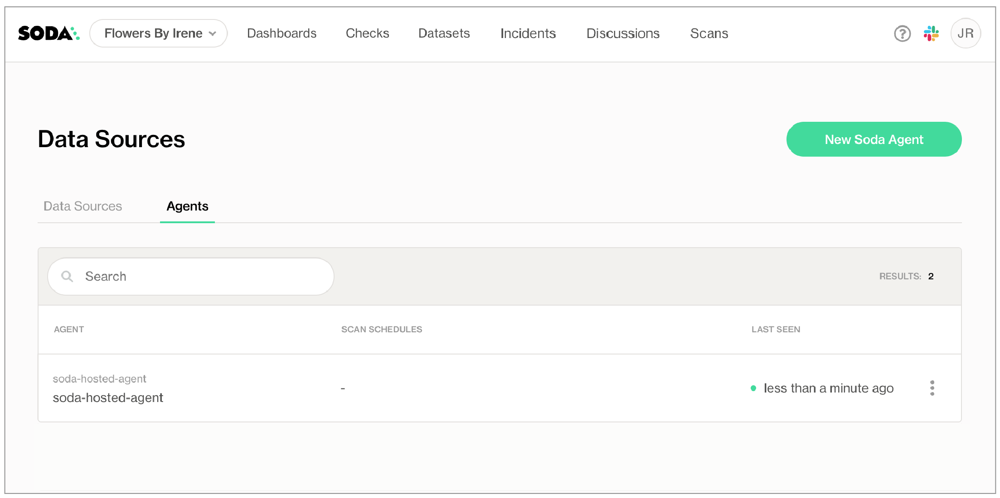
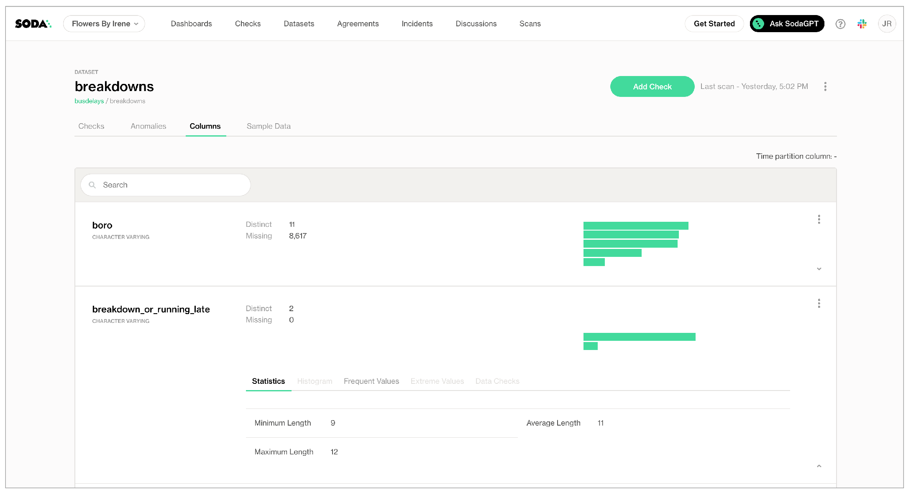

# Automate anomaly detection


**Available in 2025:** refer to the new [Soda docs](https://app.gitbook.com/o/ig9n9VJPAFRSFLtZKVB2/s/A2PmHkO5cBgeRPdiPPOG/).


Use this guide to set up Soda and begin automatically monitoring the data quality of datasets in a data source. Use the guided workflow in Soda Cloud to connect to a data source, profile your data, and activate **anomaly dashboards** for your datasets.

<figure><figcaption></figcaption></figure>

## About this guide

This guide offers Data Analysts, Data Scientists, and business users instructions to set up Soda to profile and begin monitoring data for quality, right out of the box.

This example offers instructions for both a self-hosted and Soda-hosted agent deployment models which use Soda Cloud connected to a Soda Agent to securely access data sources and execute scheduled scans for data quality anomaly detections. See: [Choose a flavor of Soda](../quick-start-sip/setup-guide.md).

## Set up a Soda Agent



This setup provides a secure, out-of-the-box Soda-hosted Agent to manage access to data sources from within your Soda Cloud account.

#### Compatibility <a href="#compatibility" id="compatibility"></a>

| <p>BigQuery<br>Databricks SQL<br>MS SQL Server<br>MySQL</p> | <p>PostgreSQL<br>Redshift<br>Snowflake<br> </p> |
| ----------------------------------------------------------- | ----------------------------------------------- |

#### Set up <a href="#set-up" id="set-up"></a>

1. If you have not already done so, create a Soda Cloud account at [cloud.soda.io](https://cloud.soda.io/signup?utm_source=docs). If you already have a Soda account, log in.
2. By default, Soda prepares a Soda-hosted agent for all newly-created accounts. However, if you are an Admin in an existing Soda Cloud account and wish to use a Soda-hosted agent, navigate to **your avatar** > **Organization Settings**. In the **Organization** tab, click the checkbox to **Enable Soda-hosted Agent**.
3.  Navigate to **your avatar** > **Data Sources**, then access the **Agents** tab. Notice your out-of-the-box Soda-hosted agent that is up and running.\


    <figure><figcaption></figcaption></figure>

Invite your colleague(s) to your Soda Cloud organization so they can access the newly-deployed Soda Agent to connect to data sources and begin monitoring data quality. In your Soda Cloud account, navigate to **your avatar** > **Invite Team Members** and fill in the blanks.



This setup uses a secure self-hosted Soda Agent to manage access to data sources from within your Soda Cloud account.

#### Compatibility <a href="#compatibility-1" id="compatibility-1"></a>

| <p>Amazon Athena<br>Amazon Redshift<br>Azure Synapse<br>ClickHouse<br>Databricks SQL<br>Denodo<br>Dremio<br>DuckDB<br>GCP BigQuery<br>Google CloudSQL</p> | <p>IBM DB2<br>MotherDuck<br>MS SQL Server<sup>1</sup><br>MySQL<br>OracleDB<br>PostgreSQL<br>Presto<br>Snowflake<br>Trino<br>Vertica</p> |
| --------------------------------------------------------------------------------------------------------------------------------------------------------- | --------------------------------------------------------------------------------------------------------------------------------------- |

<sup>1</sup> MS SQL Server with Windows Authentication does not work with Soda Agent out-of-the-box.

#### Set up <a href="#set-up-1" id="set-up-1"></a>

A self-hosted Soda Agent is a tool that empowers Soda Cloud users to securely access data sources to scan for data quality. Create a Kubernetes cluster in a cloud services provider environment, then use Helm to deploy a self-hosted Soda Agent in the cluster.

For context, the instructions to deploy a self-hosted agent assume:

* you have the appropriate access to a cloud services provider environment such as Azure, AWS, or Google Cloud that allows you to create and deploy applications to a cluster,
* you, or someone on your team, has access to the login credentials that Soda needs to be able to access a data source such as MS SQL, BigQuery, or Athena so that it can run scans of the data.

Access the [exhaustive deployment instructions](../quick-start-sip/deploy.md#deploy-a-soda-agent-in-a-kubernetes-cluster) for the cloud services provider you use.

* Cloud services provider-agnostic instructions
* Amazon Elastic Kubernetes Service (EKS)
* Microsoft Azure Kubernetes Service (AKS)
* Google Kubernetes Engine (GKE)

See also: [Soda Agent basic concepts](../learning-resources/basics.md)



## Automate data quality monitoring

_For preview participants, only._

1. As a user with permission to do so in your Soda Cloud account, navigate to **your avatar** > **Data Sources**.
2.  In the **Agents** tab, confirm that you can see your Soda-hosted agent and that its status is "green" in the **Last Seen** column.

    <figure><figcaption></figcaption></figure>
3. Navigate to the **Data source** tab, then click **New Data Source** and follow the guided steps to connect to a new data source. Refer to the subsections below for insight into the values to enter in the fields and editing panels in the guided steps.

#### 1. Attributes

| Field or Label                                                                                                                                                                | Guidance                                                                                                                                                                                                        |
| ----------------------------------------------------------------------------------------------------------------------------------------------------------------------------- | --------------------------------------------------------------------------------------------------------------------------------------------------------------------------------------------------------------- |
| Data Source Label                                                                                                                                                             | Provide a unique identifier for the data source. Soda Cloud uses the label you provide to define the immutable name of the data source against which it runs the Default Scan.                                  |
| Default Scan Agent                                                                                                                                                            | Select the Soda-hosted agent, or the name of a Soda Agent that you have previously set up in your secure environment. This identifies the Soda Agent to which Soda Cloud must connect in order to run its scan. |
| Check Schedule                                                                                                                                                                | Provide the scan frequency details Soda Cloud uses to execute scans according to your needs. If you wish, you can define the schedule as a cron expression.                                                     |
| Starting At                                                                                                                                                                   | Select the time of day to run the scan. The default value is midnight.                                                                                                                                          |
| Cron Expression                                                                                                                                                               | (Optional) Write your own [cron expression](https://en.wikipedia.org/wiki/Cron) to define the schedule Soda Cloud uses to run scans.                                                                            |
| <p>Anomaly Dashboard Scan Schedule<br><a href="https://app.gitbook.com/s/A2PmHkO5cBgeRPdiPPOG/data-observability"><strong>Available</strong></a> <strong>in 2025</strong></p> | Provide the scan frequency details Soda Cloud uses to execute a daily scan to automatically detect anomalies for the anomaly dashboard.                                                                         |

#### 2. Connect

In the editing panel, provide the connection configurations Soda Cloud needs to be able to access the data in the data source. Connection configurations are data source-specific and include values for things such as a database's host and access credentials.

Access the [data source-specific connection configurations](../data-source-reference/) for the connection syntax and descriptions; adjust the values to correspond with your data source’s details.

To more securely provide sensitive values such as usernames and passwords in a self-hosted agent deployment model, use environment variables in a `values.yml` file when you deploy the Soda Agent. See [Use environment variables for data source connection credentials](../quick-start-sip/extras.md#use-environment-variables-to-store-data-source-connection-credentials) for details.

#### 3. Discover

During its initial scan of your datasource, Soda Cloud discovers all the datasets the data source contains. It captures basic information about each dataset, including a dataset's schema and the columns it contains.

In the editing panel, specify the datasets that Soda Cloud must include or exclude from this basic discovery activity. The default syntax in the editing panel instructs Soda to collect basic dataset information from all datasets in the data source _except_ those with names that begin with `test_`. The `%` is a wildcard character. See [Add dataset discovery](../soda-cl-overview/profile.md#add-dataset-discovery) for more detail on profiling syntax.


_Known issue:_ SodaCL does not support using variables in column profiling and dataset discovery configurations.


```yaml
discover datasets:
  datasets:
    - include %
    - exclude test_%
```

#### 4. Profile

To gather more detailed profile information about datasets in your data source and automatically build an **anomaly dashboard** for data quality observability, you can configure Soda Cloud to profile the columns in datasets.

Profiling a dataset produces two tabs' worth of data in a dataset page:

*   In the **Columns** tab, you can see column profile information including details such as the calculated mean value of data in a column, the maximum and minimum values in a column, and the number of rows with missing data.

    <figure><figcaption></figcaption></figure>
*   In the **Anomalies** tab, you can access an out-of-the-box Anomaly Dashboard that uses the column profile information to automatically begin detecting anomalies in your data relative to the patterns the machine learning algorithm learns over the course of approximately five days. **Available in 2025:** [Learn more](https://app.gitbook.com/s/A2PmHkO5cBgeRPdiPPOG/data-observability)\


    <figure><figcaption></figcaption></figure>

In the editing panel, provide details that Soda Cloud uses to determine which datasets to include or exclude when it profiles the columns in a dataset. The default syntax in the editing panel instructs Soda to profile every column of every dataset in this data source, and, superfluously, all datasets with names that begin with `prod`. The `%` is a wildcard character. See [Add column profiling](../soda-cl-overview/profile.md#add-column-profiling) for more detail on profiling syntax.

Column profiling can be resource-heavy, so carefully consider the datasets for which you truly need column profile information. Refer to [Compute consumption and cost considerations](../soda-cl-overview/profile.md#compute-consumption-and-cost-considerations) for more detail.

```yaml
profile columns:
  columns:
    - "%.%"  # Includes all your datasets
    - prod%  # Includes all datasets that begin with 'prod'
```

#### 5. Assign Owner

| Field or Label        | Guidance                                                                                                                                                                                                                                                                |
| --------------------- | ----------------------------------------------------------------------------------------------------------------------------------------------------------------------------------------------------------------------------------------------------------------------- |
| Data Source Owner     | The Data Source Owner maintains the connection details and settings for this data source and its Default Scan Definition.                                                                                                                                               |
| Default Dataset Owner | The Datasets Owner is the user who, by default, becomes the owner of each dataset the Default Scan discovers. Refer to [Manage global roles, user groups, and settings ](../collaborate/roles-global.md)to learn how to adjust the Dataset Owner of individual datasets |

## Access an anomaly dashboard

After approximately five days, during which Soda’s machine learning studies your data, you can navigate to the **Anomalies** tab on the **Dataset** page on one of the datasets you included in profiling to view the issues Soda automatically detected.

<figure><figcaption></figcaption></figure>

The three **Dataset Metrics** tiles represent the most recent measurement or, in other words, one day’s worth of data anomaly detection. The three **Column Metrics** tiles display the last seven days’ worth of measurements and any anomalies that Soda detected.

When you click a **Column Metrics** tile to access more information, the list below details which columns contained anomalies.

* A red warning icon for a column indicates that Soda registered an anomaly in the last daily scan of the dataset.
* A green check icon for a column indicates that Soda resgisterd no anomalies in the last daily scan of the dataset.
* A grayed-out icon for a column indicates that Soda registered an anomaly for a check at least once in the last seven days, but not on the most recent daily scan.

Click a Dataset Metric tile or the column name for a Column Metric to open the **Check History** for the anomaly detection check. Optionally, you can add feedback to individual data points in the check history graph to help refine the anomaly detection’s algorithm pattern recognition and its ability to recognize anomalies.

<figure><figcaption></figcaption></figure>

### Set up alert notifications <a href="#set-up-alert-notifications" id="set-up-alert-notifications"></a>

The anomaly dashboard adheres to Soda’s “no noise” policy when it comes to alert notifications for data quality issues. As such, the dashboard does not automatically send any notifications to anyone out of the box. If you wish to received alert notifications for any of the anomalies the dashboard detects, use the bell (🔔) icon.

If your Soda Admin has integrated your Soda Cloud account with [Slack](../integrate-soda/integrate-slack.md) or [MS Teams](../integrate-soda/integrate-msteams.md) to receive check notifications, you can direct anomaly dashboard alerts to those channels. The dashboard does not support sending alerts via [webhook](../integrate-soda/integrate-webhooks.md).

For a **Dataset Metric**, click the bell to follow the guided instructions to set up a rule that defines where to send an alert notification when Soda detects an anomalous measurement for the metric.

<figure><figcaption></figcaption></figure>

For a **Column Metric**, click the bell next to an individual column name from those listed in the table below the three column metric tiles. Follow the guided instructions to set up a rule that defines where to send an alert notification when Soda detects an anomalous measurement for the metric.

For example, if you want to receive notifications any time Soda detects an anomalous volume of duplicate values in an `order_id` column, click the **Duplicate** tile to display all the columns for which Soda automatically detects anomalies, then click the bell for `order_id` and set up a rule. If you also wish to receive notifications for anomalous volumes of missing values in the same column, click the **Missing** tile, then click the bell for `order_id` to set up a second rule.

<figure><figcaption></figcaption></figure>

### Go further <a href="#go-further" id="go-further"></a>

* Learn more about the [anomaly dashboard](../collaborate/anomaly-dashboard.md) for datasets.
* Learn more about [organizing check results](../collaborate/), setting alerts, and investigating issues.
* [Write your own checks](../sodacl-reference/metrics-and-checks.md) for data quality.
* [Integrate Soda with Slack](../integrate-soda/integrate-slack.md) to send alert notifications directly to channels in your workspace.
* Integrate Soda with a data catalog to see data quality results from within the catalog:
  * [Atlan](../integrate-soda/integrate-atlan.md)
  * [Alation](../integrate-soda/integrate-alation.md)
  * [Metaphor](../integrate-soda/integrate-metaphor.md)


