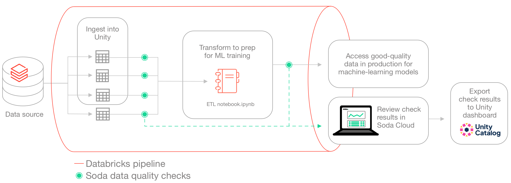
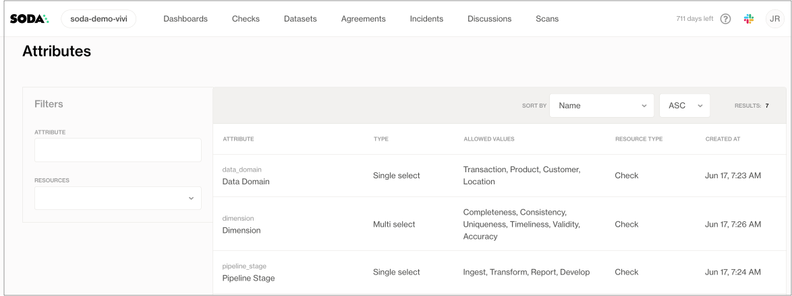
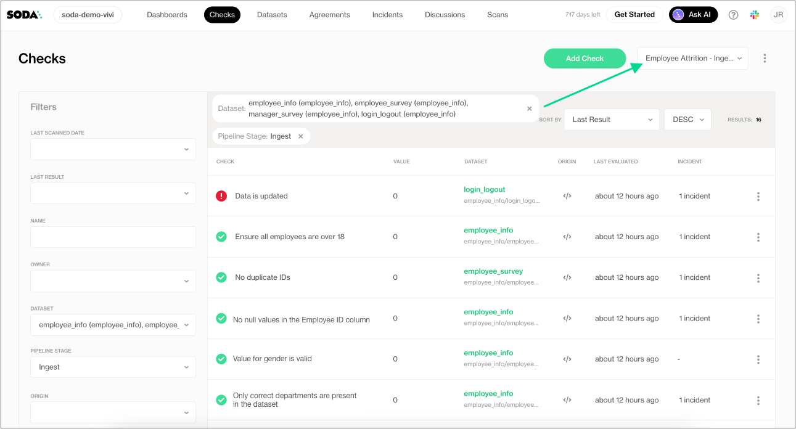
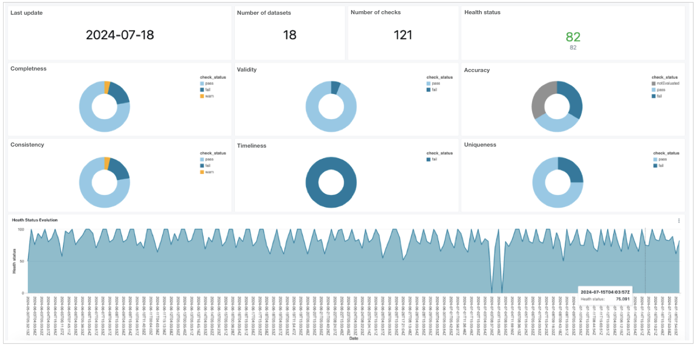

# Test data quality in a Databricks pipeline

Use this guide as an example for how to set up and use Soda to test the quality of data in a Databricks pipeline. Automatically catch data quality issues after ingestion or transformation, and before using the data to train a machine learning model.

> [Jump to Databricks notebooks](quick-start-databricks-pipeline.md#invoke-soda-in-databricks-notebooks)

<figure><figcaption></figcaption></figure>

## About this guide

The instructions below offers an example of how to execute Soda Checks Language (SodaCL) checks for data quality within a Databricks pipeline that handles data which trains a machine learning (ML) model.

For context, this guide demonstrates a Data Scientist and Data Engineer working with Human Resources data to build a forecast model for employee attrition. The Data Engineer, working with a Data Scientist, uses a Databricks notebook to gather data from SQL-accessible dataset, transforms the data into the correct format for their ML model, then uses the data to train the model.

Though they do not have direct access to the data to be able to resolve issues themselves, the Data Engineer can use Soda to detect data quality issues before the data model trains on poor-quality data. The pipeline the Data Engineer creates includes various SodaCL checks embedded at two stages in the pipeline: after data ingestion and after data transformation. At the end of the process, the pipeline stores the checks' metadata in a Databricks table which feeds into a data quality dashboard. The Data Engineer utilizes Databricks workflows to schedule this process on a daily basis.

## Prerequisites

The Data Engineer in this example uses the following:

* Python 3.8, 3.9, or 3.10
* Pip 21.0 or greater
* a Databricks account
* access to a Unity catalog

## Create a Soda Cloud account

To validate an account license or free trial, Soda Library must communicate with a Soda Cloud account via API keys. You create a set of API keys in your Soda Cloud account, then use them to configure the connection to Soda Library.

1. In a browser, the Data Engineer navigates to [cloud.soda.io/signup](https://cloud.soda.io/signup) to create a new Soda account, which is free for a 45-day trial.
2. They navigate to **your avatar** > **Profile**, access the **API keys** tab, then click the plus icon to generate new API keys.
3. They copy+paste the API key values to a temporary, secure place in their local environment.

## Connect Soda Cloud to Soda Library and data source

1. Within Databricks, the Data Engineer creates two notebooks:

* **Data Ingestion Checks**, which runs scans for data quality after data is ingested into a Unity catalog
* **Input Data Checks**, which prepares data for training a machine learning model and runs data quality scans before submitting to the model for training

2. In the same directory as the Databricks notebooks, the Data Engineer creates a `soda_settings` directory to contain this configuration file, and, later, the check YAML files that Soda needs to run scans. To connect Soda to the Unity catalog, the Data Engineer prepares a `soda_conf.yml` file which stores the data source connection details.
3. To the file, they add the data source connection configuration to the Unity catalog that contains the Human Resources data the Data Engineer uses, and the Soda Cloud API key connection configuration, then they save the file.

```yaml
data_source employees:
 type: spark
 method: databricks
 catalog: unity_catalog
 schema: employees 
 host:  hostname_from_Databricks_SQL_settings
 http_path: http_path_from_Databricks_SQL_settings
 token: my_access_token

soda_cloud:
 # Use cloud.soda.io for EU region
 # Use cloud.us.soda.io for US region
 host: https://cloud.soda.io
 api_key_id: soda-api-key-id
 api_key_secret: soda-api-key-secret
```

> Read more: [Use Soda Library with Spark DataFrames on Databricks](../data-source-reference/connect-spark.md#use-soda-library-with-spark-dataframes-on-databricks)
>
> Read more: [How Soda works](../learning-resources/how-library-works.md)

## Write checks for data quality

A check is a test that Soda executes when it scans a dataset in your data source. The `checks.yml` file stores the checks you write using the Soda Checks Language. You can create multiple checks files to organize your data quality checks and run all, or some of them, at scan time.

In this example, the Data Engineer creates two checks files in the `soda_settings` directory in Databricks:

* `ingestion_checks.yml` to execute quality checks after data ingestion into the Unity catalog in the Data Ingestion Checks notebook
* `input_data_checks.yml` to execute quality checks after transformation, and before using it to train their ML model in the Input Data Checks notebook.
* `output_data_checks.yml` to execute quality checks after training the model and monitor the performance of your model.

The raw data in this example is divided into two main categories.

* The first category is Human Resources data, which the Unity catalog contains in three datasets: basic employee information, results of manager surveys, and results of employee surveys. The survey datasets are updated on a frequent basis.
* The second category is application login data, which is a file in the Databricks file system; it is updated daily.

> Download: [employee\_info\_sample.csv](https://docs.soda.io/assets/employee_info_sample.csv)
>
> Read more: [SodaCL reference](../sodacl-reference/metrics-and-checks.md)

### Post-ingestion checks

The Data Engineer creates a checks YAML file to write checks that apply to the datasets they use to train their ML model. The Data Ingestion Checks notebook runs these checks after the data is ingested into the Unity catalog. For any checks that fail, the Data Engineer can notify upstream Data Engineers or Data Product Owners to address issues such as missing data or invalid entries.

Many of the checks that the Data Engineer prepares include [check attributes](../collaborate/check-attributes.md) which they created in Soda Cloud; see image below. When added to checks, the Data Engineer can use the attributes to filter check results in Soda Cloud, build custom views ([Collections](../collaborate/#build-check-collections)), and stay organized as they monitor data quality in the Soda Cloud user interface. Skip to [Review check results](quick-start-databricks-pipeline.md#review-check-results-in-soda-cloud) to see an example.

<figure><figcaption></figcaption></figure>

The Data Engineer also added a [dataset filter](../sodacl-reference/filters.md#configure-dataset-filters) to the quality checks that apply to the application login data. The filter serves to partition the data against which Soda executes the checks; instead of checking for quality on the entire dataset, the filter limits the scan to the previous day’s data.

ingestion\_checks.yml

```yaml
checks for employee_info:
 - invalid_count(Department) = 0:
     valid values: ['Sales', 'Research & Development', 'Human Resources']
     name: Only correct departments are present in the dataset
     attributes:
       dimension: [Validity]
       pipeline_stage: Ingest
       team: Data Engineering
 - missing_count(EmployeeID) = 0:
     name: No null values in the Employee ID column
     attributes:
       dimension: [Completeness]
       pipeline_stage: Ingest
       team: Data Engineering
 - duplicate_count(EmployeeID) = 0:
     name: No duplicate IDs
     attributes:
       dimension: [Uniqueness]
       pipeline_stage: Ingest
       team: Data Engineering
 - invalid_count(Gender) = 0:
     valid values: ['Female', 'Male', 'Non-binary']
     name: Value for gender is valid
     attributes:
       dimension: [Validity]
       pipeline_stage: Ingest
       team: Data Engineering
 - invalid_count(Age) = 0:
     valid min: 18
     name: All employees are over 18
     attributes:
       dimension: [Validity]
       pipeline_stage: Ingest
       team: Data Engineering
 - missing_count(MonthlyIncome) = 0:
     name: No null values in MonthlyIncome
     attributes:
       dimension: [Completeness]
       pipeline_stage: Ingest
       team: Data Engineering
 - failed rows:
     name: Monthly Salary equals or exceeds legally required salary
     fail condition: MonthlyIncome < 11000
 - schema:
     warn:
       when schema changes: any
     name: Columns have not been added, removed, or changed
     attributes:
       dimension: [Consistency]
       pipeline_stage: Ingest
       team: Data Engineering


checks for employee_survey:
 - invalid_count(EnvironmentSatisfaction) = 0:
     valid min: 1
     valid max: 5
     name: Values are formatted in range 1-5
     attributes:
       dimension: [Validity]
       pipeline_stage: Ingest
       team: Data Engineering
 - missing_count(EmployeeID) = 0:
     name: No null values in Employee ID
     attributes:
       dimension: [Completeness]
       pipeline_stage: Ingest
       team: Data Engineering
 - duplicate_count(EmployeeID) = 0:
     name: No duplicate IDs
     attributes:
       dimension: [Uniqueness]
       pipeline_stage: Ingest
       team: Data Engineering
 - invalid_count(WorkLifeBalance) = 0:
     valid min: 1
     valid max: 5
     name: Values are formatted in range 1-5
     attributes:
       dimension: [Validity]
       pipeline_stage: Ingest
       team: Data Engineering
 - schema:
     warn:
       when schema changes: any
     name: Columns have not been added, removed, or changed
 - values in EmployeeID must exist in employee_info EmployeeID:
    name: EmployeeID Integrity Check for employee survey


checks for manager_survey:
 - invalid_count(PerformanceRating) = 0:
     valid min: 1
     valid max: 5
     name: Values are formatted in range 1-5
     attributes:
       dimension: [Validity]
       pipeline_stage: Ingest
       team: Data Engineering
 - schema:
     warn:
       when schema changes: any
     name: Columns have not been added, removed, or changed
     attributes:
       dimension: [Consistency]
       pipeline_stage: Ingest
       team: Data Engineering
 - values in EmployeeID must exist in employee_info EmployeeID:
    name: EmployeeID integrity check for manager survey

# This filter partitions data included in the quality scan
# because the data in the dataset lags by one day 
filter login_logout [daily]:
  where: LogoutTime < CAST(current_date() AS TIMESTAMP) - INTERVAL 1 DAY AND LoginTime > CAST(current_date() AS TIMESTAMP) - INTERVAL 2 DAY

checks for login_logout [daily]:
 - invalid_count(LoginTime):
     valid regex: "^\\d{4}-\\d{2}-\\d{2}T\\d{2}:\\d{2}:\\d{2}(\\.\\d+)?(Z|[+-]\\\
       d{2}:\\d{2})$"
     name: Login time format
     fail: when > 0
     attributes:
       dimension: [Validity]
       pipeline_stage: Ingest
       team: Data Engineering
 - missing_count(LogoutTime) = 0:
     name: No nulls in LogoutTime
     attributes:
       dimension: [Completeness]
       pipeline_stage: Ingest
       team: Data Engineering
 - values in EmployeeID must exist in employee_info EmployeeID:
    name: EmployeeID Integrity Check for login times
 - freshness(LogoutTime) < 2d:
     name: Data is updated
     attributes:
       dimension: [Timeliness]
       pipeline_stage: Ingest
       team: Data Engineering
```

## Post-transformation checks

The Data Engineer also prepared a second set of SodaCL checks in a separate file to run after transformation in the Input Data Checks notebook. Curious readers can download the [ETL notebook.ipynb](https://docs.soda.io/assets/Data%20Ingestion%20Checks.ipynb) to review transformations and the resulting `input_data_attrition_model` output into a DataFrame.

Two of the checks the Data Engineer prepares involve checking groups of data. The [group evolution check](../sodacl-reference/group-evolution.md) validates the presence or absence of a group in a dataset, or to check for changes to groups in a dataset relative to their previous state; in this case, it confirms the presence of the `Married` group in the data, and when any group changes. Further, the [group by check](../sodacl-reference/group-by.md) collects and presents check results by category; in this case, it groups the results according to `JobLevel`.

input\_data\_checks.yml

```yaml
filter input_data_attrition_model [daily]:
  where: PartitionDate < CAST(current_date() AS TIMESTAMP) - INTERVAL 1 DAY AND PartitionDate > CAST(current_date() AS TIMESTAMP) - INTERVAL 2 DAY


checks for input_data_attrition_model [daily]:
 - missing_count(Attrition)=0::
     name: Target value is not missing
     attributes:
       pipeline: Transform
       team: Data Science
       dimension: [Completeness]
 - invalid_percent(TotalWorkingYears):
     valid min: 0
     name: Working years can't be negative
     warn: when > 0%
     fail: when > 10%
     attributes:
       pipeline: Transform
       team: Data Science
       attribute: [Validity]
 - values in EmployeeID must exist in employee_info EmployeeID:
    name: EmployeeID Integrity Check
 - failed rows:
     name: Overtime detected
     fail query: |
       SELECT *
       FROM input_data_attrition_model
       WHERE WorkingMinutes > 750
     attributes:
       pipeline: Transform
       team: Data Science
 - freshness(PartitionDate) < 2d:
     name: Data is fresh
     attributes:
       pipeline: Transform
       team: Data Science
       dimension: [Timeliness]
 - group evolution:
     name: Marital status
     query: |
       SELECT MaritalStatus FROM input_data_attrition_model GROUP BY 1
     fail:
       when required group missing: [Married]
     warn:
       when groups change: any
     attributes:
       pipeline: Transform
       team: Data Science
       dimension: [Consistency]
 - group by:
     query: |
       SELECT JobLevel, min(MonthlyIncome) AS salary
       FROM input_data_attrition_model
       GROUP BY 1
     fields:
       - JobLevel
     checks:
       - salary:
           warn: when < 0
           fail: when < -1
           name: Min Salary Normalised cannot be below -1
           attributes:
             pipeline: Transform
             team: Data Science
             dimension: [Accuracy]
```

## Invoke Soda in Databricks notebooks

At the [beginning](quick-start-databricks-pipeline.md#connect-soda-cloud-to-soda-library-and-data-source) of this exercise, the Data Engineer created two notebooks in their Databricks workflow:

* **Data Ingestion Checks** to run after data is ingested into the Unity catalog
* **Input Data Check** to run after transformation, and before using the data to train the ML model

The following outlines the contents of each notebook and the steps included to install Soda and invoke it to run scans for data quality, thereby executing the data quality checks in the checks YAMLfiles. Beyond invoking Soda to scan for data quality, the notebooks also save the checks' metadata for further analysis.

#### Data ingestion checks

> Download: [Data Ingestion Checks.ipynb](https://docs.soda.io/assets/Data%20Ingestion%20Checks.ipynb)

```python
# Install to run checks contained in files
pip install -i https://pypi.cloud.soda.io soda-spark-df

# Import Scan from Soda Library
from soda.scan import Scan 
import yaml
from io import StringIO
from pathlib import Path
from datetime import datetime, timedelta

# Define file directory
settings_path = Path('/Workspace/Users/my_user_id/employee_attrition/soda_settings')

# Define results file directory
result_path = Path('/Workspace/Users/my_user_id/employee_attrition/checks_output')

# Define the file partition
partition = (datetime.today().date() - timedelta(days=1)).strftime("%Y-%m-%d")
# Create a scan object
scan = Scan()

# Set scan name and data source name
scan.set_scan_definition_name("Employee Attrition Scan")
scan.set_data_source_name("employees")

# Add file to be scanned 
df = spark.read.option("header", True).csv(f"dbfs:/Workspace/Users/my_user_id/employee_attrition/soda_settings/login_logout/PartitionDate={partition}")

# Create temporary View to run the checks 
df.createOrReplaceTempView("login_logout")

# Function to create temporary views of the tables to be included in the same scan
def create_temp_views(spark, schema, table_names):
    for table in table_names:
        full_table_name = f"{schema}.{table}"
        df = spark.table(full_table_name)
        df.createOrReplaceTempView(table)

# Create the temp view from the table list
schema = "unity_catalog.employees"
table_names = ["employee_info", "employee_survey", "manager_survey"]

create_temp_views(spark, schema, table_names)

# Add Views to the scan object
scan.add_spark_session(spark, data_source_name="employees")

# Access the checks YAML file 
with open(settings_path/"ingestion_checks.yml") as ing_checks:
    ingestion = ing_checks.read()

# Create a file-like object from the YAML content
ingestion_checks = StringIO(ingestion)

# Use the scan.add_sodacl_yaml method to retrieve the checks
scan.add_sodacl_yaml_str(ingestion_checks)

# Retrieve the configuration file and use the scan.add_sodacl_yaml method 
with open(settings_path/"soda_conf.yml") as cfg:
    cfg_content = cfg.read()

# Create a file-like object from the YAML content
conf = StringIO(cfg_content)

# Add the data source connection configuration to the scan
scan.add_configuration_yaml_str(conf)

# Execute the scan
scan.execute()

# Check the Scan object for methods to inspect the scan result; print all logs to console
print(scan.get_logs_text())

# Save the checks metadata for further analysis
metadata = scan.build_scan_results()

scan_date = datetime.now().date().strftime("%Y-%m-%d")

scan.save_scan_result_to_file(result_path/f"ingestion_result_{scan_date}.json", metadata['checks'])
```

#### Input data checks and model output checks

> Download: [Input Data Checks.ipynb](https://docs.soda.io/assets/Input%20Data%20Checks.ipynb)

```python
# Install to run checks on data in Unity datasets 
pip install -i https://pypi.cloud.soda.io soda-spark[databricks]

#restart to use updated packages
%restart_python

# Import Scan from Soda Library
from soda.scan import Scan 
import yaml
from io import StringIO
from pathlib import Path

# Define file directory
settings_path = Path('/Workspace/Users/my_user_id/employee_attrition/soda_settings')

# Create a scan object
scan = Scan()

# Set scan name and data source name
scan.set_scan_definition_name("Attrition Model - Input Data Checks")
scan.set_data_source_name("employee_info")

# Attach a Spark session
scan.add_spark_session(spark)

# Access the checks YAML file 
with open(settings_path/"input_data_checks.yml") as input_checks:
    input_data = input_checks.read()

# Create a file-like object from the YAML content
input_data_checks = StringIO(input_data)

# Use the scan.add_sodacl_yaml method to retrieve the checks
scan.add_sodacl_yaml_str(input_data_checks)

# Retrieve the configuration file and use the scan.add_sodacl_yaml method 
with open(settings_path/"soda_conf.yml") as cfg:
    cfg_content = cfg.read()

# Create a file-like object from the YAML content
conf = StringIO(cfg_content)

# Add the connection configuration to the scan
scan.add_configuration_yaml_str(conf)
scan.execute()

# Check the Scan object for methods to inspect the scan result; print all logs to console
print(scan.get_logs_text())
```

Using the same structure the data scientists define some extra checks to validate and monitor the performance of their model after training. They define a ratio between the categories and apply an anomaly detection to make sure that there are no spikes or unexpected swifts in the label distribution. Furthermore, they add a check to ensure that they will notified when the model accuracy is below 60% and/or when the dataset is incomplete.

model\_output\_checks.yml

```yaml
discover datasets:
  datasets:
    - attrition_model_output

profile columns:
  columns:
    - include attrition_model_output.%

filter attrition_model_output [daily]:
   where: PartitionDate < CAST(current_date() AS TIMESTAMP) - INTERVAL 1 DAY AND PartitionDate > CAST(current_date() AS TIMESTAMP) - INTERVAL 2 DAY

checks for attrition_model_output [daily]:
  - row_count > 0:
      name: Dataset cannot be empty
      attributes: 
        pipeline_stage: Training
        team: Data Science
        dimension: [Completeness]

  - missing_count(Attrition) = 0:
      name: Attrition field is not completed
      attributes: 
        pipeline_stage: Training
        team: Data Science
        dimension: [Completeness]

  - avg(Accuracy):
      name: Accuracy is not below 60%
      fail: when < 0.60
      warn: when < 0.70
      attributes:
        pipeline_stage: Training
        team: Data Science
        dimension: [Accuracy]
        
  - anomaly detection for attrition_ratio:
      name: Attrition ratio anomaly detection
      attrition_ratio query: |
        SELECT (COUNT(CASE WHEN Attrition = true THEN 1 END) * 1.0) / COUNT(*) AS attrition_ratio
        FROM attrition_model_output
      attributes:
        pipeline_stage: Training
        team: Data Science
        dimension: [Accuracy]
    
```

## Review check results in Soda Cloud

After running the notebooks, the Data Engineer accesses Soda Cloud to review the check results.

In the **Checks** page, they apply filters to narrow the results to the datasets involved in the Employee Attrition ML model, and distill the results even further by selecting to display only those results with the Pipeline attribute of `Ingest`. They save the results as a Collection labeled **Employee Attrition - Ingestion** to easily access the relevant quality results in the future.

<figure><figcaption></figcaption></figure>

## Review check results in a Unity dashboard

After the Data Engineer trains the model to forecast employee attrition, they decide to devise an extra step in the process to use the [Soda Cloud API](broken-reference) export all the Soda check results and dataset metadata back into the Unity catalog, then build a dashboard to display the results.


_Coming soon:_ a tutorial for building a dashboard using the Soda Cloud API.


<figure><figcaption></figcaption></figure>

## Go further

* Learn more about [SodaCL metrics and checks](../sodacl-reference/metrics-and-checks.md).
* Learn more about [getting organized](../collaborate/) in Soda Cloud.
* Set [notification rules](../collaborate/notif-rules.md) to receive alerts when checks fail.


