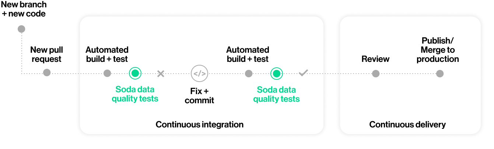
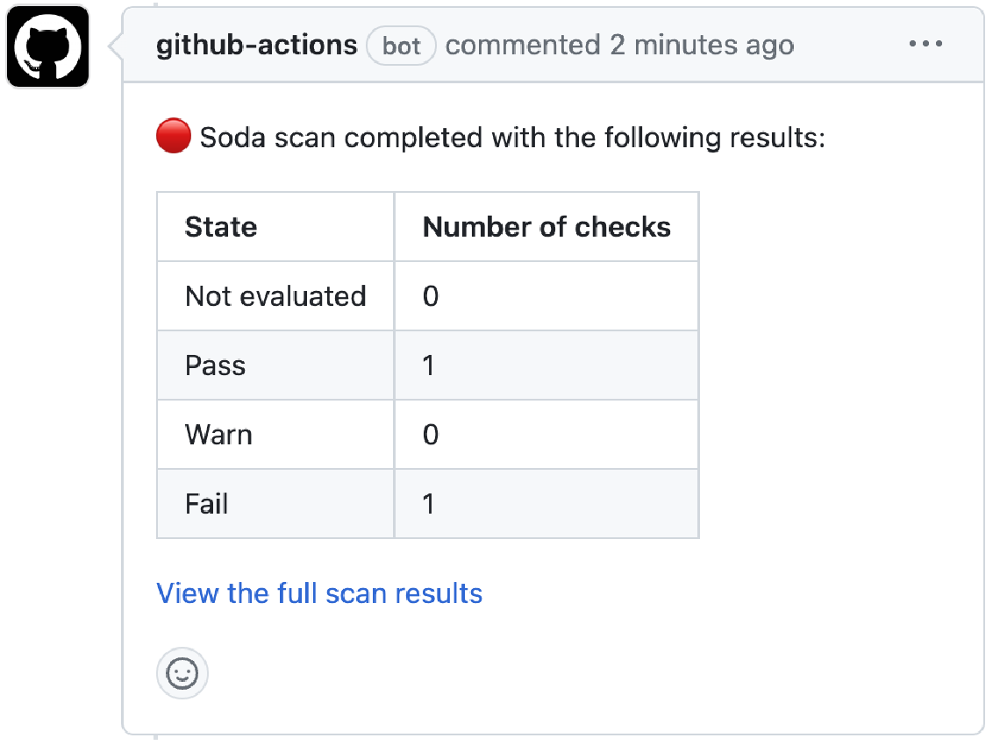
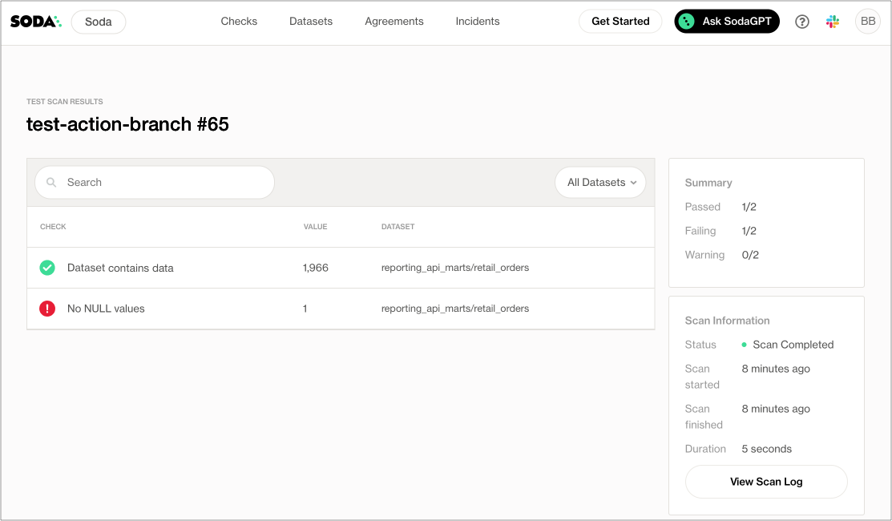

# Test data quality during CI/CD development

Use this guide to install and set up Soda to test the quality of your data during your development lifecycle. Catch data quality issues in a GitHub pull request before merging data management changes, such as transformations, into production.



<figure><figcaption></figcaption></figure>

## About this guide

The instructions below offer Data Engineers an example of how to use the [Soda Library Action](https://github.com/marketplace/actions/soda-library-action) to execute SodaCL checks for data quality on data in a Snowflake data source.

For context, the example assumes that a team of people use GitHub to collaborate on managing data ingestion and transformation with dbt. In the same repo, team members collaborate to write tests for data quality in SodaCL checks YAML files. With each new pull request, or commit to an existing one, in the repository that adds a transformation or makes changes to a dbt model, the GitHub Action in Workflow executes a Soda scan for data quality and presents the results of the scan in a comment in the pull request, and in Soda Cloud.

Where the scan results indicate an issue with data quality, Soda notifies the team via a notification in Slack so that they can investigate and address any issues before merging the PR into production.

Borrow from this guide to connect to your own data source, add the GitHub Action for Soda to a Workflow, and execute your own relevant tests for data quality to prevent issues in production.

## Add the GitHub Action for Soda to a Workflow

1. In a browser, navigate to [cloud.soda.io/signup](https://cloud.soda.io/signup) to create a new Soda account, which is free for a 45-day trial. If you already have a Soda account, log in.
2. Navigate to **your avatar** > **Profile**, then access the **API keys** tab. Click the plus icon to generate new API keys. Copy+paste the API key values to a temporary, secure place in your local environment.

<details>

<summary>Why do I need a Soda Cloud account?</summary>

To validate your account license or free trial, the Soda Library Docker image that the GitHub Action uses to execute scans must communicate with a Soda Cloud account via API keys.\
Create new API keys in your Soda Cloud account, then use them to configure the connection between the Soda Library Docker image and your account later in this procedure.

</details>

3. In the GitHub repository in which you wish to include data quality scans in a Workflow, create a folder named `soda` for the configuration files that Soda requires as input to run a scan.
4. In this folder, create two files:

* a `configuration.yml` file to store the connection configuration Soda needs to connect to your data source and your Soda Cloud account.
* a `checks.yml` file to store the SodaCL checks you wish to execute to test for data quality; see [next section](quick-start-dev.md#write-checks-for-data-quality).

5. Follow the [instructions](../quick-start-sip/install.md#configure-soda) to add connection configuration details for both your data source and your Soda Cloud account to the `configuration.yml`, as per the example below.

```yaml
    data_source my_datasource_name:
      type: snowflake
      username: ${ SNOWFLAKE_USER }
      password: ${ SNOWFLAKE_PASS }
      account: ${ SNOWFLAKE_ACCOUNT } 
      database: sodadata_test
      warehouse: compute_wh
      role: analyst
      session_parameters:
        QUERY_TAG: soda-queries
        QUOTED_IDENTIFIERS_IGNORE_CASE: false
      schema: public
    
    soda_cloud:
      host: cloud.us.soda.io
      api_key_id: ${ SODA_CLOUD_API_KEY }
      api_key_secret: ${ SODA_CLOUD_API_SECRET } 
```

6. In the `.github/workflows` folder in your GitHub repository, open an existing Workflow or [create a new workflow](https://docs.github.com/en/actions/using-workflows/about-workflows#create-an-example-workflow) file.
7. In your browser, navigate to the GitHub Marketplace to access the [Soda Library Action](https://github.com/marketplace/actions/soda-library-action). Click **Use latest version** to copy the code snippet for the Action.
8. Paste the snippet into your new or existing workflow as an independent step, then add the required action inputs and environment variable as in the following example.

* Be sure to add the Soda Action _after_ the step in the workflow that completes a dbt run that executes your dbt tests.
*   Best practice dictates that you configure sensitive credentials using GitHub secrets. Read more about [GitHub encrypted secrets](https://docs.github.com/en/actions/security-guides/encrypted-secrets).\


    ```yaml
    # This GitHub Action runs a Soda scan on a Snowflake data source called reporting_api_marts.
    name: Run Soda Scan on [reporting_api_marts]
    # GitHub triggers this job when a user creates or updates a pull request.
    on: pull_request
    jobs:
      soda_scan:
        runs-on: ubuntu-latest
        name: Run Soda Scan
        steps:
          - name: Checkout
            uses: actions/checkout@v3

          - name: Perform Soda Scan
            uses: sodadata/soda-github-action@main
            env:
              SODA_CLOUD_API_KEY: ${{ secrets.SODA_CLOUD_API_KEY }}
              SODA_CLOUD_API_SECRET: ${{ secrets.SODA_CLOUD_API_SECRET }}
              SNOWFLAKE_USERNAME: ${{ secrets.SNOWFLAKE_USERNAME }}
              SNOWFLAKE_PASSWORD: ${{ secrets.SNOWFLAKE_PASSWORD }}

            with:
              soda_library_version: v1.0.4
              data_source: snowflake_api_marts
              configuration: ./soda/configuration.yml
              checks: ./soda/checks.yml
    ```

9. Save the changes to your workflow file.

## Write checks for data quality

A check is a test that Soda executes when it scans a dataset in your data source. The `checks.yml` file stores the checks you write using the [Soda Checks Language (SodaCL)](../soda-cl-overview/). You can create multiple `checks.yml` files to organize your data quality checks and run all, or some of them, at scan time.

1. In your `soda` folder, open the `checks.yml` file, then copy and paste the following rather generic checks into the file.

* Replace the value of `dataset_name` with the name of a dataset in your data source.
* Replace the value of `column1` with the name of a column in the dataset.\
  `yaml checks for dataset_name: # Checks that dataset contains rows - row_count > 0: name: Dataset contains data # Checks that column contains no NULL values - missing_count(column1) = 0: name: No NULL values`

2. Save the `checks.yml` file.

## Trigger a scan and examine the scan results

To trigger the GitHub Action and initiate a Soda scan for data quality, create a new pull request in your repository. Be sure to trigger a Soda scan _after_ the step in your Workflow that completes the dbt run that executed your dbt tests.

<details>

<summary>What does the GitHub Action do?</summary>

To summarize, the action completes the following tasks:

1. Checks to validate that the required Action input values are set.
2. Builds a Docker image with a specific Soda Library version for the base image.
3. Expands the environment variables to pass to the Docker run command as these variables can be configured in the workflow file and contain secrets.
4. Runs the built image to trigger the Soda scan for data quality.
5. Converts the Soda Library scan results to a markdown table using newest hash from 1.0.0 version.
6. Creates a pull request comment.
7. Posts any additional messages to make it clear whether or not the scan failed.

See the public [soda-github-action](https://github.com/sodadata/soda-github-action) repository for more detail.

</details>

1. For the purposes of this exercise, create a new branch in your GitHub repo, then make a small change to an existing file and commit and push the change to the branch.
2. Execute a [dbt run](https://docs.getdbt.com/reference/commands/run).
3. Create a new pull request, then navigate to your GitHub account and review the pull request you just created. Notice that the Soda scan action is queued and perhaps already running against your data to check for quality.
4.  When the job completes, navigate to the pull request's **Conversation** tab to view the comment the Action posted via the github-action bot. The table indicates the states and volumes of the check results.x\
    \


    <figure><figcaption></figcaption></figure>
5. To examine the full scan report and troubleshoot any issues, click the link in the comment to **View full scan results**, then click **View Scan Log**. Use \[Troubleshoot SocaCL]\() for help diagnosing issues.

<figure><figcaption></figcaption></figure>

✨Well done!✨ You've taken the first step towards a future in which you and your colleagues prevent data quality issues from getting into production. Huzzah!

## Go further

* [Get organized](https://docs.soda.io/soda-cloud/collaborate.html) in Soda!
* [Request a demo](https://www.soda.io/schedule-a-demo). Hey, what can Soda do for you?




