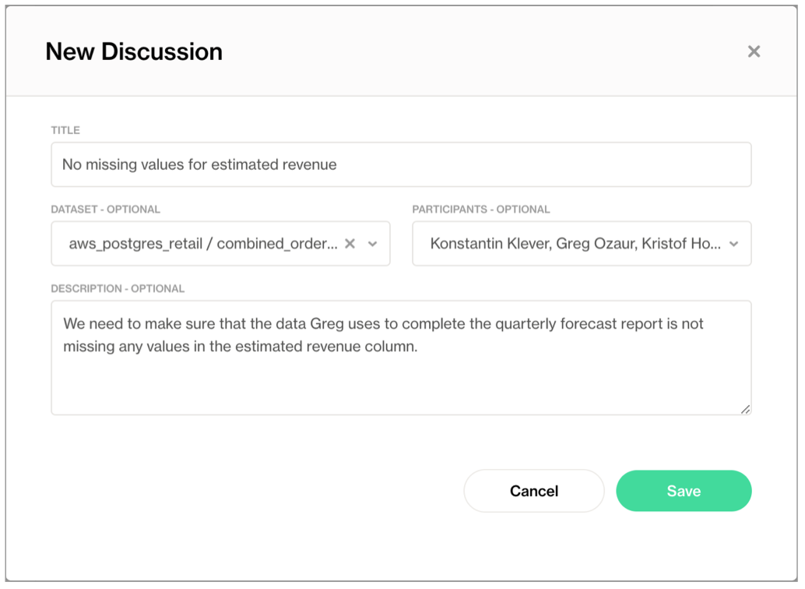

# Self-serve Soda

Use this guide to set up Soda Cloud and enable users across your organization to serve themselves when it comes to testing data quality.

Deploy a Soda Agent in a Kubernetes cluster to connect to both a data source and the Soda Cloud, then invite your Data Analyst and Data Scientist colleagues to join the account, start data quality discussions, and begin creating their own SodaCL checks for data quality.

## About this guide

The instructions below offer Data Engineers an example of how to set up the Soda Cloud to enable non-coder colleagues to propose, discuss, and create their own data quality tests. After all, data quality testing is a team sport!

Once you have completed the set-up, you can direct your non-coding colleagues to log in to Soda Cloud and begin creating Discussions. A Discussion in Soda is a messaging space that facilitates collaboration between data producers and data consumers. Together, colleagues can establish the expected and agreed-upon state of data quality in a dataset by proposing, then approving data quality checks that execute as part of a scheduled scan in Soda.

When checks fail during data quality scans, you and your colleagues get alerts via Slack which enable you to address issues before they have a downstream impact on the users or applications that depend upon the data.

## Access or deploy a Soda Agent




1. If you have not already done so, create a Soda Cloud account at [cloud.soda.io](https://cloud.soda.io/signup?utm_source=docs). If you already have a Soda account, log in.
2. By default, Soda prepares a Soda-hosted agent for all newly-created accounts. However, if you are an Admin in an existing Soda Cloud account and wish to use a Soda-hosted agent, navigate to **your avatar** > **Organization Settings**. In the **Organization** tab, click the checkbox to **Enable Soda-hosted Agent**.
3.  Navigate to **your avatar** > **Data Sources**, then access the **Agents** tab. Notice your out-of-the-box Soda-hosted agent that is up and running.\

    <figure><figcaption></figcaption></figure>



Soda Agent is a tool that empowers Soda Cloud users to securely access data sources to scan for data quality. Create a Kubernetes cluster in a cloud services provider environment, then use Helm to deploy a self-hosted Soda Agent in the cluster.

For context, this example assumes that:

* you have the appropriate access to a cloud services provider environment such as Azure, AWS, or Google Cloud that allows you to create and deploy applications to a cluster,
* you, or someone on your team, has access to the login credentials that Soda needs to be able to access a data source such as MS SQL, BigQuery, or Athena so that it can run scans of the data.

Access the [exhaustive deployment instructions](../quick-start-sip/deploy.md#deploy-a-soda-agent-in-a-kubernetes-cluster) for the cloud services provider you use.

* Cloud services provider-agnostic instructions
* Amazon Elastic Kubernetes Service (EKS)
* Microsoft Azure Kubernetes Service (AKS)
* Google Kubernetes Engine (GKE)

See also: [Soda Agent basic concepts](../learning-resources/basics.md)



## Connect a data source

Depending on your deployment model, Soda Agent supports connections with the following data sources.

#### **Self-hosted agent**

| 
Amazon Athena Amazon Redshift Azure Synapse ClickHouse Databricks SQL Denodo Dremio DuckDB GCP BigQuery Google CloudSQL
 | 
IBM DB2 MotherDuck MS SQL Server1 MySQL OracleDB PostgreSQL Presto Snowflake Trino Vertica
 |
| --------------------------------------------------------------------------------------------------------------------------------------------------------- | --------------------------------------------------------------------------------------------------------------------------------------- |

1 MS SQL Server with Windows Authentication does not work with Soda Agent out-of-the-box.

#### **Soda-hosted agent**

| 
BigQuery Databricks SQL MS SQL Server MySQL
 | 
PostgreSQL Redshift Snowflake  
 |
| ----------------------------------------------------------- | ----------------------------------------------- |

1. Log in to your Soda Cloud account, then navigate to **your avatar** > **Data Sources**.
2.  In the **Agents** tab, confirm that you can see a Soda-hosted agent, or the Soda Agent you deployed, and that its status is “green” in the **Last Seen** column. If not, refer to the Soda Agent documentation to [troubleshoot](../quick-start-sip/deploy.md#troubleshoot-deployment) its status.\

    <figure><figcaption></figcaption></figure>
3. Navigate to the **Data Sources** tab, then click **New Data Source** and follow the [guided steps](../quick-start-sip/managed-agent.md#add-a-new-data-source) to:
   * identify the new data source and its default scan definition
   * provide connection configuration details for the data source such as name, schema, and login credentials, and test the connection to the data source
   * profile the datasets in the data source to gather basic metadata about the contents of each
   * identify the datasets to which you wish to apply automated monitoring for anomalies and schema changes
   * assign ownership roles for the data source and its datasets
4. Save the new data source.

## Set up Slack integration and notification rules

Use this integration to enable Soda to send alert notifications to a Slack channel to notify your team when check results warn and fail.

If your team does not use Slack, you can follow the instructions to integrate with [MS Teams](../integrate-soda/integrate-msteams.md), instead, or skip this step as Soda sends alert notifications via email by default.

1. Log in to your Soda Cloud account and navigate to **your avatar** > **Organization Settings**, then navigate to the **Integrations** tab and click the **+** icon to add a new integration.
2. Follow the guided steps to authorize Soda to connect to your Slack workspace. If necessary, contact your organization's Slack Administrator to approve the integration with Soda.

* **Configuration** tab: select the public channels to which Soda can post messages; Soda cannot post to private channels.
* **Scope** tab: select the two Soda features, **Alert Notifications** and **Discussions**, which can access the Slack integration.

3. To dictate where Soda must send alert notifications for checks that fail, create a new notification rule. Navigate to **your avatar** > **Notification Rules**, then click **New Notification Rule**. Follow the guided steps to complete the new rule directly Soda to send check results that fail to a specific channel in your Slack workspace.

> Learn more about [Integrating with Slack](../integrate-soda/integrate-slack.md).
>
> Learn more about [Setting notification rules](../collaborate/notif-rules.md).

## Invite your colleagues

After testing and saving the new data source, invite your colleagues to your Soda Cloud account so they can begin creating new agreements.

Navigate to **your avatar** > **Invite Team Members**, then complete the form to send invitations to your colleagues.

## Begin a discussion and propose checks

While waiting for your colleagues to accept your Soda invitation, get a head start on setting up data quality checks on the data that matters the most to your data consumers.

🎥 Watch a [5-minute video](https://www.soda.io/resources/introducing-no-code-checks) of the following procedure, if you like!

1. In Soda Cloud, navigate to **Discussions** from the main navigation bar.
2.  Start a **New Discussion**, providing relevant details for a discussion on data quality metrics, and adding people whose perspectives will add value to the data quality of a particular dataset.

    <figure><figcaption></figcaption></figure>
3. Kick off the data quality discussion with your colleagues: begin with **Propose Check**, then use the no-code check interface to select from the list available checks for the dataset. Most common baseline data quality checks include: missing, invalid, duplicate, and freshness. Refer to [Define SodaCL checks](../soda-cl-overview/) for more detail on how to leverage no-code checks.
4. After filling in the blanks and testing the check, **Propose Check** to add the SodaCL check to the discussion. When your colleagues join and review the Discussions, they can add comments or propose new or different checks to address the data quality issues of this dataset.
5. When you and your team agree on the data quality checks to add to the dataset, you, as the data producer, can **Review & Add** the check to a scan for the dataset – either existing or new – so that Soda begins executing the check as per the data source's default scan schedule.

\
✨Well done!✨ You've taken the first step towards a future in which you and your colleagues can collaborate on defining and maintaining good-quality data. Huzzah!

## Go further?

* [Get organized](../collaborate/) in Soda!
* [Integrate Soda](../integrate-soda/) with your data catalog.
* Use [failed row samples](../run-a-scan/failed-row-samples.md) to investigate data quality issues.
* [Request a demo](https://www.soda.io/schedule-a-demo). Hey, what can Soda do for you?


