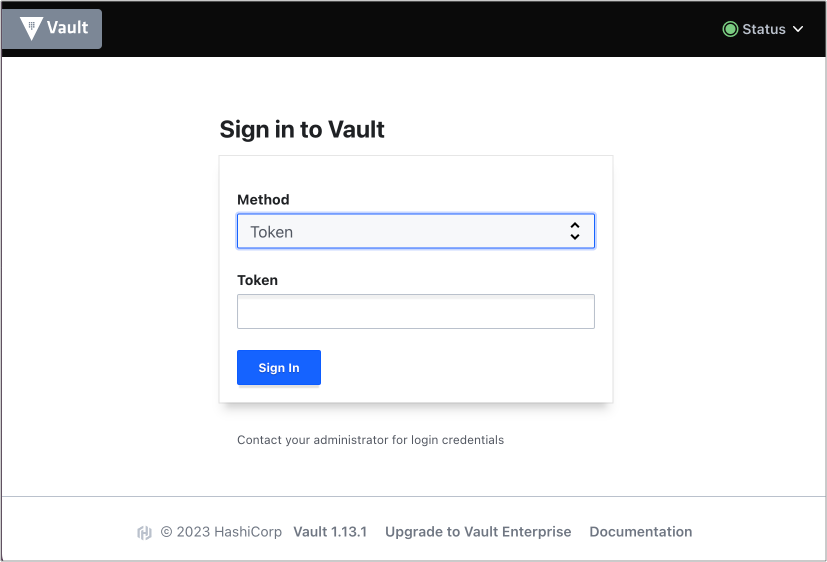
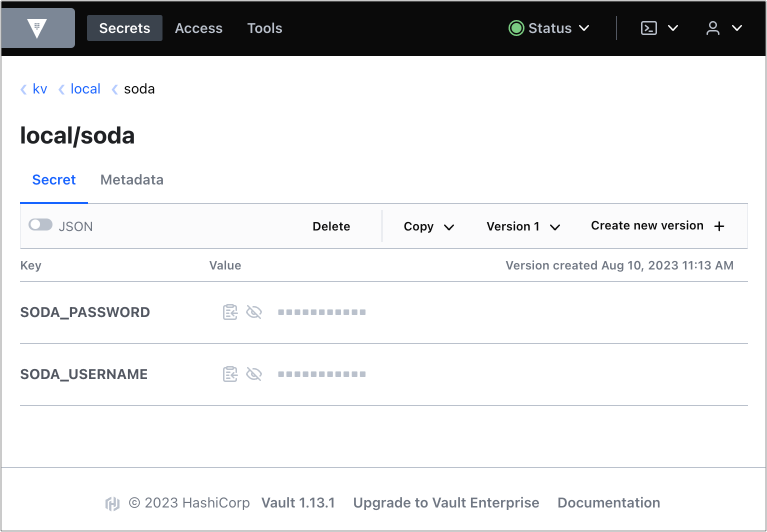

# Integrate an External Secrets Manager with a Soda Agent

Use this guide to set up a Soda Agent to securely retrieve frequently-rotated and/or encrypted data source login credentials.

Rather than managing sensitive login credentials for data sources passed via the Helm chart value `soda.env`, you can set up a Soda Agent to integrate with external secrets managers such as Hashicorp Vault, AWS Secrets Manager, or Azure Key Vault, so that it can securely access up-to-date, externally-stored login credentials for data sources.

## About this guide

This exercise points to a GitHub repository from which you can set up a locally-run, example Kubernetes cluster to illustrate what an integration between a Soda Agent and an external secrets manager looks like.

When you complete the exercise, you will have examples of the things you need for a Soda Agent to access an external secrets manager:

* **External Secrets Operator (ESO)** which is a Kubernetes operator that facilitates a connection between the Soda Agent and your secrets manager; see [external-secrets.io](https://external-secrets.io/latest/).
* a **ClusterSecretStore** resource which provides a central gateway with instructions on how to access your secret backend
* an **ExternalSecret** resource which instructs the cluster on which values to fetch, and references the ClusterSecretStore

Follow the instructions below to use the Terraform files in the repository to:

* set up and configure a local Kubernetes cluster
* deploy External Secrets Operator
* configure both a ClusterSecretStore and ExternalSecrets to access username and password examples in a Hashicorp Vault
* set up an example PostgreSQL data source containing NYC bus breakdowns and delays data
* deploy a Soda Agent configured to use the external secrets manager to access login credentials for a data source
* create a Soda Cloud account and set up a new data source that accesses the data in the PostgreSQL data source via the Soda Agent and the external secrets manager

## Prerequisites

For this exercise, you must have installed the following tools:

* [Terraform](https://developer.hashicorp.com/terraform/downloads) to build a locally-run example environment
* One container runtime that provides containers to use as local Kubernetes cluster nodes, either:
  * [Docker Desktop](https://docs.docker.com/desktop/), for users who prefer to use a UI
  * [Docker engine](https://docs.docker.com/engine/install/), for users who prefer to use the command-line\
    OR\

  * [Podman Desktop](https://podman-desktop.io/docs/Installation), for users who prefer to use a UI
  * [Podman engine](https://podman.io/docs/installation), for users who prefer to use the command-line
* (Optional) [kind](https://kind.sigs.k8s.io/docs/user/quick-start/#installation) to create and run a Kubernetes cluster locally
* (Optional) [kubectl](https://kubernetes.io/docs/tasks/tools/#kubectl) to execute commands against the Kubernetes cluster

## Set up

1. Clone the [`github.com/sodadata/soda-agent-use-cases`](https://github.com/sodadata/soda-agent-use-cases) repository locally.
2.  Navigate to the `setup` directory in the repository.

    ```
    cd soda-agent-external-secrets/setup
    ```
3.  Use the Terraform commands below to:

    * create a local Kubernetes cluster,
    * setup a Hashicorp Vault,
    * deploy External Secrets Operator,
    * setup a Kubernetes UI dashboard called Headlamp
    * create a PostgreSQL data source containing a NYC bus breakdowns and delays dataset

    ```shell
    terraform init
    terraform apply -auto-approve
    ```

    Output (last few lines):

    ```shell
    ...
    Apply complete! Resources: 13 added, 0 changed, 0 destroyed.
    Outputs:
    base_port = 30200
    cluster_admin_token = <sensitive>
    cluster_name = "soda-agent-external-secrets"
    dashboard_access = "http://127.0.0.1:30202"
    soda_agent_namespace = "soda-agent"
    vault_access = "http://127.0.0.1:30200"
    vault_init_access = "http://127.0.0.1:30201"
    vault_root_token = <sensitive>
    ```

## Configure

1.  Navigate to the `configure` directory in the repository.

    ```
    cd ..
    cd configure
    ```
2.  Use the Terraform commands below to:

    * configure a Hashicorp Vault,
    * configure the Vault provider of the ESO,
    * create a Kubernetes secret with a value for `appRoleSecretId` to access the Hashicorp Vault,
    * create an `ExternalSecret`,
    * create a `ClusterSecretstore`,
    * populate some secret values into Vault

    ```shell
    terraform init
    terraform apply -auto-approve
    ```

    Output (last few lines):

    ```shell
    ...
    Apply complete! Resources: 20 added, 0 changed, 0 destroyed.
    Outputs:
    dashboard_access = "http://127.0.0.1:30202"
    dashboard_token = <sensitive>
    vault_access = "http://127.0.0.1:30200"
    vault_admin_password = <sensitive>
    vault_admin_username = "admin"
    vault_read_only_password = <sensitive>
    vault_read_only_role_id = "3e94ee54-1799-936e-9cec-5c5a19a5eeeb"
    vault_read_only_role_secret_id = <sensitive>
    vault_read_only_token = <sensitive>
    vault_read_only_username = "soda"
    ```

## Access the Hashicorp Vault

1.  The configuration output produces a URL value for `vault_access` which, by default, is [https://127.0.0.1:30200](https://127.0.0.1:30200). Click the link to access the Hashicorp Vault login page in your browser.\


    <figure><figcaption></figcaption></figure>
2.  To log in, change the Method to `Username`, then use the `vault_admin_username` to populate the first field. To extract the value for `vault_admin_password` for the second field, use the following command:

    ```
    terraform output -raw vault_admin_password
    ```

    Hint: To copy the password directly to the clipboard the command, use one of the following commands:

    ```
    # MacOS
    terraform output -raw vault_admin_password | pbcopy
    ```

    ```
    # Linux
    terraform output -raw vault_admin_password | xclip -selection clipboard
    ```
3.  Now logged in, from the list of Secret Engines, navigate to `kv/local/soda` to see the example username and password secrets in the vault. If you wish, you can set new secrets that the Soda Agent can use.\
    \


    <figure><figcaption></figcaption></figure>

## Deploy a Soda Agent and pass login credentials

1. Access [Deploy a Soda Agent](../quick-start-sip/deploy.md#create-a-soda-cloud-account) and follow the instructions to create a free, 45-day trial Soda Cloud account and an API key id, and an API key secret for the Soda Agent.
2.  Prepare a values YAML file to deploy a Soda Agent in your cluster, as per the following example.

    ```yaml
    soda:
      apikey:
        id: "value-from-step1"
        secret: "value-from-step1"
      agent:
        name: "my-soda-agent-external-secrets"
      scanlauncher:
        existingSecrets:
          # from spec.target.name in the ExternalSecret file
          - soda-agent-secrets 
        idle:
          enabled: true
          replicas: 1
      cloud:
        # Use https://cloud.us.soda.io for US region 
        # Use https://cloud.soda.io for EU region
        endpoint: "https://cloud.soda.io"
    ```
3.  Deploy the Soda Agent using the following command:

    ```shell
    helm install soda-agent soda-agent/soda-agent \
      --values values.yml \
      --namespace soda-agent
    ```

## Create the example data source in Soda Cloud

To use your newly-deployed Soda Agent, you start by creating a new data source in your Soda Cloud account, then you can create a Soda Agreement to write checks for data quality.

1. In your Soda Cloud account, navigate to your **avatar** > **Scans & Data**. Click **New Data Source**, then follow the guided steps to create a new data source. Refer to [Add a new data source](../quick-start-sip/deploy.md#add-a-new-data-source) for full instructions for setting up a data source.
2.  In step 2 of the flow, use the following data source connection configuration. This connects to the example data source you created during [Set up](quick-start-secrets.md#set-up).

    ```yaml
    data_source nyc_bus_breakdowns_and_delays:
      type: postgres
      connection:
        host: sodademonyc-postgresql
        port: "5432"
        username: ${POSTGRES_USERNAME}
        password: ${POSTGRES_PASSWORD}
        database: nyc
      schema: public
    ```
3. Complete the guided workflow to **Save & Run** a scan of the data source to validate that Soda Cloud can access the data in the example data source via the Soda Agent. It uses the external secrets manager configuration you set up to fetch, then pass the username and password to the data source.
4. Follow the instructions to [Define SodaCL checks](../soda-cl-overview/#define-sodacl-checks) using no-code checks in Soda Cloud, then run scans for data quality.

## About the ClusterSecretStore

The `ClusterSecretStore` is a YAML-configured set of instructions for accessing the external secrets manager which, in this case, is a Hashicorp Vault using a KV Secrets Engine V2. Note that some values in the example are generated; values in your own file vary.

```
apiVersion: external-secrets.io/v1beta1
kind: ClusterSecretStore
metadata:
  name: vault-app-role
spec:
  provider:
    vault:
      auth:
        appRole:
          path: approle
          roleId: 3e94ee54-1799-936e-9cec-5c5a19a5eeeb
          secretRef:
            key: appRoleSecretId
            name: external-secrets-vault-app-role-secret-id
            namespace: external-secrets
      path: kv
      server: http://vault.vault.svc.cluster.local:8200
      version: v2
```

## About the ExternalSecret

The `ExternalSecret` is a separate YAML-based set of instructions for which secrets to fetch. The example below references the `ClusterSecretStore` above, which facilitates access to the Hashicorp Vault. The Soda Agent uses the `ExternalSecret` to retrieve data source credential values.

```
apiVersion: external-secrets.io/v1beta1
kind: ExternalSecret
metadata:
  name: soda-agent
  namespace: soda-agent
spec:
  data:
  - remoteRef:
      key: local/soda
      property: POSTGRES_USERNAME
    secretKey: POSTGRES_USERNAME
  - remoteRef:
      key: local/soda
      property: POSTGRES_PASSWORD
    secretKey: POSTGRES_PASSWORD
  refreshInterval: 1m
  secretStoreRef:
    kind: ClusterSecretStore
    name: vault-app-role
  target:
    name: soda-agent-secrets
    template:
      data:
        soda-agent.conf: |
          POSTGRES_USERNAME={{ .POSTGRES_USERNAME }}
          POSTGRES_PASSWORD={{ .POSTGRES_PASSWORD }}

      engineVersion: v2
```

The `target template` configuration in the `ExernalSecret` creates a file called `soda-agent.conf` into which it adds the username and password values in the [dotenv format](https://saurabh-kumar.com/python-dotenv/#file-format) that the Soda Agent expects.

## Go further

* Access standard instructions to [integrate with a secrets manager](../quick-start-sip/extras.md#integrate-with-a-secrets-manager).
* [Get organized](../collaborate/) in Soda!
* [Request a demo](https://www.soda.io/schedule-a-demo). Hey, what can Soda do for you?


