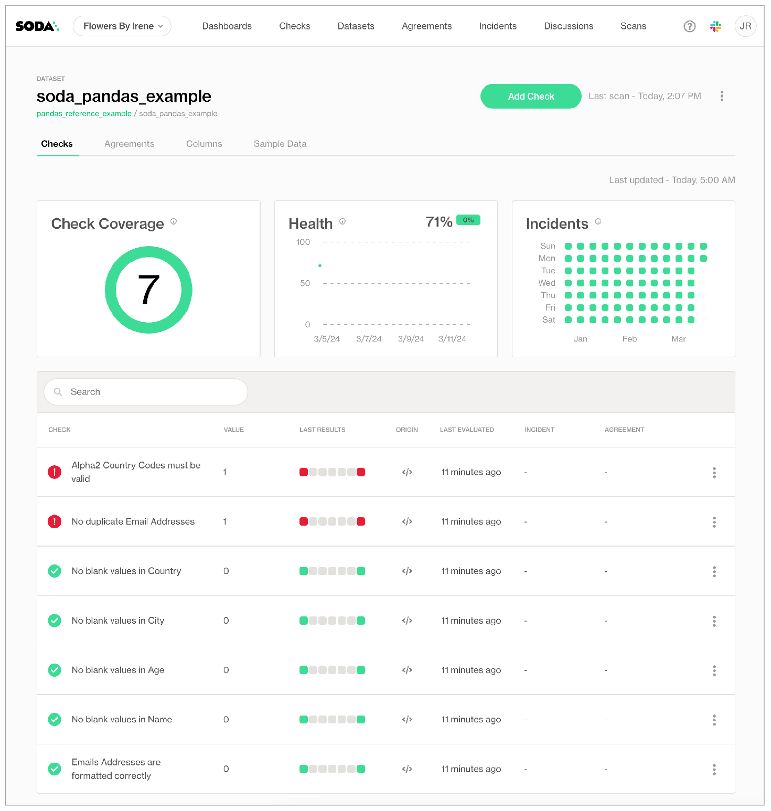
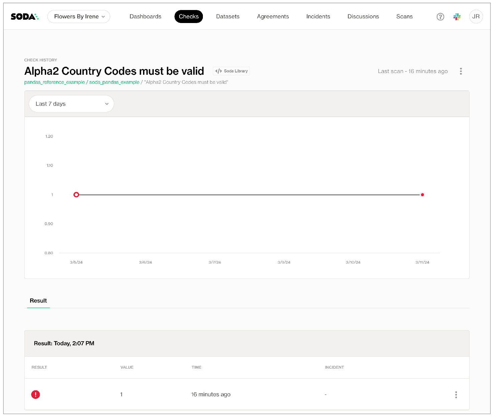

# Reroute failed row samples

Using Soda Library, you can programmatically run scans that reroute failed row samples to display them in the command-line instead of Soda Cloud.

By default, Soda Library _implicitly_ pushes samples of any failed rows to Soda Cloud for missing, validity, duplicate, and reference checks; see [About failed row samples](../run-a-scan/failed-row-samples.md#about-failed-row-samples). Instead of sending the results to Soda Cloud, you can use a Python custom sampler to programmatically instruct Soda to display those samples in the command-line.

Follow the instructions below to modify an example script and run it locally to invoke Soda to run a scan on example data and display samples in the command-line for the rows that failed missing, validity, duplicate, and reference checks. This example uses Dask and Pandas to convert CSV sample data into a DataFrame on which Soda can run a scan, and also to convert failed row samples into a CSV to route them to, or display them in, a non-Soda Cloud location.

Note that although the example does not send failed row samples to Soda Cloud, it does still send dataset profile information and the data quality check results to Soda Cloud.

## Prerequisites

* a code or text editor such as PyCharm or Visual Studio Code
* Python 3.8, 3.9, or 3.10
* Pip 21.0 or greater

## Set up and run example script

Jump to: [script](route-failed-rows.md#example-script)

1. In a browser, navigate to [cloud.soda.io/signup](https://cloud.soda.io/signup) to create a new Soda account, which is free for a 45-day trial. If you already have a Soda account, log in.
2. Navigate to **your avatar** > **Profile**, then access the **API keys** tab. Click the plus icon to generate new API keys. Copy+paste the API key values to a temporary, secure place in your local environment.

<details>

<summary>Why do I need a Soda Cloud account?</summary>

To validate your account license or free trial, the Soda Library Docker image that the GitHub Action uses to execute scans must communicate with a Soda Cloud account via API keys.\
Create new API keys in your Soda Cloud account, then use them to configure the connection between the Soda Library Docker image and your account later in this procedure.

</details>

3. Best practice dictates that you run Soda in a virtual environment. From the command line, create a new directory in your environment, then use the following command to create, then activate, a virtual environment called `.sodadataframes`.

```shell
python -m venv .sodadataframes
# MacOS
source .sodadataframes/bin/activate 
# Windows
source .sodadataframes\Scripts\activate
```

4. Run the following commands to upgrade pip, then install Soda Library for Dask and Pandas.

```shell
# MacOS
pip install --upgrade pip  
# Windows 
python.exe -m pip install --upgrade pip

pip install -i https://pypi.cloud.soda.io soda-pandas-dask
```

5. Copy + paste the [script](route-failed-rows.md#example-script) below into a new `Soda-dask-pandas-example.py` file in the same directory in which you created your virtual environment. In the file, replace the above-the-line values with your own Soda Cloud values, then save the file.
6. From the command-line, use the following command to run the example and see both the scan results and the failed row samples as command-line output.

```shell
python Soda-dask-pandas-example.py 
```

Output:

```shell
By downloading and using Soda Library, you agree to Sodas Terms & Conditions (https://go.soda.io/t&c) and Privacy Policy (https://go.soda.io/privacy). 
Running column profiling for data source: pandas_reference_example
Profiling columns for the following tables:
  - soda_pandas_example
Scan summary:
5/7 checks PASSED: 
    soda_pandas_example in pandas_reference_example
      No blank values in Name [PASSED]
      No blank values in Age [PASSED]
      No blank values in City [PASSED]
      No blank values in Country [PASSED]
      Emails Addresses are formatted correctly [PASSED]
2/7 checks FAILED: 
    soda_pandas_example in pandas_reference_example
      Alpha2 Country Codes must be valid [FAILED]
        value: 1
      No duplicate Email Addresses [FAILED]
        check_value: 1
Oops! 2 failures. 0 warnings. 0 errors. 5 pass.
Sending results to Soda Cloud
Soda Cloud Trace: 628131****
Failed Rows in a Dataframe Example
-----------------------------------
      name  age         city              email country                        failed_check                  created_at
0    Alice   25     New York  alice@example.net      US        No duplicate Email Addresses  2024-03-12 10:40:55.681690
1      Bob   30  Los Angeles  alice@example.net      BT        No duplicate Email Addresses  2024-03-12 10:40:55.681690
2  Charlie   66      Chicago  alice@example.net      BO        No duplicate Email Addresses  2024-03-12 10:40:55.681690
3    David   87     Chicago1  alice@example.net     ABC        No duplicate Email Addresses  2024-03-12 10:40:55.681690
4    David   87     Chicago1  alice@example.net     ABC  Alpha2 Country Codes must be valid  2024-03-12 10:40:55.731225
```

7.  In your Soda Cloud account, navigate to **Datasets**, then click to open **soda.pandas.example**. Soda displays the check results for the scan you just executed via the command-line.\
    If you wish, click the **Columns** tab to view the dataset profile information Soda Library collected and pushed to Soda Cloud.

    <figure><figcaption></figcaption></figure>
8.  Click the **Alpha2 Country Codes must be valid** row to view the latest check result, which failed. Note that Soda Cloud does not display a tab for **Failed Rows Analysis** which would normally contain samples of failed rows from the scan.

    <figure><figcaption></figcaption></figure>

#### Example script

```python
import pandas as pd
from soda.scan import Scan
from soda.sampler.sampler import Sampler
from soda.sampler.sample_context import SampleContext
from datetime import datetime
import json
import os

# For the US Region, use "cloud.us.soda.io".
# For the EU region, use "cloud.soda.io".
soda_cloud_host = "cloud.soda.io" 

# Input the API keys you generated in step 2.
cloud_apikeyID = "XXX"  
cloud_apikeySecret = "XXX"

# Set to "true" to view failed row samples in Soda Cloud.
# Set to "false" to view samples in the CLI/separate DataFrame.
failed_rows_cloud = "false"

# ----------------------------------------------------------------------------------------

# Reroute failed row samples (exceptions)

class CustomSampler(Sampler):
    def store_sample(self, sample_context: SampleContext):
        rows = sample_context.sample.get_rows()
        json_data = json.dumps(rows) # Convert failed rows to JSON
        exceptions_df = pd.read_json(json_data) #create dataframe with failed rows
        # Define exceptions dataframe
        exceptions_schema = sample_context.sample.get_schema().get_dict()
        exception_df_schema = []
        for n in exceptions_schema:
            exception_df_schema.append(n["name"])
        exceptions_df.columns = exception_df_schema
        check_name = sample_context.check_name
        exceptions_df['failed_check'] = check_name
        exceptions_df['created_at'] = datetime.now()
        exceptions_df.to_csv(check_name+".csv", sep=",", index=False, encoding="utf-8")


# Sample data1
data_list = [
    {'name': 'Alice', 'age': 25, 'city': 'New York', 'email': 'alice@example.net', 'country': 'US'},
    {'name': 'Bob', 'age': 30, 'city': 'Los Angeles', 'email': 'alice@example.net', 'country': 'BT'},
    {'name': 'Charlie', 'age': 66, 'city': 'Chicago', 'email': 'alice@example.net', 'country': 'BO'},
    {'name': 'David', 'age': 87, 'city': 'Chicago1', 'email': 'alice@example.net', 'country': 'ABC'}
]

# Sample data2
reference_list = [
    {'iso2_country': 'US'},
    {'iso2_country': 'BT'},
    {'iso2_country': 'BO'},
    {'iso2_country': 'CN'}
]

# Convert Sample data1 to a Pandas DataFrame
pandas_frame1 = pd.DataFrame(data_list)

# Convert Sample data2 to a Pandas DataFrame
pandas_frame2 = pd.DataFrame(reference_list)

# Setup Soda data quality scan
scan = Scan()
scan.add_pandas_dataframe(dataset_name="soda_pandas_example", pandas_df=pandas_frame1, data_source_name="pandas_reference_example")
scan.add_pandas_dataframe(dataset_name="reference", pandas_df=pandas_frame2, data_source_name="pandas_reference_example") # reference List
scan.set_scan_definition_name("pandas_reference_example")
scan.set_data_source_name("pandas_reference_example")
if failed_rows_cloud == "false":
    scan.sampler = CustomSampler()

# Define data quality checks using SodaCL

checks = """
checks for soda_pandas_example:
  
  - missing_count(name) = 0:
      name: No blank values in Name

  - missing_count(age) = 0:
      name: No blank values in Age

  - missing_count(city) = 0:
      name: No blank values in City

  - missing_count(country) = 0:
      name: No blank values in Country
  
  - invalid_count(email) = 0:
      valid format: email
      name: Email addresses are formatted correctly
  
  - duplicate_count(email) = 0:
      name: No duplicate email addresses

  - values in (country) must exist in reference (iso2_country):
      name: Alpha2 country codes must be valid

profile columns:
  columns:
    - include soda_pandas_example.%
"""

config = f"""
soda_cloud:
  host: {soda_cloud_host}
  api_key_id: {cloud_apikeyID}
  api_key_secret: {cloud_apikeySecret}
"""

# Execute a scan

scan.add_sodacl_yaml_str(checks)
scan.add_configuration_yaml_str(config)
# When testing, you can set scan.set_is_local(True) to avoid sending failed row samples to Soda Cloud.
scan.set_is_local(False)
scan.execute()


# Create a DataFrame for any exceptions
# Optionally, you can write this DataFrame to an external table.
if failed_rows_cloud == "false":
    current_dir = os.path.dirname(os.path.realpath(__file__))
    csv_files = [file for file in os.listdir(current_dir) if file.endswith('.soda')]
    if len(csv_files) == 0:
        pass
    else:
        dfs = []
        for file in csv_files:
            file_path = os.path.join(current_dir, file)
            df = pd.read_csv(file_path)
            dfs.append(df)
        if len(dfs) == 1:
            combined_df = dfs[0]
        else:
            combined_df = pd.concat(dfs, ignore_index=True)
        print("Failed Rows in a Dataframe Example")
        print("-----------------------------------")
        print(combined_df)
    # remove the CSV files that were created
        for file in csv_files:
            os.remove(os.path.join(current_dir, file))
```

## Go further

* Learn how to [Manage sensitive data](sensitive-data.md) in Soda Cloud.
* Learn how to [Disable failed rows sampling for specific columns](../run-a-scan/failed-row-samples.md#disable-failed-row-samples).
* [Disable samples in Soda Cloud](../soda-cl-overview/sample-datasets.md#disable-samples-in-soda-cloud) entirely.
* Learn how to use a custom sampler to route failed row samples to an [external storage location](../run-a-scan/failed-row-samples.md#reroute-failed-row-samples).


