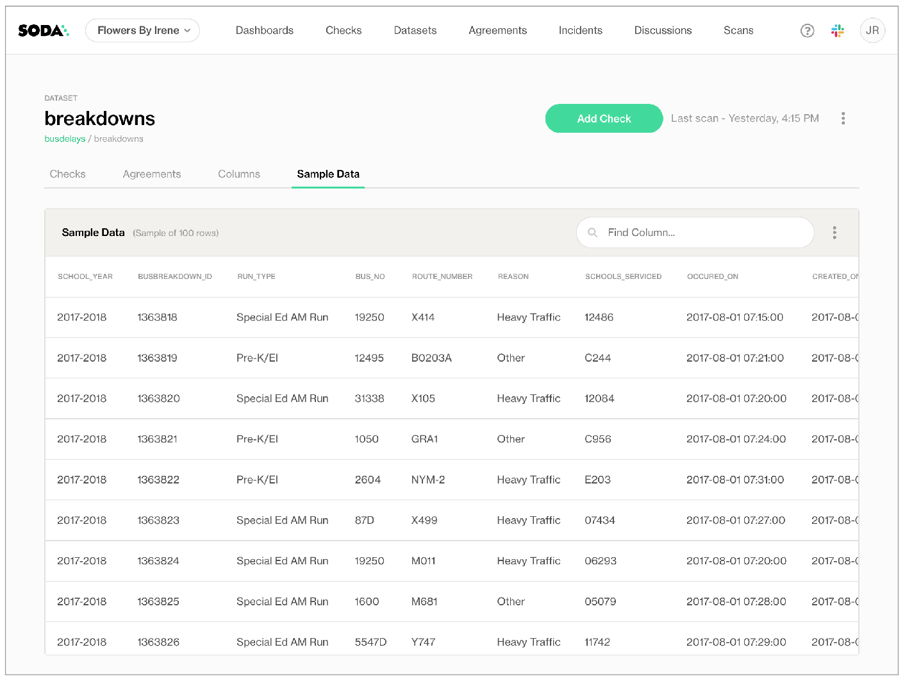
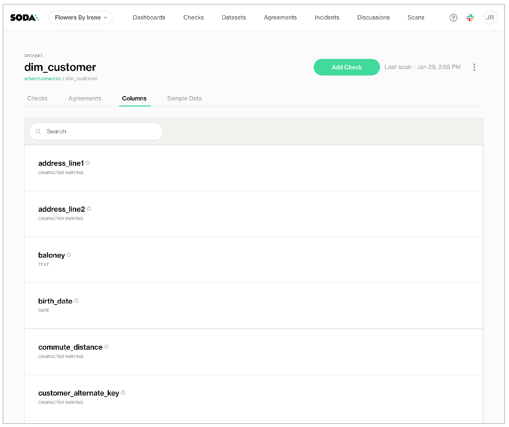
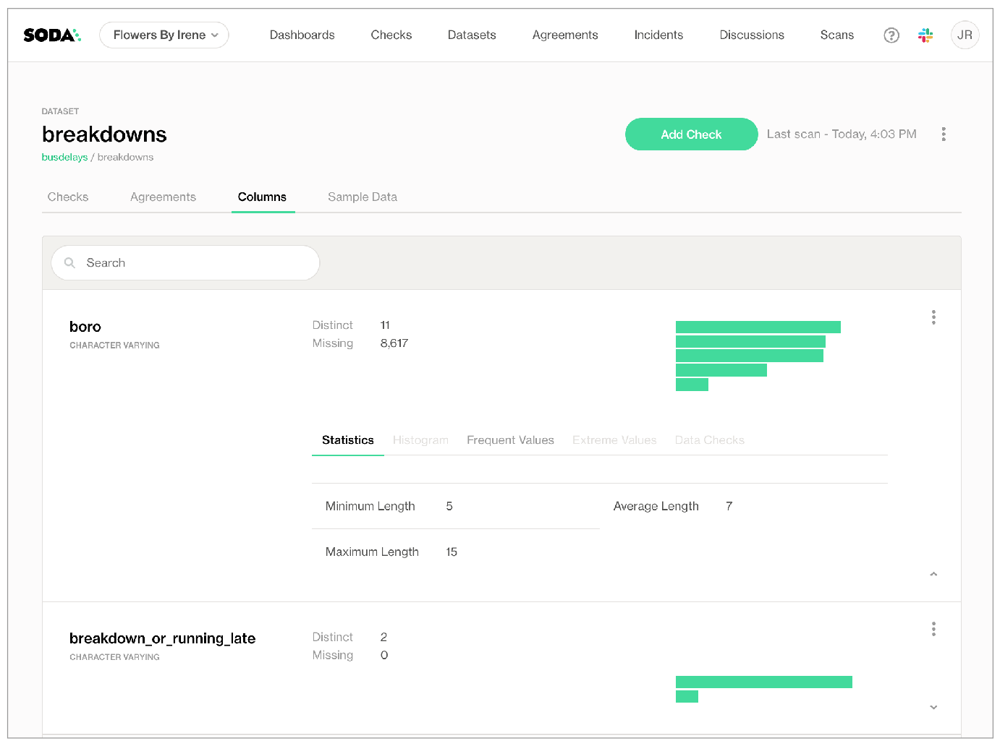
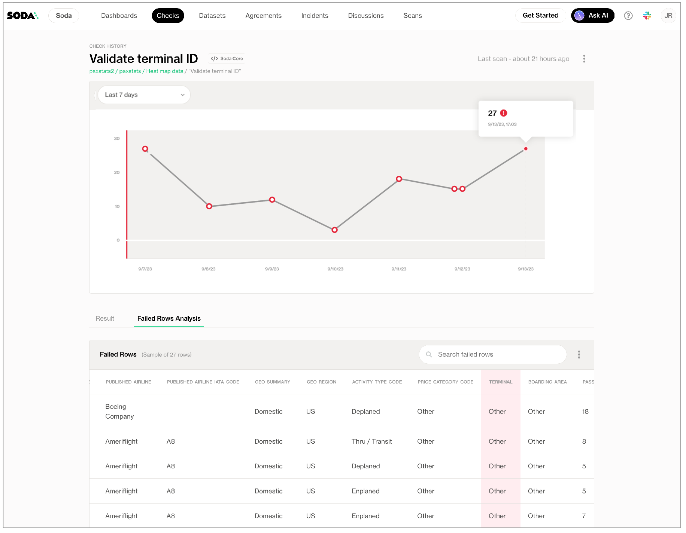

# Manage sensitive data

Soda provides several capabilities and configurable settings that help you manage access to sensitive data. What follows are several options that you can implement to guard against unauthorized access to sensitive data that Soda may check for data quality.

## Utilize roles and permissions in Soda Cloud

Soda Cloud employs roles and permissions that apply to users of an organization's account. These access controls enable you to define who can access, add, change, or delete metadata or access to data in the account.

Refer to [Manage roles, user groups, and settings](../collaborate/roles-global.md) for much more detail and guidance on how to limit access.

## Deploy a self-hosted Soda Agent

Soda's self-hosted agent is a containerized Soda Library deployed in a Kubernetes cluster in your cloud services provider environment, such as Azure or AWS. It enables users of Soda Cloud to securely access your data sources so it can perform data quality scanning while meeting your infrastructure team’s security rules and requirements that protect credentials and record-level data from exposure.

Consider [deploying a self-hosted agent](../quick-start-sip/deploy.md) in your own infrastructure to securely manage access to your data sources. See also: [Soda architecture](../learning-resources/soda-cloud-architecture.md)

Further, if you use an external secrets manager such as Hashicorp Vault or AWS Secrets Manager, you may wish to [integrate](../quick-start-sip/extras.md#integrate-with-a-secrets-manager) your self-hosted Soda Agent with your secrets manager to securely and efficiently grant Soda access to data sources that use frequently-rotated login credentials.

## Limit data sampling

During the data source onboarding process, you have the option to [configure Soda](../soda-cl-overview/sample-datasets.md) to collect and store 100 rows of sample data for the datasets in the data source. This is a feature you must implicitly configure; Soda does not collect sample rows of data by default.

These samples, accessible in Soda Cloud as in the example below, enable users to gain insight into the data's characteristics, facilitating the formulation of data quality rules.

<figure><figcaption></figcaption></figure>

### Turn off sample data collection

Where your datasets contain sensitive or private information, you may not want to collect, send, store, or visualize _any_ samples from your data source to Soda Cloud. In such a circumstance, you can disable the feature completely in Soda Cloud.

To prevent Soda Cloud from receiving any sample data or failed row samples for any datasets in any data sources to which you have connected your Soda Cloud account, proceed as follows:

1. As a user with [permission](../collaborate/roles-global.md#global-roles-and-permissions) to do so, log in to your Soda Cloud account and navigate to **your avatar** > **Organization Settings**.
2. In the **Organization** tab, uncheck the box to **Allow Soda to collect sample data and failed row samples for all datasets**, then **Save**.

Alternatively, if you use Soda Library, you can adjust the configuration in your `configuration.yml` to disable all samples for an individual data source, as in the following example.

```yaml
data_source my_datasource:
  type: postgres
  ...
  sampler:
    disable_samples: True
```

### Limit sample data collection

If you wish to provide sample rows for some datasets and only wish to limit the ones for which Soda collects samples, you can add a `sample datasets` configuration to your data source.

Navigate to **your avatar** > **Data Sources** > **New Data Source**, or select an existing data source, to begin. You can add this configuration to one of two places:

* to either step [3. Discover](../quick-start-sip/deploy.md#id-3.-discover)\
  OR
* step [4. Profile](../quick-start-sip/deploy.md#id-4.-profile)

The example configuration below uses a wildcard character (`%`) to specify that Soda collects sample rows for all datasets with names that begin with `region`, and _not_ to send samples for any other datasets in the data source.

```yaml
sample datasets:
  datasets:
    - include region%
```

The following example excludes a list of datasets from any sampling, and implicitly collects samples for all other datasets in the data source.

```yaml
sample datasets:
  datasets:
    - exclude [credit_card, birth_date]
```

* If you configure `sample datasets` to include specific datasets, Soda implicitly _excludes_ all other datasets from sampling.
* If you combine an include config and an exclude config and a dataset fits both patterns, Soda excludes the dataset from sampling.
* For excluded datasets, Soda does not generate, store, or offer visualizations of sample rows anywhere. For those datasets without sample rows, users must use another tool, such as a query builder for a data source, to collect any sample data they require.
* No other functionality within Soda relies on these sample rows; if you exclude a dataset in a sample configuration, you can still configure individual failed row checks which collect independent failed row samples at scan time. Learn more about [managing failed row samples](../run-a-scan/failed-row-samples.md).

## Limit data profiling

During the data source onboarding process, you have the option to [configure Soda](../soda-cl-overview/profile.md) to profile the datasets, and/or their columns, when it connects to the data source.

When it **discovers datasets**, as in the example below, Soda captures only the names of the datasets in the data source, each dataset's schema, and the data type of each column.

<figure><figcaption></figcaption></figure>

When it **profiles datasets**, as in the example below, Soda automatically evaluates several data quality metrics for each column of a dataset based on the column's data type, such as missing and distinct values, calculated statistical metrics, and frequently occurring values. The majority of these metrics are aggregated which safeguards against the exposure of record-level data.

In instances where a column contains categorical data, profiling provides insights into the most extreme and frequent values, which could potentially reveal information about the data. However, as Soda only exposes individual metric values, end-users cannot link these calculated metrics to specific records.

<figure><figcaption></figcaption></figure>

### Limit or turn off dataset discovery

If you wish to limit the profiling that Soda performs on datasets in a data source, or limit the datasets which it discovers, you can do so at the data source level as part of the guided workflow to create or edit a data source. Navigate to **your avatar** > **Data Sources** > **New Data Source**, or select an existing data source, to begin.

In step 3 of the guided workflow, **Discover**, you have the option of listing the datasets you wish to discover, as in the example below. Refer to [Add dataset discovery](../soda-cl-overview/profile.md#add-dataset-discovery) for many examples and variations of this configuration.

```yaml
discover datasets:
  datasets:
    - include %
    - exclude test%
```

To avoid discovering _any_ datasets in your data source, use the following configuration.

```yaml
discover datasets:
  datasets:
    - exclude %
```

### Limit or turn off dataset profiling

If you wish to limit the profiling that Soda performs on datasets in a data source, or limit the datasets which it profiles, you can do so at the data source level as part of the guided workflow to create or edit a data source. Navigate to **your avatar** > **Data Sources** > **New Data Source**, or select an existing data source, to begin.

In step 4 of the guided workflow, **Profile**, you have the option of listing the datasets you wish to profile, as in the example below which excludes columns that begin with `pii` and any columns that contain `email` in their names. Refer to [Add column profiling](../soda-cl-overview/profile.md#add-column-profiling) for many examples and variations of this configuration.

```yaml
profile columns:
  columns:
    - exclude %.pii_%
    - exclude %.%email%
```

To avoid profiling _any_ datasets in your data source, use the following configuration.

```yaml
profile columns:
  columns:
    - exclude %.% 
```

Dataset profiling can be resource-heavy, so carefully consider the datasets for which you truly need column profile information. Refer to [Compute consumption and cost considerations](../soda-cl-overview/profile.md#compute-consumption-and-cost-considerations) for more detail.

## Limit failed row sampling

When a scan results in a failed check, the CLI output displays information about the check that failed and why, including the [actual SQL queries](../run-a-scan/failed-row-samples.md#about-failed-row-samples) that retrieve failed row samples. To offer more insight into the data that failed a check, Soda Cloud displays failed row samples in a check result’s measurement history, as in the example below.

There are two ways Soda collects and displays failed row samples in your Soda Cloud account.

* **Implicitly:** Soda automatically collects 100 failed row samples for the following checks:
  * [reference check](../sodacl-reference/reference.md#failed-row-samples)
  * checks that use a [missing metric](../sodacl-reference/missing-metrics.md#failed-row-samples)
  * checks that use a [validity metric](../sodacl-reference/validity-metrics.md#failed-row-samples)
  * checks that use a [duplicate metric](../sodacl-reference/numeric-metrics.md#failed-row-samples)
  * [metric reconciliation check](../sodacl-reference/recon.md#metric-reconciliation-checks) that include missing, validity, or duplicate metrics, or reference checks
  * [record reconciliation checks](../sodacl-reference/recon.md#record-reconciliation-checks)
* **Explicitly:** Soda automatically collects 100 failed row samples for the following explicitly-configured checks:
  * [failed rows check](../sodacl-reference/failed-rows-checks.md)
  * [user-defined checks](../sodacl-reference/user-defined.md) that use the `failed rows query` configuration

<figure><figcaption></figcaption></figure>

### Turn off failed row sampling

Where your datasets contain sensitive or private information, you may not want to collect, send, store, or visualize _any_ samples from your data source to Soda Cloud. In such a circumstance, you can disable the feature completely in Soda Cloud.

Users frequently disable failed row sampling in Soda Cloud and, instead, reroute failed row samples to an internal database; see [Reroute failed row samples](route-failed-rows.md) below.

### Customize failed row sampling

For checks which implicitly collect failed rows samples, you can add a configuration to prevent Soda from collecting those samples from specific columns or datasets that contain sensitive data. For example, you may wish to exclude a column that contains personal identifiable information (PII) such as credit card numbers from the Soda query that collects samples.

Refer to [manage failed row samples](../run-a-scan/failed-row-samples.md) for extensive options and details.

### Reroute failed row samples

If the data you are checking contains sensitive information, you may wish to send any failed rows samples that Soda collects to a secure, internal location rather than Soda Cloud. These configurations apply to checks defined as no-code checks, in an agreement, or in a checks YAML file.

To do so, you have two options:

1. **HTTP sampler**: Create a function, such as a lambda function, available at a specific URL within your environment that Soda can invoke for every check result in a data source that fails and includes failed row samples. Use the function to perform any necessary parsing from JSON to your desired format (CSV, Parquet, etc.) and store the failed row samples in a location of your choice.
2. **Python CustomSampler**: If you run programmatic Soda scans of your data, add a custom sampler to your Python script to collect samples of rows with a `fail` check result. Once collected, you can print the failed row samples in the CLI, for example, or save them to an alternate destination.

Learn how to define custom samplers in [Manage failed rows samples](../run-a-scan/failed-row-samples.md).

## Go further

* Learn more about how to [manage failed row samples](../run-a-scan/failed-row-samples.md).
* Run scans locally to prevent Soda Library from pushing results to Soda Cloud. Access the **Prevent pushing scan results to Soda Cloud** in the [Run a scan](../run-a-scan/#scan-for-data-quality) tab.


